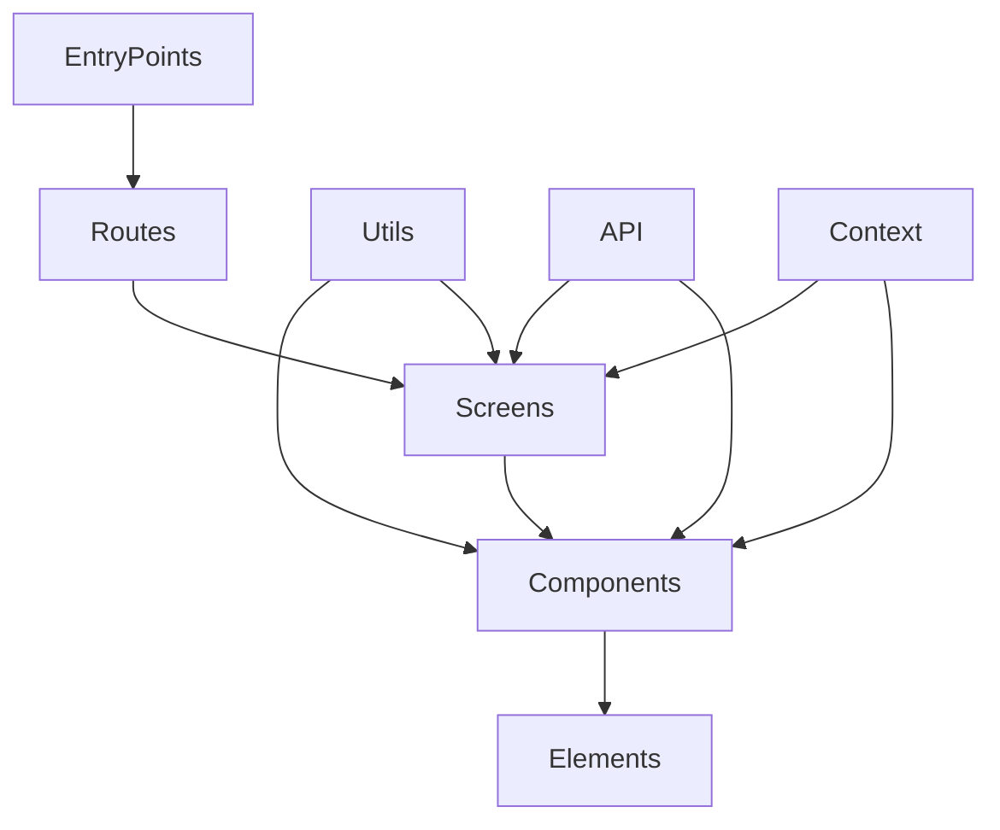

# System Patterns

This document describes the system patterns observed in the codebase.

Component Relationships

## Component Structure

The application follows a modular component structure, with clear separation of concerns:

### Core Components

1. **Entry Points**: Application entry points

   - Located in `src/entryPoints/`

3. **Container**: Reusable API values

   - Located in `src/container/`

2. **Screens**: Main screen components for different sections of the application

   - Located in `src/screens/`
   - Organized by feature area (e.g., `login`, `orders`)

3. **Components**: Reusable UI components

   - Located in `src/components/`
   - Follows a component-based architecture for reusability

4. **Utils**: Utility functions and helpers

   - Located in `src/utils/`
   - Includes common functionality used across the application

5. **API**: API integration and data fetching
   - Located in `src/APIUtils/`
   - Handles communication with backend services

6. **Context**: Context providers for managing application state
   - Located in `src/context/`
   - Provides a way to share data between components

## Utility Functions

The codebase uses a variety of utility functions to perform common tasks, such as string manipulation, data conversion, and data validation. These functions are typically located in the `src/utils` directory.

### Example: `LogicUtils.res`

The `src/utils/LogicUtils.res` file contains a number of utility functions, including:

*   `isEmptyString`: Checks if a string is empty.
*   `isNonEmptyString`: Checks if a string is not empty.
*   `methodStr`: Converts a `Fetch.requestMethod` to a string.
*   `safeParseOpt`: Parses a string into JSON and returns an optional JSON value.
*   `safeParse`: Parses a string into JSON and returns a JSON value with a null default.
*   `getDictFromJsonObject`: Gets a dictionary from a JSON object.
*   `convertMapObjectToDict`: Converts a map object to a dictionary.
*   `removeDuplicate`: Removes duplicate elements from an array of strings.
*   `sortBasedOnPriority`: Sorts an array of strings based on a priority array.
*   `toCamelCase`: Converts a string to camel case.
*   `toKebabCase`: Converts a string to kebab case.
*   `kebabToSnakeCase`: Converts a string from kebab case to snake case.
*   `getNameFromEmail`: Gets the name from an email address. This function splits the email string by "@" and capitalizes each name after splitting by ".".
*   `getOptionString`: Gets an optional string from a dictionary.
*   `getString`: Gets a string from a dictionary with a default value.
*   `getStringFromJson`: Gets a string from a JSON value with a default value.
*   `getBoolFromJson`: Gets a boolean from a JSON value with a default value.
*   `getArrayFromJson`: Gets an array from a JSON value with a default value.
*   `getOptionalArrayFromDict`: Gets an optional array from a dictionary.
*   `getArrayFromDict`: Gets an array from a dictionary with a default value.
*   `getArrayDataFromJson`: Gets an array of data from a JSON value, mapping each item to an object.
*   `getStrArray`: Gets an array of strings from a dictionary.
*   `getStrArrayFromJsonArray`: Gets an array of strings from a JSON array.
*   `getStrArryFromJson`: Gets an array of strings from a JSON value.
*   `getOptionStrArrayFromJson`: Gets an optional array of strings from a JSON value.
*   `getStrArrayFromDict`: Gets an array of strings from a dictionary with a default value.
*   `getOptionStrArrayFromDict`: Gets an optional array of strings from a dictionary.
*   `getNonEmptyString`: Gets a non-empty string.
*   `getNonEmptyArray`: Gets a non-empty array.
*   `getOptionBool`: Gets an optional boolean from a dictionary.
*   `getBool`: Gets a boolean from a dictionary with a default value.
*   `getJsonObjectFromDict`: Gets a JSON object from a dictionary.
*   `getvalFromDict`: Gets a value from a dictionary.
*   `getBoolFromString`: Gets a boolean from a string.
*   `getStringFromBool`: Gets a string from a boolean.
*   `getIntFromString`: Gets an integer from a string.
*   `getOptionIntFromString`: Gets an optional integer from a string.
*   `getOptionFloatFromString`: Gets an optional float from a string.
*   `getFloatFromString`: Gets a float from a string.
*   `getIntFromJson`: Gets an integer from a JSON value.
*   `getOptionIntFromJson`: Gets an optional integer from a JSON value.
*   `getOptionFloatFromJson`: Gets an optional float from a JSON value.
*   `getFloatFromJson`: Gets a float from a JSON value.
*   `getInt`: Gets an integer from a dictionary with a default value.
*   `getOptionInt`: Gets an optional integer from a dictionary.
*   `getOptionFloat`: Gets an optional float from a dictionary.
*   `getFloat`: Gets a float from a dictionary with a default value.
*   `getObj`: Gets an object from a dictionary with a default value.
*   `getDictFromUrlSearchParams`: Gets a dictionary from URL search parameters.
*   `setDictNull`: Sets a dictionary value to null.
*   `setOptionString`: Sets an optional string in a dictionary.
*   `setOptionJson`: Sets an optional JSON value in a dictionary.
*   `setOptionBool`: Sets an optional boolean in a dictionary.
*   `setOptionArray`: Sets an optional array in a dictionary.
*   `setOptionDict`: Sets an optional dictionary in a dictionary.
*   `setOptionInt`: Sets an optional integer in a dictionary.
*   `mapOptionOrDefault`: Maps an optional value to a default value.
*   `capitalizeString`: Capitalizes a string.
*   `snakeToCamel`: Converts a string from snake case to camel case.
*   `camelToSnake`: Converts a string from camel case to snake case.
*   `userNameToTitle`: Converts a user name to a title.
*   `camelCaseToTitle`: Converts a camel case string to a title. This function capitalizes the input string and replaces the camel case with spaces.
*   `isContainingStringLowercase`: Checks if a string contains a substring in lowercase.
*   `snakeToTitle`: Converts a string from snake case to a title. This function splits the input string by "_" and capitalizes each word.
*   `titleToSnake`: Converts a string from a title to snake case. This function splits the input string by " " and converts each word to lowercase, joining them with "_".
*   `getIntFromString`: Gets an integer from a string.
*   `removeTrailingZero`: Removes trailing zeros from a numeric string.
*   `shortNum`: Shortens a number.
*   `latencyShortNum`: Shortens a latency value.
*   `checkEmptyJson`: Checks if a JSON value is empty.
*   `numericArraySortComperator`: A comparator for sorting numeric arrays.
*   `isEmptyDict`: Checks if a dictionary is empty.
*   `isNullJson`: Checks if a JSON value is null.
*   `stringReplaceAll`: Replaces all occurrences of a string in another string.
*   `getUniqueArray`: Gets a unique array.
*   `getFirstLetterCaps`: Gets the first letter of each word in a string in caps.
*   `getDictfromDict`: Gets a dictionary from a dictionary.
*   `checkLeapYear`: Checks if a year is a leap year.
*   `getValueFromArray`: Gets a value from an array.
*   `isEqualStringArr`: Checks if two string arrays are equal.
*   `getDefaultNumberFormat`: Gets the default number format.
*   `indianShortNum`: Shortens a number using the Indian number format.
*   `convertNewLineSaperatedDataToArrayOfJson`: Converts newline separated data to an array of JSON values.
*   `getTypeValue`: Gets a type value.
*   `formatCurrency`: Formats a currency.
*   `formatAmount`: Formats an amount.
*   `valueFormatter`: Formats a value based on its type.
*   `getObjectArrayFromJson`: Gets an array of objects from a JSON value.
*   `getListHead`: Gets the head of a list.
*   `dataMerge`: Merges data.
*   `getJsonFromStr`: Gets JSON from a string.
*   `compareLogic`: Compares two values.
*   `getJsonFromArrayOfJson`: Gets JSON from an array of JSON values.
*   `getTitle`: Gets the title of a string.
*   `regex`: Creates a regular expression. This function creates a regular expression with the given search string.
*   `checkStringStartsWithSubstring`: Checks if a string starts with a substring.
*   `listOfMatchedText`: Gets a list of matched text. This function returns a list of matched text based on a search string.
*   `getJsonFromArrayOfString`: Gets JSON from an array of strings.
*   `truncateFileNameWithEllipses`: Truncates a file name with ellipses. This function truncates a file name with ellipses if it exceeds the maximum text length.
*   `getDaysDiffForDates`: Gets the difference in days between two dates.
*   `getOptionalFromNullable`: Gets an optional value from a nullable value.
*   `getValFromNullableValue`: Gets a value from a nullable value.
*   `dateFormat`: Formats a date.
*   `deleteNestedKeys`: Deletes nested keys from a dictionary.
*   `removeTrailingSlash`: Removes a trailing slash from a string.
*   `getMappedValueFromArrayOfJson`: Gets a mapped value from an array of JSON values.
*   `uniqueObjectFromArrayOfObjects`: Gets a unique object from an array of objects.

## Coding Conventions

The codebase follows a number of coding conventions, including:

*   Using camel case for variable names (e.g., `myVariable`).
*   Using kebab case for file names (e.g., `my-file.res`).
*   Using snake case for database column names (e.g., `my_column`).

## Architectural Patterns

The codebase appears to use a modular architecture, with each module containing its own `App`, `Container`, and `Screens` directories. This suggests a pattern of feature-based modules.

### Example: `Hypersense`, `IntelligentRouting`, `Recon`, `RevenueRecovery`, `Vault`

These modules all follow a similar structure, with `App` files likely serving as the entry point, `Container` files managing state and logic, and `Screens` files defining the UI.

## React Components

The codebase uses React components extensively.

### Example: `HyperSwitchApp.res`

The `src/entryPoints/HyperSwitchApp.res` file defines the main application component.

*   It uses `React.useEffect` hooks for:
    *   Setting up the dashboard.
    *   Applying the theme.
    *   Updating the dashboard page state when the user group ACL changes.
    *   Tracking page views with Mixpanel.
*   It uses `React.useContext` to access global context values such as:
    *   `showFeedbackModal` and `setShowFeedbackModal` from `GlobalProvider`.
    *   `activeProduct` and `setActiveProductValue` from `ProductSelectionProvider`.
    *   `getThemesJson` from `ThemeProvider`.
    *   `logoURL` from `ThemeProvider`.
    *    `userInfo` from `UserInfoProvider`.
*   It uses `Recoil.useRecoilValueFromAtom` to access Recoil state values such as:
    *   `merchantDetailsValueAtom` for merchant details.
    *   `featureFlagAtom` for feature flag details.
*   It uses `Recoil.useRecoilState` to manage Recoil state such as:
    *   `userGroupACLAtom` for user group ACL.
*    It uses `RescriptReactRouter.useUrl` to get the current URL.
*    It uses `MerchantSpecificConfigHook.useMerchantSpecificConfig` to fetch merchant specific config.
*    It uses `GroupACLHooks.useUserGroupACLHook` to fetch user group ACL.
*    It uses `MerchantDetailsHook.useFetchMerchantDetails` to fetch merchant account details.
*   It renders different content based on the `dashboardPageState`, `screenState`, `merchantDetailsTypedValue.product_type`, and `url.path`.
*   It uses `RenderIf` components to conditionally render content.
*   It uses `ErrorBoundary` to handle errors.
*   It uses a `Navbar` component with header actions and left actions.
*   It uses a `Sidebar` component for navigation.

### Example: `OrchestrationApp.res`

The `src/Orchestration/OrchestrationApp.res` file defines the main application component for the Orchestration product.

*   It uses `React.useEffect` hooks (implicitly through `MerchantSpecificConfigHook.useMerchantSpecificConfig` and `GroupACLHooks.useUserGroupACLHook`) to:
    * Fetch merchant specific configurations.
    * Fetch user group ACL.
*   It uses `Recoil.useRecoilValueFromAtom` to access Recoil state values such as:
    *   `featureFlagAtom` for feature flag details.
*   It uses `React.useContext` to access context values such as:
    *   `checkUserEntity` from `UserInfoProvider`.
*   It uses `MerchantSpecificConfigHook.useMerchantSpecificConfig` to access:
    *   `useIsFeatureEnabledForMerchant` to check if a feature is enabled for a merchant.
    *   `merchantSpecificConfig` to access merchant specific configurations.
*   It uses `GroupACLHooks.useUserGroupACLHook` to access:
    *   `userHasAccess` to check if a user has access to a specific group.
    *   `hasAnyGroupAccess` to check if a user has access to any of the specified groups.
*   It uses `RescriptReactRouter.useUrl` to get the current URL.
*   It renders different container components based on the URL path, such as:
    *   `MerchantAccountContainer` for merchant account related pages.
    *   `ConnectorContainer` for connector related pages.
    *   `APMContainer` for APM related pages.
    *   `TransactionContainer` for transaction related pages.
    *   `AnalyticsContainer` for analytics related pages.
    *   `NewAnalyticsContainer` for new analytics related pages.
    *   `UserManagementContainer` for user management related pages.
*   It uses `AccessControl` components to conditionally render content based on user access and feature flag settings.
*   It uses `EntityScaffold` to render entity lists and show pages.
*   It uses `FilterContext` to provide a filter context for new analytics pages.
*   It uses `UnauthorizedPage` to display an unauthorized page.
*   It uses `HSwitchSettings` for account settings.
*   It uses various tables such as `PaymentAttemptTable`, `PaymentIntentTable`, `RefundsTable`, and `DisputeTable` for displaying data.

## Authentication Module

The `src/entryPoints/AuthModule/` directory contains components and logic related to user authentication.

### Example: `AuthEntry.res`

The `src/entryPoints/AuthModule/AuthEntry.res` file defines the entry point for the authentication module.

*   It uses `React.component` to define a functional React component.
*   It uses `Recoil.useRecoilValueFromAtom` to access the `featureFlagAtom` Recoil state, specifically the `downTime` property.
*   It uses `RenderIf` components to conditionally render content based on the `downTime` value.
    *   If `downTime` is true, it renders the `UnderMaintenance` component.
    *   If `downTime` is false, it renders a nested structure of providers and the `HyperSwitchApp` component.
*   It uses nested providers to provide context values to the application:
    *   `AuthInfoProvider` to provide authentication-related context.
    *   `AuthWrapper` to handle authentication logic and UI.
    *   `GlobalProvider` to provide global application context.
    *   `UserInfoProvider` to provide user information context.
    *   `ProductSelectionProvider` to provide product selection context.
*   This component demonstrates a pattern of using feature flags to control the rendering of different parts of the application.
*   It also demonstrates a pattern of using nested providers to manage and provide context values to different parts of the application.

## Fragments

The `src/fragments/` directory contains reusable UI snippets or partial components.

### Example: Structure

The `src/fragments/` directory contains the following:

*   `ConnectorFragments/`: This directory likely contains fragments related to connectors.
*   `FragmentUtils.res`: This file might contain utility functions for working with fragments.
*   `VerticalStepIndicator/`: This directory likely contains a component for displaying a vertical step indicator.

This directory structure suggests a pattern of organizing reusable UI elements into a dedicated `fragments` directory.

### Example: `ConnectorFragments/`

The `src/fragments/ConnectorFragments/` directory contains components and logic related to connector fragments.

*   `ConnectorAuthKeys/`: This directory likely contains components for displaying and managing connector authentication keys.
*   `ConnectorFragmentUtils.res`: This file contains utility functions for working with connector fragments, such as `connectorLabelDetailField`. Currently, it only defines `connectorLabelDetailField`, which is a dictionary that maps "connector_label" to "Connector label".
*   `ConnectorHelperV2.res`: This file contains helper functions and components for rendering connector-related UI elements. It includes functions for creating text inputs, select inputs, toggle inputs, and radio inputs. It also includes React components for displaying connector credentials (`CredsInfoField`, `CashtoCodeCredsInfo`, `PreviewCreds`) and processor status (`ProcessorStatus`).
*   `ConnectorLabel/`: This directory likely contains components for displaying connector labels.
*   `ConnectorMetadataV2/`: This directory likely contains components for displaying and managing connector metadata.
*   `ConnectorPaymentMethodv2/`: This directory likely contains components for displaying and managing connector payment methods.
*   `ConnectorWebhookDetails/`: This directory likely contains components for displaying connector webhook details.

This directory structure suggests a pattern of organizing reusable UI elements related to connectors into a dedicated `ConnectorFragments` directory.
