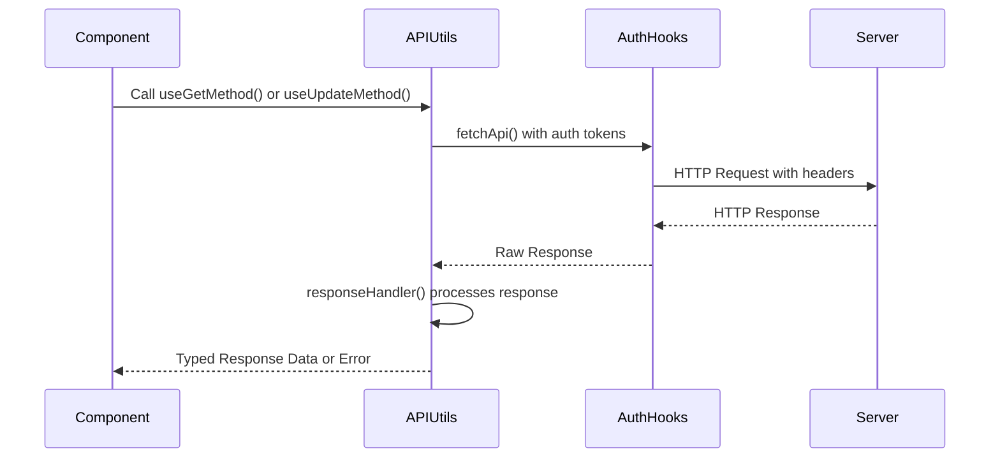
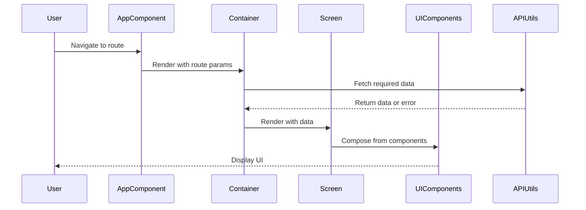

# Hyperswitch Control Center - System Patterns

## Architecture Overview

Hyperswitch Control Center follows a modern, type-safe frontend architecture based on ReScript and React. The architecture emphasizes composability, type safety, and clean separation of concerns.

```mermaid
graph TD
    Client[Client Browser]
    API[Hyperswitch API]
    
    subgraph "Frontend Application"
        Components[Component Layer]
        API_Utils[API Utilities]
        State[State Management]
        Screens[Screen Modules]
        Entities[Entity Definitions]
        
        Components --> API_Utils
        Screens --> Components
        Screens --> API_Utils
        Screens --> State
        API_Utils --> Entities
    end
    
    Client --> Frontend Application
    API_Utils --> API
```

## Core Architectural Patterns

### 1. Type-First Development

ReScript enables type-first development, where types guide implementation:

- **Type Definitions**: Extensive use of variant types and records to model domain concepts
- **Interface Files**: .resi files define public interfaces, enforcing encapsulation
- **Pattern Matching**: Leveraged for exhaustive handling of data variants
- **Type Safety**: Compile-time type checking eliminates entire classes of runtime errors

Example from APIUtilsTypes.res:
```rescript
type entityTypeWithVersion = V1(entityName) | V2(v2entityNameType)

type getUrlTypes = (
  ~entityName: entityTypeWithVersion,
  ~methodType: Fetch.requestMethod,
  ~id: option<string>=?,
  ~connector: option<string>=?,
  ~userType: userType=?,
  ~userRoleTypes: userRoleTypes=?,
  ~reconType: reconType=?,
  ~hypersenseType: hypersenseType=?,
  ~queryParamerters: option<string>=?,
) => string
```

### 2. Centralized API Communication

API communication is centralized through a set of utilities:

- **URL Generation**: Consistently formatted URLs based on entity type and parameters
- **Request Handling**: Standardized request/response handling with error management
- **Type Safety**: Strongly typed request parameters and response handling
- **Auth Integration**: Authentication state management integrated with API calls

The pattern allows for:
- Consistent error handling
- Centralized authentication
- Type-safe API interactions across the application

### 3. Component Composition

UI is built through component composition with clear interfaces:

- **Typed Props**: All component props are explicitly typed
- **Variant Pattern**: Components often accept variant types for different states
- **Context Usage**: Theme and other app-wide settings provided via React Context
- **Composition**: Complex UI assembled from simpler building blocks

Example from Button.res:
```rescript
type buttonState = Normal | Loading | Disabled | NoHover | Focused
type buttonVariant = Fit | Long | Full | Rounded
type buttonType = Primary | Secondary | PrimaryOutline | ...

@react.component
let make = (
  ~buttonState: buttonState=Normal,
  ~buttonType: buttonType=SecondaryFilled,
  ~buttonVariant: buttonVariant=Fit,
  // ... other props
) => {
  // Implementation
}
```

### 4. Feature Module Organization

Application is organized into feature modules:

- **Module Pattern**: Each major feature has its own module directory
- **App Component**: Entry point for the feature (e.g., HypersenseApp)
- **Container Components**: Handle business logic and data management
- **Screen Components**: Handle presentation and user interaction
- **Shared Components**: Reusable across multiple features

Example module structure:
```
src/
  ├── IntelligentRouting/
  │   ├── IntelligentRoutingApp.res    # Entry point
  │   ├── IntelligentRoutingContainer/ # Logic containers
  │   └── IntelligentRoutingScreens/   # UI components
  ├── Recon/
  ├── Hypersense/
  └── ...
```

### 5. State Management Patterns

State management uses Recoil with ReScript bindings:

- **Atom Pattern**: State broken into small, composable atoms
- **Selector Pattern**: Derived state computed from atoms
- **User Information Context**: Global user/auth state provided via context
- **Local vs. Global State**: Clear separation of local component state from global application state

### 6. Styling Approach

Styling leverages Tailwind CSS with a focus on:

- **Utility Classes**: Components use utility classes for styling
- **Theme Configuration**: Global theme settings through context
- **Dark Mode Support**: Consistent dark/light mode patterns
- **Responsive Design**: Mobile-first approach with responsive utilities

### 7. Error Handling Pattern

Robust error handling approach:

- **Try-Catch Pattern**: Error boundaries around API calls
- **Global Error State**: Centralized error state management
- **Toast Notifications**: User-facing error notifications
- **Logging**: Error events sent to monitoring systems

From APIUtils.res:
```rescript
let responseHandler = async (
  ~url,
  ~res,
  ~showToast: ToastState.showToastFn,
  ~showErrorToast: bool,
  // ...
) => {
  // Standard error handling logic
}
```

## Data Flow Patterns

### API Request Flow



### Component Rendering Flow



## Security Patterns

1. **Authentication**
   - Token-based authentication
   - Session management
   - Automatic redirection on auth failure

2. **Authorization**
   - Role-based access control
   - Feature-based permissions
   - UI elements conditionally rendered based on permissions

3. **Secure Communication**
   - HTTPS for all API communication
   - Secure handling of credentials

## Feature Flag Pattern

Features can be enabled/disabled through a configuration system:

- **Configuration Files**: Feature flags defined in config files
- **Environment Variables**: Runtime overrides through environment variables
- **UI Adaptation**: Components conditionally render based on feature flags

## Extensibility Patterns

The architecture supports extensibility through:

1. **Plugin Architecture**: Major features implemented as pluggable modules
2. **Consistent Interfaces**: Standard patterns for components and API interactions
3. **Theme Customization**: Themeable UI components with customization points
4. **Feature Flags**: Selective enabling of features based on configuration
