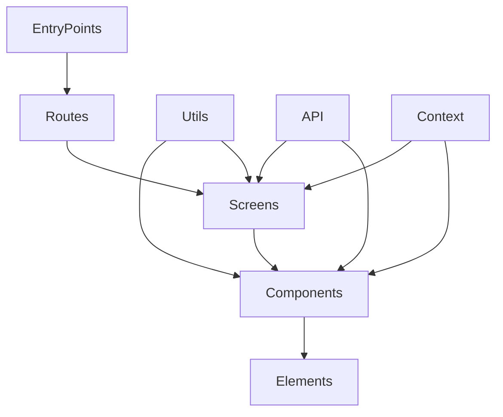

# Component Architecture

This document outlines the component relationships and overall structure within the application.

## Component Relationships

The following diagram illustrates the typical flow and relationship between different types of components in the system:

## Component Structure

The application follows a modular component structure, with clear separation of concerns:

### Core Components

1.  **Entry Points**: Application entry points

    - Located in `src/entryPoints/`

2.  **Container**: Reusable API values

    - Located in `src/container/`

3.  **Screens**: Main screen components for different sections of the application

    - Located in `src/screens/`
    - Organized by feature area (e.g., `login`, `orders`)

4.  **Components**: Reusable UI components

    - Located in `src/components/`
    - Follows a component-based architecture for reusability

5.  **Utils**: Utility functions and helpers

    - Located in `src/utils/`
    - Includes common functionality used across the application

6.  **API**: API integration and data fetching

    - Located in `src/APIUtils/`
    - Handles communication with backend services

7.  **Context**: Context providers for managing application state
    - Located in `src/context/`
    - Provides a way to share data between components
