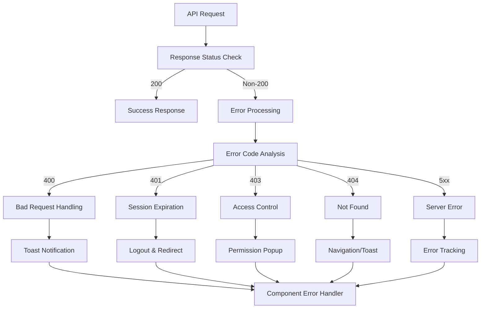

# API Error Handling in Hyperswitch

This document provides a comprehensive guide to error handling in the Hyperswitch Control Center's API layer, focusing on how the `APIUtils` module manages errors, notifications, and recovery.

## Overview

Error handling is a critical aspect of the Hyperswitch API layer, ensuring that API failures are properly managed, communicated to users, and handled gracefully by the application. The error handling system provides:

1. Centralized error processing
2. User-friendly error notifications
3. Session management
4. Access control enforcement
5. Detailed error tracking and analytics



## Error Handling Architecture

### 1. Response Processing

The `responseHandler` function is the core of the error handling system:

```rescript
let responseHandler = async (
  ~url,
  ~res,
  ~showToast: ToastState.showToastFn,
  ~showErrorToast: bool,
  ~showPopUp: PopUpState.popUpProps => unit,
  ~isPlayground,
  ~popUpCallBack,
  ~handleLogout,
  ~sendEvent: (
    ~eventName: string,
    ~email: string=?,
    ~description: option<'a>=?,
    ~section: string=?,
    ~metadata: JSON.t=?,
  ) => unit,
) => {
  // Extract JSON from response
  let json = try {
    await res->(res => res->Fetch.Response.json)
  } catch {
  | _ => JSON.Encode.null
  }

  // Get response status and headers
  let responseStatus = res->Fetch.Response.status
  let responseHeaders = res->Fetch.Response.headers

  // Special handling for server errors (5xx)
  if responseStatus >= 500 && responseStatus < 600 {
    let xRequestId = responseHeaders->Fetch.Headers.get("x-request-id")->Option.getOr("")
    let metaData = [
      ("url", url->JSON.Encode.string),
      ("response", json),
      ("status", responseStatus->JSON.Encode.int),
      ("x-request-id", xRequestId->JSON.Encode.string),
    ]->getJsonFromArrayOfJson
    sendEvent(~eventName="API Error", ~description=Some(responseStatus), ~metadata=metaData)
  }

  // Process based on status code
  switch responseStatus {
  | 200 => json // Success case
  | _ => {
      // Extract error information
      let errorDict = json->getDictFromJsonObject->getObj("error", Dict.make())
      let errorStringifiedJson = errorDict->JSON.Encode.object->JSON.stringify

      // Check for playground mode
      if isPlayground && responseStatus === 403 {
        popUpCallBack()
      } else if showErrorToast {
        // Handle different error types based on status
        switch responseStatus {
        | 400 => // Bad Request handling
        | 401 => // Session expiration handling
        | 403 => // Forbidden/access control handling
        | 404 => // Not found handling
        | _ => // Generic error handling
        }
      }
      // Throw the error for the caller to handle
      Exn.raiseError(errorStringifiedJson)
    }
  }
}
```

### 2. Exception Handling

When exceptions occur during API calls, they are caught and processed by the `catchHandler` function:

```rescript
let catchHandler = (
  ~err,
  ~showErrorToast,
  ~showToast: ToastState.showToastFn,
  ~isPlayground,
  ~popUpCallBack,
) => {
  // Extract error message if available
  switch Exn.message(err) {
  | Some(msg) => Exn.raiseError(msg)
  | None => {
      // Special handling for playground mode
      if isPlayground {
        popUpCallBack()
      } else if showErrorToast {
        // Generic error notification
        showToast(~toastType=ToastError, ~message="Something Went Wrong", ~autoClose=false)
      }
      Exn.raiseError("Failed to Fetch")
    }
  }
}
```

## Error Response Structure

The API returns errors in a consistent format:

```json
{
  "error": {
    "type": "invalid_request_error",
    "code": "HE_01",
    "message": "Invalid request data",
    "details": {
      "field": "amount",
      "reason": "Amount must be greater than zero"
    }
  }
}
```

Key fields:

- `type`: General error category
- `code`: Specific error code (e.g., "HE_01")
- `message`: Human-readable error message
- `details`: Additional context about the error

## Status Code Handling

### 400 Bad Request

For 400 errors, the system looks for specific error codes to determine appropriate actions:

```rescript
| 400 => {
    let errorCode = errorDict->getString("code", "")
    switch errorCode->CommonAuthUtils.errorSubCodeMapper {
    | HE_02 | UR_33 =>
      // Redirect to home page for certain error codes
      RescriptReactRouter.replace(GlobalVars.appendDashboardPath(~url="/home"))
    | _ => ()
    }
  }
```

### 401 Unauthorized

For 401 errors, the system handles session expiration:

```rescript
| 401 =>
  // Only handle session expiration once
  if !sessionExpired.contents {
    // Show warning toast
    showToast(~toastType=ToastWarning, ~message="Session Expired", ~autoClose=false)

    // Perform logout and redirect
    handleLogout()->ignore
    AuthUtils.redirectToLogin()

    // Set flag to prevent duplicate handling
    sessionExpired := true
  }
```

### 403 Forbidden

For 403 errors, the system shows an access control popup:

```rescript
| 403 =>
  // Show access control popup
  showPopUp({
    popUpType: (Warning, WithIcon),
    heading: "Access Forbidden",
    description: {
      noAccessControlText->React.string
    },
    handleConfirm: {
      text: "Close",
      onClick: {
        _ => ()
      },
    },
  })
```

### 404 Not Found

For 404 errors, the system may redirect or show notifications:

```rescript
| 404 => {
    let errorCode = errorDict->getString("code", "")
    switch errorCode->CommonAuthUtils.errorSubCodeMapper {
    | HE_02 => RescriptReactRouter.replace(GlobalVars.appendDashboardPath(~url="/home"))
    | _ => ()
    }
  }
```

### 5xx Server Errors

For server errors, the system tracks the event and shows a generic notification:

```rescript
// Special handling for 5xx errors
if responseStatus >= 500 && responseStatus < 600 {
  let xRequestId = responseHeaders->Fetch.Headers.get("x-request-id")->Option.getOr("")
  let metaData = [
    ("url", url->JSON.Encode.string),
    ("response", json),
    ("status", responseStatus->JSON.Encode.int),
    ("x-request-id", xRequestId->JSON.Encode.string),
  ]->getJsonFromArrayOfJson
  sendEvent(~eventName="API Error", ~description=Some(responseStatus), ~metadata=metaData)
}
```

## Error Notification System

The system uses two primary methods for notifying users about errors:

### 1. Toast Notifications

Toast notifications provide non-blocking feedback about errors:

```rescript
showToast(
  ~toastType=ToastError,
  ~message=errorDict->getString("message", "Error Occurred"),
  ~autoClose=false,
)
```

Toast types:

- `ToastError`: For critical errors
- `ToastWarning`: For warnings like session expiration
- `ToastInfo`: For informational messages

### 2. Popup Dialogs

For more serious errors that require acknowledgment, popup dialogs are used:

```rescript
showPopUp({
  popUpType: (Warning, WithIcon),
  heading: "Access Forbidden",
  description: {
    noAccessControlText->React.string
  },
  handleConfirm: {
    text: "Close",
    onClick: {
      _ => ()
    },
  },
})
```

## Session Management

The system includes specialized handling for session management errors:

```rescript
// Session expiration tracking
let sessionExpired = ref(false)

// Session expiration handling
if !sessionExpired.contents {
  showToast(~toastType=ToastWarning, ~message="Session Expired", ~autoClose=false)

  handleLogout()->ignore
  AuthUtils.redirectToLogin()

  sessionExpired := true
}
```

## Error Handling in Components

Components should implement try/catch blocks around API calls:

```rescript
// Basic error handling
try {
  setLoading(_ => true)
  let url = getURL(~entityName=V1(ORDERS), ~methodType=Get)
  let response = await getMethod(url)
  setData(_ => response["data"])
} catch {
| _ => setError(_ => Some("Failed to load data"))
} finally {
  setLoading(_ => false)
}

// More advanced error handling
try {
  // API call
} catch {
| Exn.Error(e) => {
    // Extract detailed error information
    let errorMsg = switch Exn.message(e) {
    | Some(msg) => {
        // Try to parse as JSON
        try {
          let json = msg->JSON.parse
          let errorObj = json->getDictFromJsonObject
          errorObj->getString("message", "An error occurred")
        } catch {
        | _ => msg
        }
      }
    | None => "Unknown error"
    }

    setError(_ => Some(errorMsg))
  }
}
```

## Controlling Error Notifications

The `showErrorToast` parameter in API methods allows components to control whether automatic error notifications are shown:

```rescript
// With automatic error notifications
let getMethod = APIUtils.useGetMethod(~showErrorToast=true)

// Without automatic error notifications (for custom handling)
let getMethodSilent = APIUtils.useGetMethod(~showErrorToast=false)

// Usage with custom error handling
try {
  let response = await getMethodSilent(url)
  // Process response
} catch {
| Exn.Error(e) => {
    // Custom error UI or processing
    setCustomErrorUI(_ => true)
  }
}
```

## Error Codes and Handling

The system uses error codes to identify specific error conditions:

```rescript
switch errorCode->CommonAuthUtils.errorSubCodeMapper {
| HE_01 => // General error
| HE_02 => // Resource not found
| UR_33 => // User permission error
| _ => // Unknown error
}
```

Common error codes:

| Code  | Description          | Handling             |
| ----- | -------------------- | -------------------- |
| HE_01 | General error        | Display message      |
| HE_02 | Resource not found   | Redirect to home     |
| UR_33 | Permission error     | Redirect to home     |
| AU_01 | Authentication error | Show login prompt    |
| AU_02 | Session expired      | Logout and redirect  |
| VA_01 | Validation error     | Highlight form field |

## Playground Mode Error Handling

The system has special handling for the playground/demo mode:

```rescript
let isPlayground = HSLocalStorage.getIsPlaygroundFromLocalStorage()

// Check for playground mode and access errors
if isPlayground && responseStatus === 403 {
  popUpCallBack()
}

// Prompt to sign up
let popUpCallBack = () =>
  showPopUp({
    popUpType: (Warning, WithIcon),
    heading: "Sign Up to Access All Features!",
    description: {
      "To unlock the potential and experience the full range of capabilities, simply sign up today."->React.string
    },
    handleConfirm: {
      text: "Sign up Now",
      onClick: {
        _ => handleLogout()->ignore
      },
    },
  })
```

## Error Tracking and Analytics

The system integrates with analytics to track API errors:

```rescript
if responseStatus >= 500 && responseStatus < 600 {
  let xRequestId = responseHeaders->Fetch.Headers.get("x-request-id")->Option.getOr("")
  let metaData = [
    ("url", url->JSON.Encode.string),
    ("response", json),
    ("status", responseStatus->JSON.Encode.int),
    ("x-request-id", xRequestId->JSON.Encode.string),
  ]->getJsonFromArrayOfJson
  sendEvent(~eventName="API Error", ~description=Some(responseStatus), ~metadata=metaData)
}
```

This tracking helps identify patterns in errors and monitor API health.

## Best Practices

### 1. Always Use Try/Catch

Always wrap API calls in try/catch blocks:

```rescript
try {
  let response = await getMethod(url)
  // Process response
} catch {
| _ => // Error handling
} finally {
  // Cleanup
}
```

### 2. Set Loading States

Track loading states for better UX:

```rescript
try {
  setLoading(_ => true)
  // API call
} catch {
| _ => // Error handling
} finally {
  setLoading(_ => false)
}
```

### 3. Handle Specific Error Cases

Handle specific error cases when possible:

```rescript
catch {
| Exn.Error(e) => {
    let msg = Exn.message(e)->Option.getOr("Unknown error")
    if msg->Js.String2.includes("validation") {
      // Handle validation errors
    } else if msg->Js.String2.includes("not found") {
      // Handle not found errors
    } else {
      // Generic error handling
    }
  }
}
```

### 4. Use Error State

Maintain error state for feedback:

```rescript
let (data, setData) = React.useState(_ => None)
let (loading, setLoading) = React.useState(_ => false)
let (error, setError) = React.useState(_ => None)

// In UI
switch (loading, data, error) {
| (true, _, _) => <LoadingSpinner />
| (false, Some(data), _) => <DataDisplay data />
| (false, None, Some(errorMsg)) => <ErrorDisplay message=errorMsg />
| (false, None, None) => <EmptyState />
}
```

### 5. Silent Error Handling

Use `showErrorToast=false` for custom error handling:

```rescript
let getMethodSilent = APIUtils.useGetMethod(~showErrorToast=false)

try {
  let response = await getMethodSilent(url)
  // Process response
} catch {
| Exn.Error(e) => {
    // Custom error UI instead of toast
    showCustomErrorModal(e)
  }
}
```

### 6. Graceful Degradation

Design for graceful degradation when API errors occur:

```rescript
// Fall back to cached data on API failure
try {
  let response = await getMethod(url)
  setData(_ => response["data"])
  // Also update cache
  LocalStorage.setItem("cached_data", JSON.stringify(response["data"]))
} catch {
| _ => {
    // Try to load from cache
    let cachedData = LocalStorage.getItem("cached_data")
    if cachedData !== null {
      try {
        setData(_ => JSON.parse(cachedData))
        setError(_ => Some("Using cached data due to connectivity issues"))
      } catch {
      | _ => setError(_ => Some("Failed to load data"))
      }
    } else {
      setError(_ => Some("Failed to load data"))
    }
  }
}
```

## Common Error Patterns

### 1. Form Validation Errors

For form validation errors (typically 400 status):

```rescript
try {
  let response = await updateMethod(url, formData, Post)
  // Success handling
} catch {
| Exn.Error(e) => {
    let msg = Exn.message(e)->Option.getOr("{}")
    try {
      let errorJson = JSON.parse(msg)
      let errorObj = errorJson->getDictFromJsonObject
      let fieldErrors = errorObj->getObj("details", Dict.make())

      // Set field-specific errors
      setFieldErrors(_ => fieldErrors)
    } catch {
    | _ => setGenericError(_ => "Invalid form data")
    }
  }
}
```

### 2. Session Expiration

For session expiration (401 status), the system already handles this centrally, but components can add additional handling:

```rescript
try {
  let response = await getMethod(url)
  // Process response
} catch {
| Exn.Error(e) => {
    let msg = Exn.message(e)->Option.getOr("")
    if msg->Js.String2.includes("401") || msg->Js.String2.includes("unauthorized") {
      // Save current state or work
      LocalStorage.setItem("saved_draft", JSON.stringify(currentDraft))

      // The system will handle logout and redirect
    } else {
      // Handle other errors
    }
  }
}
```

### 3. Access Control

For access control errors (403 status):

```rescript
try {
  let response = await getMethod(url)
  // Process response
} catch {
| Exn.Error(e) => {
    let msg = Exn.message(e)->Option.getOr("")
    if msg->Js.String2.includes("403") || msg->Js.String2.includes("forbidden") {
      // Show limited/restricted UI
      setUiMode(_ => Restricted)
    } else {
      // Handle other errors
    }
  }
}
```

### 4. Not Found

For not found errors (404 status):

```rescript
try {
  let response = await getMethod(url)
  // Process response
} catch {
| Exn.Error(e) => {
    let msg = Exn.message(e)->Option.getOr("")
    if msg->Js.String2.includes("404") || msg->Js.String2.includes("not found") {
      // Show not found UI
      setNotFound(_ => true)
    } else {
      // Handle other errors
    }
  }
}
```

### 5. Server Errors

For server errors (5xx status):

```rescript
try {
  let response = await getMethod(url)
  // Process response
} catch {
| Exn.Error(e) => {
    let msg = Exn.message(e)->Option.getOr("")
    if msg->Js.String2.includes("500") || msg->Js.String2.includes("server error") {
      // Show temporary outage message
      setServerDown(_ => true)

      // Schedule retry
      let _ = Js.Global.setTimeout(() => {
        fetchData()->ignore
      }, 5000)
    } else {
      // Handle other errors
    }
  }
}
```

## Conclusion

The error handling system in Hyperswitch's API layer provides a comprehensive approach to managing errors, with centralized processing, user-friendly notifications, and detailed tracking. By leveraging this system effectively, components can create robust error handling that enhances the user experience even when things go wrong.
