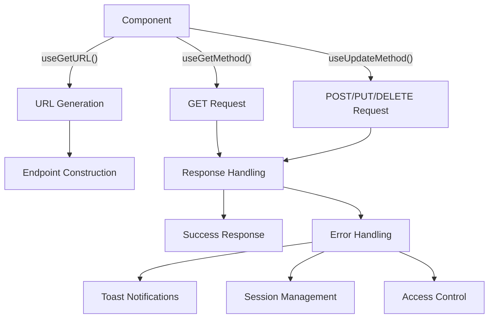

# APIUtils in Hyperswitch

This document provides a comprehensive overview of the API utilities in the Hyperswitch Control Center, focusing on the implementation in the `src/APIUtils/` directory.

## Overview

The APIUtils module serves as the central interface for all API interactions within the Hyperswitch Control Center. It provides a type-safe approach to making API requests, handling responses, managing errors, and constructing endpoints dynamically based on the application state.



## Core Components

### 1. Type System

The type system is defined in `APIUtilsTypes.res` and provides comprehensive type safety for API interactions:

```rescript
// Entity type for V1 endpoints
type entityName =
  | CONNECTOR
  | ROUTING
  | MERCHANT_ACCOUNT
  | ORDERS
  // Many more entity types...

// Entity type for V2 endpoints
type v2entityNameType =
  | CUSTOMERS
  | V2_CONNECTOR
  | V2_ORDERS_LIST
  // Other V2 entity types...

// Combined type for all endpoints
type entityTypeWithVersion = V1(entityName) | V2(v2entityNameType)

// Type for the URL generation function
type getUrlTypes = (
  ~entityName: entityTypeWithVersion,
  ~methodType: Fetch.requestMethod,
  ~id: option<string>=?,
  ~connector: option<string>=?,
  ~userType: userType=?,
  ~userRoleTypes: userRoleTypes=?,
  ~reconType: reconType=?,
  ~hypersenseType: hypersenseType=?,
  ~queryParameters: option<string>=?,
) => string
```

### 2. URL Generation

The URL generation logic is the heart of the API system, dynamically constructing endpoints based on numerous factors:

#### V1 URL Generation

```rescript
let useGetURL = () => {
  let {getUserInfoData} = React.useContext(UserInfoProvider.defaultContext)

  let getUrl = (
    ~entityName: entityTypeWithVersion,
    ~methodType: Fetch.requestMethod,
    ~id=None,
    ~connector=None,
    ~userType: userType=#NONE,
    ~userRoleTypes: userRoleTypes=NONE,
    ~reconType: reconType=#NONE,
    ~hypersenseType: hypersenseType=#NONE,
    ~queryParameters: option<string>=None,
  ) => {
    let {transactionEntity, analyticsEntity, userEntity, merchantId, profileId} = getUserInfoData()
    let connectorBaseURL = `account/${merchantId}/connectors`

    let endpoint = switch entityName {
    | V1(entityNameType) =>
      // Complex pattern matching based on entity type, method, IDs, etc.
      // ...
    | V2(entityNameForv2) =>
      getV2Url(
        ~entityName=entityNameForv2,
        ~userType,
        ~id,
        ~methodType,
        ~queryParameters,
        ~profileId,
        ~merchantId,
      )
    }

    `${Window.env.apiBaseUrl}/${endpoint}`
  }
  getUrl
}
```

#### V2 URL Generation

```rescript
let getV2Url = (
  ~entityName: v2entityNameType,
  ~userType: userType=#NONE,
  ~methodType: Fetch.requestMethod,
  ~id=None,
  ~profileId,
  ~merchantId,
  ~queryParameters: option<string>=None,
) => {
  let connectorBaseURL = "v2/connector-accounts"
  let peymantsBaseURL = "v2/payments"

  switch entityName {
  | CUSTOMERS =>
    // Handle customer endpoints
  | V2_CONNECTOR =>
    // Handle connector endpoints
  // ...many more entity types
  }
}
```

### 3. API Request Methods

The module provides two primary methods for making API requests:

#### GET Requests

```rescript
let useGetMethod = (~showErrorToast=true) => {
  // Access user context, auth hooks, toast notifications, etc.

  async (url, ~version=UserInfoTypes.V1) => {
    try {
      let res = await fetchApi(
        url,
        ~method_=Get,
        ~xFeatureRoute,
        ~forceCookies,
        ~merchantId,
        ~profileId,
        ~version,
      )
      await responseHandler(
        ~url,
        ~res,
        ~showErrorToast,
        ~showToast,
        ~showPopUp,
        ~isPlayground,
        ~popUpCallBack,
        ~handleLogout,
        ~sendEvent,
      )
    } catch {
    | Exn.Error(e) =>
      catchHandler(~err={e}, ~showErrorToast, ~showToast, ~isPlayground, ~popUpCallBack)
    | _ => Exn.raiseError("Something went wrong")
    }
  }
}
```

#### POST/PUT/DELETE Requests

```rescript
let useUpdateMethod = (~showErrorToast=true) => {
  // Access user context, auth hooks, toast notifications, etc.

  async (
    url,
    body,
    method,
    ~bodyFormData=?,
    ~headers=Dict.make(),
    ~contentType=AuthHooks.Headers("application/json"),
    ~version=UserInfoTypes.V1,
  ) => {
    try {
      let res = await fetchApi(
        url,
        ~method_=method,
        ~bodyStr=body->JSON.stringify,
        ~bodyFormData,
        ~headers,
        ~contentType,
        ~xFeatureRoute,
        ~forceCookies,
        ~merchantId,
        ~profileId,
        ~version,
      )
      await responseHandler(
        ~url,
        ~res,
        ~showErrorToast,
        ~showToast,
        ~isPlayground,
        ~showPopUp,
        ~popUpCallBack,
        ~handleLogout,
        ~sendEvent,
      )
    } catch {
    | Exn.Error(e) =>
      catchHandler(~err={e}, ~showErrorToast, ~showToast, ~isPlayground, ~popUpCallBack)
    | _ => Exn.raiseError("Something went wrong")
    }
  }
}
```

### 4. Response Handling

The response handling logic processes both successful and failed responses:

```rescript
let responseHandler = async (
  ~url,
  ~res,
  ~showToast: ToastState.showToastFn,
  ~showErrorToast: bool,
  ~showPopUp: PopUpState.popUpProps => unit,
  ~isPlayground,
  ~popUpCallBack,
  ~handleLogout,
  ~sendEvent: (
    ~eventName: string,
    ~email: string=?,
    ~description: option<'a>=?,
    ~section: string=?,
    ~metadata: JSON.t=?,
  ) => unit,
) => {
  let json = try {
    await res->(res => res->Fetch.Response.json)
  } catch {
  | _ => JSON.Encode.null
  }

  let responseStatus = res->Fetch.Response.status
  let responseHeaders = res->Fetch.Response.headers

  // Special handling for 5xx errors
  if responseStatus >= 500 && responseStatus < 600 {
    // Send event for API error
  }

  switch responseStatus {
  | 200 => json // Return the JSON on success
  | _ => {
      // Handle different error codes
      switch responseStatus {
      | 400 => // Handle 400 errors
      | 401 => // Handle session expiration
      | 403 => // Handle forbidden access
      | 404 => // Handle not found
      | _ => // Handle other errors
      }
      // Raise error for caller to handle
      Exn.raiseError(errorStringifiedJson)
    }
  }
}
```

### 5. Error Handling

The module includes sophisticated error handling:

```rescript
let catchHandler = (
  ~err,
  ~showErrorToast,
  ~showToast: ToastState.showToastFn,
  ~isPlayground,
  ~popUpCallBack,
) => {
  switch Exn.message(err) {
  | Some(msg) => Exn.raiseError(msg)
  | None => {
      // Handle cases where error has no message
      if isPlayground {
        popUpCallBack()
      } else if showErrorToast {
        showToast(~toastType=ToastError, ~message="Something Went Wrong", ~autoClose=false)
      }
      Exn.raiseError("Failed to Fetch")
    }
  }
}
```

### 6. Session Management

The module handles session management, including logout functionality:

```rescript
let useHandleLogout = (~eventName="user_sign_out") => {
  let getURL = useGetURL()
  let mixpanelEvent = MixpanelHook.useSendEvent()
  let {setAuthStateToLogout} = React.useContext(AuthInfoProvider.authStatusContext)
  let clearRecoilValue = ClearRecoilValueHook.useClearRecoilValue()
  let fetchApi = AuthHooks.useApiFetcher()

  () => {
    try {
      let logoutUrl = getURL(~entityName=V1(USERS), ~methodType=Post, ~userType=#SIGNOUT)
      // Send logout event, clear auth state, and clean up local storage
      // ...
    } catch {
    | _ => CommonAuthUtils.clearLocalStorage()
    }
  }
}

// Session expiration tracking
let sessionExpired = ref(false)
```

## Usage Patterns

### Basic API Call

```rescript
// In a component
let getURL = APIUtils.useGetURL()
let getMethod = APIUtils.useGetMethod()

// Effect for fetching data
React.useEffect0(() => {
  let fetchPayments = async () => {
    try {
      setLoading(_ => true)
      let url = getURL(~entityName=V1(ORDERS), ~methodType=Get)
      let response = await getMethod(url)
      setPayments(_ => response["data"])
    } catch {
    | _ => () // Error handling
    } finally {
      setLoading(_ => false)
    }
  }

  fetchPayments()->ignore
  None
})
```

### POST Request with Body

```rescript
let updateMethod = APIUtils.useUpdateMethod()

let createRefund = async () => {
  setSubmitting(_ => true)
  try {
    let url = getURL(~entityName=V1(REFUNDS), ~methodType=Post)
    let body = {
      "payment_id": paymentId,
      "amount": amount->Float.fromString->Option.getOr(0.0),
      "reason": reason,
    }
    let _ = await updateMethod(url, body, Post)
    // Handle success
  } catch {
  | _ => () // Error handling
  } finally {
    setSubmitting(_ => false)
  }
}
```

### Error Handling in Components

```rescript
try {
  // Make API call
} catch {
| Exn.Error(e) => {
    // The APIUtils will already have shown a toast notification if showErrorToast=true
    // Additional handling if needed:
    let errorMessage = Exn.message(e)->Option.getOr("Unknown error")
    setError(_ => Some(errorMessage))
  }
}
```

## Key Features

### 1. Type Safety

The APIUtils module leverages ReScript's type system to ensure:

- All API endpoints follow the expected structure
- Method types match endpoint capabilities
- Proper handling of optional parameters
- Comprehensive error handling

### 2. Context-Aware URL Construction

The URL generation automatically adapts based on:

- User's entity context (Merchant, Profile, Organization, Tenant)
- API versioning (V1 vs V2)
- Transaction entity context
- Analytics entity context

### 3. Centralized Error Handling

Error handling is consistently managed across the application:

- Notification system for user-facing errors
- Session expiration detection and handling
- Access control verification
- Playground mode special handling
- API error tracking and analytics

### 4. Security Integration

The module integrates with the application's security system:

- Authentication headers
- Session management
- Access control enforcement
- Security event tracking

## Common URL Patterns

### Payments

```
GET    v1/payments/{id}                - Get payment details
GET    v1/payments/list                - List payments
POST   v1/payments/list                - Search payments
GET    v1/payments/aggregate           - Get payment aggregates
GET    v1/payments/v2/filter           - Get payment filters
GET    v2/payments/{id}                - Get payment details (v2)
GET    v2/payments/list                - List payments (v2)
GET    v2/payments/profile/filter      - Get profile payment filters (v2)
```

### Refunds

```
GET    v1/refunds/{id}                 - Get refund details
GET    v1/refunds/list                 - List refunds
POST   v1/refunds                      - Create refund
GET    v1/refunds/aggregate            - Get refund aggregates
GET    v1/refunds/v2/filter            - Get refund filters
```

### Disputes

```
GET    v1/disputes/{id}                - Get dispute details
GET    v1/disputes/list                - List disputes
GET    v1/disputes/aggregate           - Get dispute aggregates
GET    v1/disputes/filter              - Get dispute filters
POST   v1/disputes/evidence/{id}       - Submit dispute evidence
POST   v1/disputes/accept/{id}         - Accept dispute
```

### Connectors

```
GET    v1/account/{merchantId}/connectors          - List connectors
GET    v1/account/{merchantId}/connectors/{id}     - Get connector details
POST   v1/account/{merchantId}/connectors          - Create connector
POST   v1/account/{merchantId}/connectors/{id}     - Update connector
GET    v2/profiles/{profileId}/connector-accounts  - List connector accounts (v2)
```

### User Management

```
POST   v1/user/signin                  - Sign in
POST   v1/user/signout                 - Sign out
POST   v1/user/signup                  - Sign up
GET    v1/user/data                    - Get user data
POST   v1/user/create_org              - Create organization
POST   v1/user/create_merchant         - Create merchant
```

## Best Practices

1. **Type-First Approach**
   - Always use the proper entity types when constructing URLs
   - Let ReScript's type system validate your API calls

2. **Centralized URL Generation**
   - Always use `useGetURL()` for constructing API endpoints
   - Never hardcode URLs in components

3. **Consistent Error Handling**
   - Use the `showErrorToast` parameter to control user-facing errors
   - Add specific error handling in components as needed

4. **Request Isolation**
   - Wrap each API call in its own try/catch block
   - Avoid chaining multiple API calls without error handling

5. **Response Typing**
   - Cast response data to typed structures
   - Use option types for potentially missing values

6. **Loading States**
   - Track loading states for UX feedback
   - Use finally blocks to ensure loading states are reset

## Implementation Details

### Feature Flags Integration

The APIUtils module integrates with feature flags:

```rescript
let {xFeatureRoute, forceCookies} = HyperswitchAtom.featureFlagAtom->Recoil.useRecoilValueFromAtom
```

These flags control:

- Route versioning and feature availability
- Cookie handling for API requests

### Playground Mode

The module has special handling for playground/demo mode:

```rescript
let isPlayground = HSLocalStorage.getIsPlaygroundFromLocalStorage()

let popUpCallBack = () =>
  showPopUp({
    popUpType: (Warning, WithIcon),
    heading: "Sign Up to Access All Features!",
    description: {
      "To unlock the potential and experience the full range of capabilities, simply sign up today..."
    },
    // ...
  })
```

This provides a controlled experience for demo users while encouraging sign-up.

### Analytics Integration

The module integrates with analytics tracking:

```rescript
let sendEvent = MixpanelHook.useSendEvent()

// Tracking API errors
if responseStatus >= 500 && responseStatus < 600 {
  let xRequestId = responseHeaders->Fetch.Headers.get("x-request-id")->Option.getOr("")
  let metaData = [
    ("url", url->JSON.Encode.string),
    ("response", json),
    ("status", responseStatus->JSON.Encode.int),
    ("x-request-id", xRequestId->JSON.Encode.string),
  ]->getJsonFromArrayOfJson
  sendEvent(~eventName="API Error", ~description=Some(responseStatus), ~metadata=metaData)
}
```

This provides visibility into API health and performance.

## Common Errors and Handling

| Error Code | Type         | Handling                                             |
| ---------- | ------------ | ---------------------------------------------------- |
| 400        | Bad Request  | Specific error code checking, toast notification     |
| 401        | Unauthorized | Session expiration, redirect to login                |
| 403        | Forbidden    | Access control popup, explaining missing permissions |
| 404        | Not Found    | Potentially redirect to home, toast notification     |
| 5xx        | Server Error | Event tracking, toast notification                   |

## Conclusion

The APIUtils module provides a robust, type-safe interface for all API interactions in the Hyperswitch Control Center. Its structured approach to URL generation, request handling, error management, and response processing ensures consistent behavior throughout the application while leveraging ReScript's powerful type system to prevent common mistakes.
