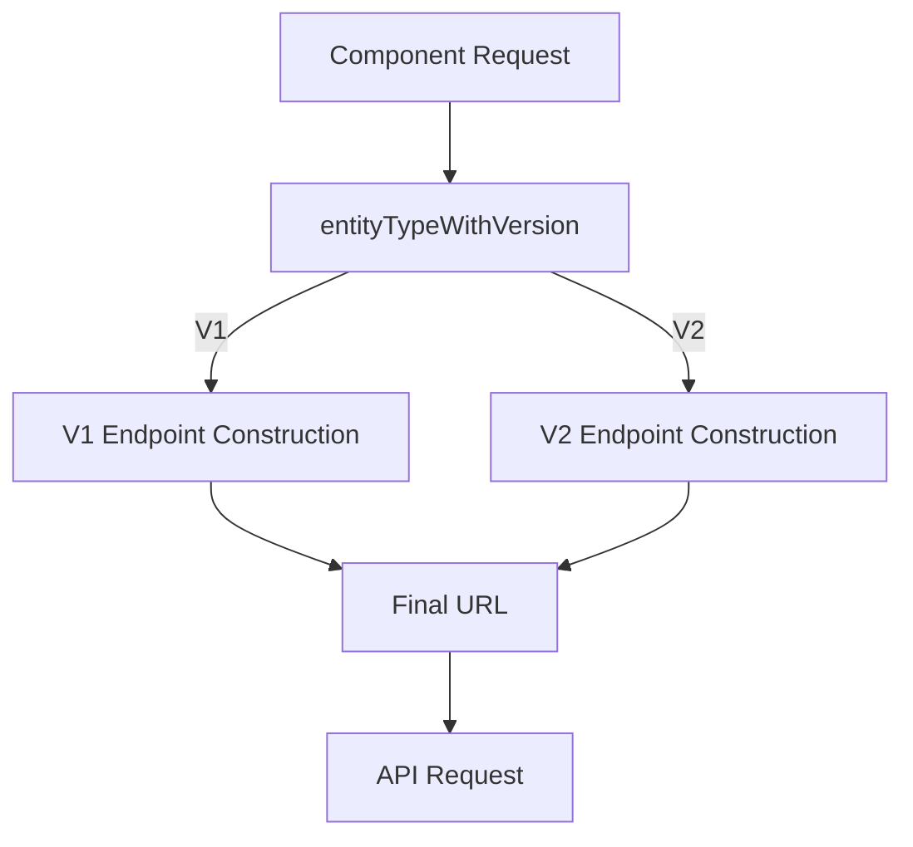

# API Versioning in Hyperswitch

This document explains the API versioning strategy in the Hyperswitch Control Center, focusing on how the `APIUtils` module handles multiple API versions.

## Overview

Hyperswitch implements a versioned API approach, primarily using `v1` and `v2` endpoints. The versioning system is designed to support backward compatibility while allowing for new features and improvements in the API structure.



## Type System for Versioning

The version handling is built into the type system, ensuring type safety when constructing endpoints:

```rescript
// V1 entity types
type entityName =
  | CONNECTOR
  | ROUTING
  | MERCHANT_ACCOUNT
  | ORDERS
  // Many more entity types...

// V2 entity types
type v2entityNameType =
  | CUSTOMERS
  | V2_CONNECTOR
  | V2_ORDERS_LIST
  | PAYMENT_METHOD_LIST
  | RETRIEVE_PAYMENT_METHOD
  | V2_ORDER_FILTERS
  | USERS
  | TOTAL_TOKEN_COUNT
  | MERCHANT_ACCOUNT

// Combined type that includes version information
type entityTypeWithVersion = V1(entityName) | V2(v2entityNameType)
```

## URL Generation with Versioning

The URL generation function handles the versioning by examining the `entityTypeWithVersion` parameter:

```rescript
let getUrl = (
  ~entityName: entityTypeWithVersion,
  ~methodType: Fetch.requestMethod,
  ~id=None,
  ~connector=None,
  ~userType: userType=#NONE,
  ~userRoleTypes: userRoleTypes=NONE,
  ~reconType: reconType=#NONE,
  ~hypersenseType: hypersenseType=#NONE,
  ~queryParamerters: option<string>=None,
) => {
  let {transactionEntity, analyticsEntity, userEntity, merchantId, profileId} = getUserInfoData()
  let connectorBaseURL = `account/${merchantId}/connectors`

  let endpoint = switch entityName {
  | V1(entityNameType) =>
    // V1 endpoint construction...
  | V2(entityNameForv2) =>
    getV2Url(
      ~entityName=entityNameForv2,
      ~userType,
      ~id,
      ~methodType,
      ~queryParamerters,
      ~profileId,
      ~merchantId,
    )
  }

  `${Window.env.apiBaseUrl}/${endpoint}`
}
```

## V1 Endpoints

V1 endpoints are constructed directly in the main `getUrl` function using a complex pattern matching system:

```rescript
| V1(entityNameType) =>
  switch entityNameType {
  | CONNECTOR =>
    switch methodType {
    | Get =>
      switch id {
      | Some(connectorID) => `${connectorBaseURL}/${connectorID}`
      | None =>
        switch userEntity {
        | #Tenant
        | #Organization
        | #Merchant
        | #Profile =>
          `account/${merchantId}/profile/connectors`
        }
      }
    | Post | Delete =>
      // More pattern matching...
    | _ => ""
    }
  // Many more entity types...
  }
```

## V2 Endpoints

V2 endpoints are handled by a separate function, `getV2Url`, which is called when the entity type is wrapped in `V2`:

```rescript
let getV2Url = (
  ~entityName: v2entityNameType,
  ~userType: userType=#NONE,
  ~methodType: Fetch.requestMethod,
  ~id=None,
  ~profileId,
  ~merchantId,
  ~queryParamerters: option<string>=None,
) => {
  let connectorBaseURL = "v2/connector-accounts"
  let peymantsBaseURL = "v2/payments"

  switch entityName {
  | CUSTOMERS =>
    switch (methodType, id) {
    | (Get, None) => "v2/customers/list"
    | (Get, Some(customerId)) => `v2/customers/${customerId}`
    | _ => ""
    }
  | V2_CONNECTOR =>
    // V2 connector endpoints...
  | V2_ORDERS_LIST =>
    // V2 orders list endpoints...
  // More V2 entity types...
  }
}
```

## Version Selection in Components

In components, developers specify the version when constructing the URL:

```rescript
// Using a V1 endpoint
let url = getURL(~entityName=V1(ORDERS), ~methodType=Get)

// Using a V2 endpoint
let url = getURL(~entityName=V2(V2_ORDERS_LIST), ~methodType=Get)
```

## API Method Version Parameter

Both `useGetMethod` and `useUpdateMethod` accept an optional version parameter that can be passed to the underlying API fetcher:

```rescript
let useGetMethod = (~showErrorToast=true) => {
  // ...
  async (url, ~version=UserInfoTypes.V1) => {
    try {
      let res = await fetchApi(
        url,
        ~method_=Get,
        // Other parameters...
        ~version,
      )
      // ...
    }
  }
}

// Example usage with explicit version:
let response = await getMethod(url, ~version=UserInfoTypes.V2)
```

## Version-Specific Request Headers

The `fetchApi` function can use the version parameter to adjust request headers:

```rescript
// Setting version-specific headers
let headers = switch version {
| V1 => Dict.fromArray([("User-Entity", userEntity->getUserEntityString)])
| V2 => Dict.fromArray([
    ("User-Entity", userEntity->getUserEntityString),
    ("API-Version", "V2")
  ])
}
```

## Version Differences

### V1 vs V2 Payment Endpoints

| Feature | V1 | V2 |
|---------|----|----|
| Base Path | `/payments` | `/v2/payments` |
| List Endpoint | `/payments/list` | `/v2/payments/list` |
| Filters | `/payments/v2/filter` | `/v2/payments/profile/filter` |
| Response Format | Nested response | Flattened response |
| Pagination | Simple limit/offset | Cursor-based pagination |
| Field Names | `created_at` | `created_at_time` |

### V1 vs V2 Connector Endpoints

| Feature | V1 | V2 |
|---------|----|----|
| Base Path | `/account/{merchantId}/connectors` | `/v2/connector-accounts` |
| List Endpoint | `/account/{merchantId}/profile/connectors` | `/v2/profiles/{profileId}/connector-accounts` |
| Configuration | Nested config | Structured config |
| Metadata | Limited | Enhanced metadata support |

## Migration Strategy

When migrating from V1 to V2 endpoints:

1. **Gradual Adoption**
   - New features should use V2 endpoints
   - Existing features can migrate incrementally

2. **Dual Support Period**
   - Both V1 and V2 endpoints are maintained during transition
   - Feature flags can control which version is used

3. **Component Updates**
   - Update entity types from `V1(ENTITY)` to `V2(V2_ENTITY)`
   - Update response handling for any format changes

4. **Error Handling**
   - V2 endpoints may have different error formats
   - Update error handling appropriately

## Feature Flag Integration

The API versioning can be controlled through feature flags:

```rescript
let {xFeatureRoute, forceCookies} = HyperswitchAtom.featureFlagAtom->Recoil.useRecoilValueFromAtom

// Using feature flags to control versioning
let entityName = xFeatureRoute ? V2(V2_ORDERS_LIST) : V1(ORDERS)
let url = getURL(~entityName, ~methodType=Get)
```

## Example Migrations

### Migrating a Payment List Component

```rescript
// Before (V1)
let url = getURL(~entityName=V1(ORDERS), ~methodType=Get)
let response = await getMethod(url)
let payments = response["data"]

// After (V2)
let url = getURL(~entityName=V2(V2_ORDERS_LIST), ~methodType=Get)
let response = await getMethod(url, ~version=UserInfoTypes.V2)
let payments = response["payments"] // V2 uses a different response structure
```

### Migrating a Connector Creation

```rescript
// Before (V1)
let url = getURL(~entityName=V1(CONNECTOR), ~methodType=Post)
let body = {
  "connector_type": "stripe",
  "connector_name": "my-stripe",
  "connector_account_details": {
    "api_key": apiKey,
  }
}
let response = await updateMethod(url, body, Post)

// After (V2)
let url = getURL(~entityName=V2(V2_CONNECTOR), ~methodType=Post)
let body = {
  "connector_type": "stripe",
  "connector_name": "my-stripe",
  "connector_label": "My Stripe Account", // V2 adds new fields
  "connector_account_details": {
    "api_key": apiKey,
    "secret_key": secretKey, // V2 requires additional fields
  },
  "metadata": { // V2 supports enhanced metadata
    "category": "cards",
    "priority": "high"
  }
}
let response = await updateMethod(url, body, Post, ~version=UserInfoTypes.V2)
```

## Best Practices

1. **Use Type Safety**
   - Always use the appropriate entity type (V1 or V2)
   - Leverage ReScript's type system to catch errors

2. **Version Consistency**
   - For a given feature, use the same API version throughout
   - Don't mix V1 and V2 endpoints for the same functionality

3. **Response Format Awareness**
   - Be aware of response format differences between versions
   - Update data extraction patterns accordingly

4. **Error Handling Adaptation**
   - Check for version-specific error formats
   - Update error handling logic as needed

5. **Testing Migration**
   - Test endpoints in both versions before migrating
   - Compare responses to ensure compatibility

6. **Documentation**
   - Document which version is used for each feature
   - Note any version-specific handling

## Conclusion

The API versioning system in Hyperswitch provides a robust mechanism for evolving the API while maintaining backward compatibility. By leveraging ReScript's type system, the versioning is built into the code in a way that ensures type safety and clear version boundaries. The pattern matching approach allows for flexibility in endpoint construction while maintaining a consistent API surface.
