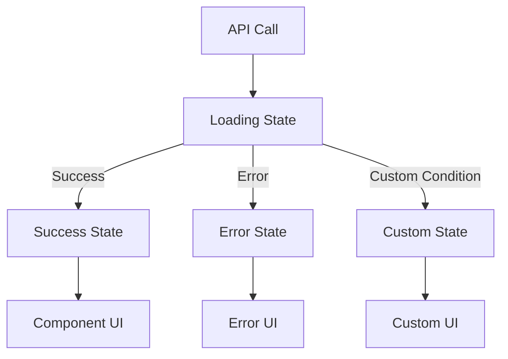

# PageLoaderWrapper Component

The PageLoaderWrapper is a core component in the Hyperswitch Control Center responsible for managing and displaying different UI states during asynchronous operations, particularly API calls. It provides a standardized approach to handling loading, error, and success states throughout the application.

## Component Overview



## State Types

The component works with a variant type `viewType` that represents different screen states:

```rescript
@unboxed
type viewType = Loading | Error(string) | Success | Custom
```

- `Loading`: Indicates that data is being fetched (shows a loading animation)
- `Error(string)`: Indicates that an error occurred (shows an error message with the provided string)
- `Success`: Indicates that data was fetched successfully (displays the child components)
- `Custom`: Allows for displaying a custom UI component (e.g., for empty states or special conditions)

## Component Props

```rescript
@react.component
let make = (
  ~children=?,                               // Optional children to render in Success state
  ~screenState: viewType,                    // Current view state (Loading, Error, Success, Custom)
  ~customUI=?,                               // Optional custom UI for Custom state
  ~sectionHeight="h-80-vh",                  // Height of the section (default: 80% of viewport)
  ~customStyleForDefaultLandingPage="",      // Additional styles for the error page
  ~customLoader=?,                           // Optional custom loader component
  ~showLogoutButton=false,                   // Whether to show logout button on error
)
```

## Usage Pattern

### Basic Integration with API Calls

```rescript
let MyComponent = () => {
  // 1. Define state for tracking API call status
  let (screenState, setScreenState) = React.useState(_ => PageLoaderWrapper.Loading)
  let (data, setData) = React.useState(_ => None)

  // 2. Define API utilities
  let getURL = APIUtils.useGetURL()
  let getMethod = APIUtils.useGetMethod()

  // 3. Implement data fetching with appropriate state transitions
  React.useEffect0(() => {
    let fetchData = async () => {
      try {
        // Set loading state before API call
        setScreenState(_ => PageLoaderWrapper.Loading)

        // Make API call
        let url = getURL(~entityName=V1(ENTITY_NAME), ~methodType=Get)
        let response = await getMethod(url)

        // Process response data
        setData(_ => Some(response))

        // Set success state after successful API call
        setScreenState(_ => PageLoaderWrapper.Success)
      } catch {
        | Exn.Error(e) => {
          // Set error state with message
          let errorMsg = Exn.message(e)->Option.getOr("Failed to fetch data")
          setScreenState(_ => PageLoaderWrapper.Error(errorMsg))
        }
      }
    }

    fetchData()->ignore
    None
  })

  // 4. Wrap component with PageLoaderWrapper
  <PageLoaderWrapper screenState>
    // Content to show in success state
    <div className="p-4">
      {switch data {
      | Some(responseData) => <DataDisplay data={responseData} />
      | None => React.null
      }}
    </div>
  </PageLoaderWrapper>
}
```

### With Custom Empty State

```rescript
// After API call, check if data is empty
if (data->Array.length > 0) {
  setScreenState(_ => PageLoaderWrapper.Success)
} else {
  setScreenState(_ => PageLoaderWrapper.Custom)
}

// In the render function
<PageLoaderWrapper
  screenState
  customUI={<NoDataFound message="No data available" />}>
  // Normal content shown only in Success state
  <DataTable data />
</PageLoaderWrapper>
```

## Best Practices

1. **Consistent State Management**: Always follow the pattern of setting `Loading` before an API call, then setting either `Success` or `Error` after the call completes.

2. **Error Messages**: When setting the `Error` state, provide a meaningful error message that helps the user understand what went wrong.

3. **Custom Loaders**: For specialized loading experiences, use the `customLoader` prop instead of creating multiple loading indicators.

4. **Empty States**: Use the `Custom` state with `customUI` to display empty states or specialized messages when data is successfully fetched but doesn't meet display criteria.

5. **Section Height**: Adjust the `sectionHeight` prop to ensure proper layout within different container contexts.

## Common Patterns

### API Data Fetching

```rescript
// Set loading state
setScreenState(_ => PageLoaderWrapper.Loading)

try {
  // Make API call
  let response = await apiCall()

  // Update state with response data
  setData(_ => response)

  // Set success state
  setScreenState(_ => PageLoaderWrapper.Success)
} catch {
  // Set error state
  setScreenState(_ => PageLoaderWrapper.Error("Error message"))
}
```

### Conditional Content Display

```rescript
<PageLoaderWrapper screenState>
  <RenderIf condition={someCondition}>
    <ComponentA />
  </RenderIf>
  <RenderIf condition={!someCondition}>
    <ComponentB />
  </RenderIf>
</PageLoaderWrapper>
```

### Form Submission

```rescript
let handleSubmit = async (formData) => {
  setScreenState(_ => PageLoaderWrapper.Loading)

  try {
    await submitData(formData)
    setScreenState(_ => PageLoaderWrapper.Success)
    showToast(~message="Data saved successfully", ~toastType=ToastSuccess)
  } catch {
    setScreenState(_ => PageLoaderWrapper.Error("Failed to save data"))
  }
}
```

## Integration with Other Components

The PageLoaderWrapper works well with:

- Toast notifications for user feedback
- Error boundaries for catching unexpected errors
- Form components for submission state management
- Table components for data loading states

## Benefits

1. **Consistency**: Provides a consistent UI/UX for loading and error states across the application
2. **Reusability**: Eliminates the need to recreate loading and error handling in each component
3. **Separation of Concerns**: Clearly separates UI state management from business logic
4. **User Experience**: Improves user experience by providing clear feedback during asynchronous operations
5. **Maintainability**: Centralizes state display logic for easier updates and improvements
