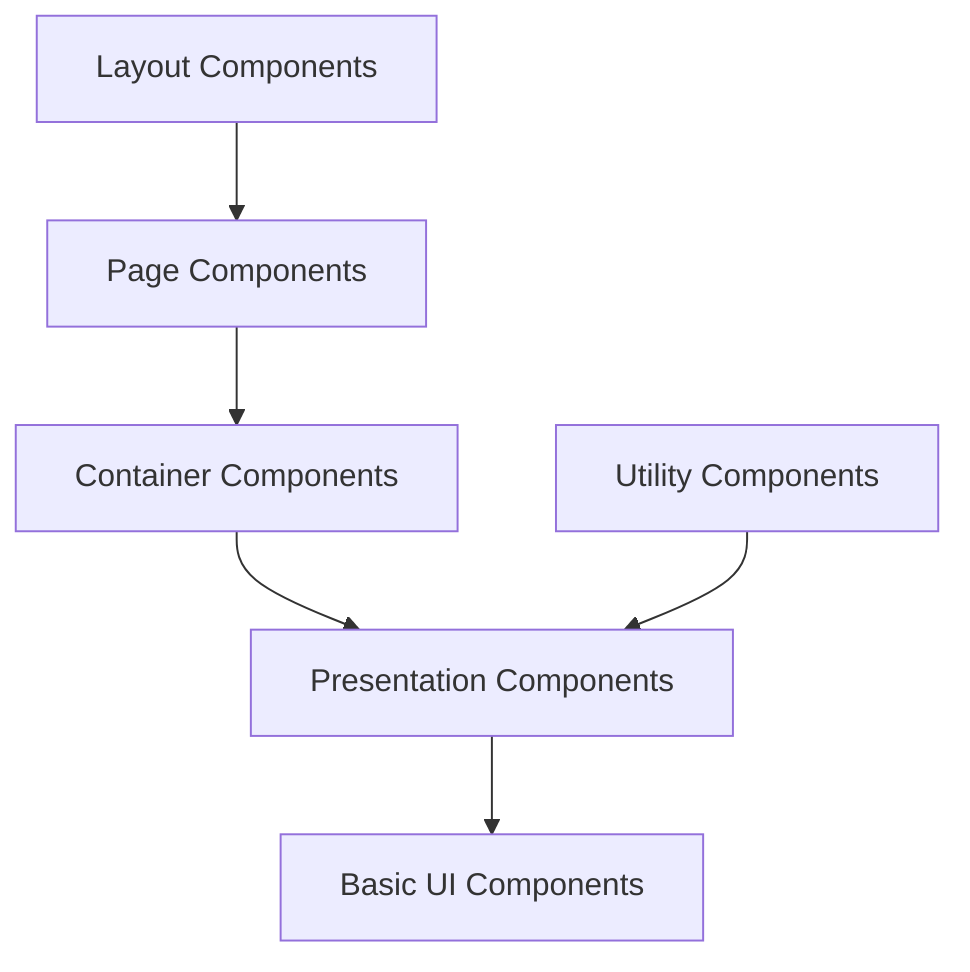

# Component Design Patterns in Hyperswitch

This document outlines the key design patterns used for creating React components in the Hyperswitch Control Center application using ReScript.

## Component Architecture Overview

Hyperswitch uses a component-based architecture with ReScript and React, emphasizing type safety, reusability, and composability.



## Key Component Patterns

### 1. Typed Component Props

All components use explicitly typed props, leveraging ReScript's type system:

```rescript
// Type definition for component props
type props = {
  title: string,
  isLoading: bool,
  data: option<array<dataItem>>,
  onAction: string => unit,
}

// Component implementation
@react.component
let make = (~title, ~isLoading, ~data, ~onAction) => {
  // Component implementation
}
```

Benefits:
- Compile-time error detection
- Self-documenting components
- Better IDE support and code completion

### 2. Variant-Based Component States

Components often use variant types to represent different states:

```rescript
// Button state variants
type buttonState = Normal | Loading | Disabled | NoHover | Focused

// Component using state variant
@react.component
let make = (~buttonState: buttonState=Normal, ~text=?) => {
  // Implementation that adapts based on the state variant
}
```

This pattern:
- Ensures all possible states are handled
- Makes state transitions explicit
- Prevents invalid state combinations

### 3. Component Composition Pattern

Complex components are built by composing simpler ones:

```rescript
// Card component composed of Header, Body and Footer
@react.component
let make = (~title, ~children, ~footerContent=?) => {
  <div className="card">
    <CardHeader title />
    <CardBody> {children} </CardBody>
    {switch footerContent {
     | Some(content) => <CardFooter> {content} </CardFooter>
     | None => React.null
     }}
  </div>
}
```

Benefits:
- Improved reusability
- Easier testing and maintenance
- Better separation of concerns

### 4. Interface and Implementation Separation

Components often use .resi files to define their public API:

```rescript
// Button.resi - Public interface
type buttonState = Normal | Loading | Disabled | NoHover | Focused
type buttonVariant = Fit | Long | Full | Rounded
type buttonType = Primary | Secondary | PrimaryOutline | ...

@react.component
let make: (
  ~buttonState: buttonState=?,
  ~text: string=?,
  ~buttonType: buttonType=?,
  // Other properties...
) => React.element
```

This pattern:
- Creates a clear public API
- Hides implementation details
- Enables better encapsulation

### 5. Component Context Usage

Components use React Context for theme and application-wide settings:

```rescript
@react.component
let make = (~text) => {
  let config = React.useContext(ThemeProvider.themeContext)
  let textColor = config.globalUIConfig.button.textColor.primaryNormal
  
  <div className={`text-${textColor}`}>
    {React.string(text)}
  </div>
}
```

Benefits:
- Avoids prop drilling
- Enables theme and feature consistency
- Facilitates global setting changes

### 6. RenderIf Conditional Rendering

Conditional rendering is handled with a dedicated RenderIf component:

```rescript
@react.component
let make = (~data) => {
  <div>
    <RenderIf condition={data->Array.length > 0}>
      <DataTable data />
    </RenderIf>
    
    <RenderIf condition={data->Array.length === 0}>
      <EmptyState />
    </RenderIf>
  </div>
}
```

This creates:
- More readable conditional rendering
- Consistent pattern throughout the codebase
- Cleaner component structure

### 7. Screen State Management

Components use a standardized approach for loading, error, and success states:

```rescript
type screenState = Loading | Error(string) | Success

@react.component
let make = (~initialData) => {
  let (screenState, setScreenState) = React.useState(_ => Loading)
  let (data, setData) = React.useState(_ => initialData)
  
  React.useEffect0(() => {
    let fetchData = async () => {
      try {
        let result = await api.getData()
        setData(_ => result)
        setScreenState(_ => Success)
      } catch {
      | Exn.Error(e) => setScreenState(_ => Error(Exn.message(e)->Option.getOr("Unknown error")))
      }
    }
    
    fetchData()->ignore
    None
  })
  
  switch screenState {
  | Loading => <LoadingIndicator />
  | Error(msg) => <ErrorDisplay message=msg />
  | Success => <DataDisplay data />
  }
}
```

Benefits:
- Consistent handling of async operations
- Clear UI feedback for users
- Standardized error handling

## Common Component Categories

### 1. Basic UI Components

Foundational UI building blocks:

- **Button**: Configurable buttons with variants
- **InputFields**: Text inputs, selects, checkboxes, etc.
- **Icon**: Icon system with consistent sizing and coloring
- **Typography**: Text components with consistent styling

Example (Button.res):
```rescript
@react.component
let make = (
  ~buttonState: buttonState=Normal,
  ~text=?,
  ~buttonType: buttonType=SecondaryFilled,
  ~buttonVariant: buttonVariant=Fit,
  ~leftIcon: iconType=NoIcon,
  ~onClick=?,
  // Other props...
) => {
  // Implementation
}
```

### 2. Composite Components

Components that combine basic components into more complex UI structures:

- **Card**: Container with consistent styling
- **Modal**: Popup dialogs and forms
- **Accordion**: Expandable content sections
- **Table**: Data display with sorting and filtering

Example:
```rescript
// Modal component combining various UI elements
@react.component
let make = (~isOpen, ~title, ~children, ~onClose) => {
  <div className={isOpen ? "modal-open" : "modal-closed"}>
    <div className="modal-content">
      <div className="modal-header">
        <Typography.Heading level=H3> {React.string(title)} </Typography.Heading>
        <Button buttonType=Transparent leftIcon=FontAwesome("times") onClick=onClose />
      </div>
      <div className="modal-body"> {children} </div>
    </div>
  </div>
}
```

### 3. Container Components

Components that manage data fetching and state:

- Handle API calls and data transformation
- Manage local state for UI components
- Handle errors and loading states
- Pass data down to presentation components

Example:
```rescript
@react.component
let make = (~id) => {
  let getURL = APIUtils.useGetURL()
  let getMethod = APIUtils.useGetMethod()
  let (data, setData) = React.useState(_ => None)
  let (isLoading, setIsLoading) = React.useState(_ => true)
  
  // Data fetching logic
  React.useEffect1(() => {
    let fetchData = async () => {
      try {
        setIsLoading(_ => true)
        let url = getURL(~entityName=V1(ORDERS), ~methodType=Get, ~id=Some(id))
        let response = await getMethod(url)
        setData(_ => Some(response))
      } catch {
      | _ => () // Error handling
      } finally {
        setIsLoading(_ => false)
      }
    }
    
    fetchData()->ignore
    None
  }, [id])
  
  <OrderDetailsDisplay isLoading data />
}
```

### 4. Page Components

Top-level components that represent full pages:

- Combine multiple container and presentation components
- Handle routing parameters
- Manage page-level state
- Define page layouts

Example:
```rescript
@react.component
let make = () => {
  let url = ReactRouter.useUrl()
  
  // Extract params from URL
  let orderId = switch url.path {
  | list{"orders", id, ..._} => Some(id)
  | _ => None
  }
  
  <div className="page-container">
    <PageHeader title="Order Details" />
    
    <div className="page-content">
      {switch orderId {
       | Some(id) => <OrderDetailsContainer id />
       | None => <NotFound />
       }}
    </div>
  </div>
}
```

## Component Styling Approaches

Hyperswitch primarily uses Tailwind CSS for styling components:

```rescript
@react.component
let make = (~text) => {
  <div className="bg-white dark:bg-gray-800 rounded-lg p-4 shadow-sm">
    <Typography.Text className="text-gray-800 dark:text-white">
      {React.string(text)}
    </Typography.Text>
  </div>
}
```

Key styling patterns:
1. **Utility Classes**: Direct use of Tailwind utility classes
2. **Dark Mode Support**: Consistent dark:* prefixes for dark mode styles
3. **Theme-based Classes**: Dynamic classes based on theme context
4. **Responsive Design**: Mobile-first with responsive breakpoint prefixes

## Best Practices

### 1. Component Decomposition

- Break down complex components into smaller, focused components
- Each component should have a single responsibility
- Extract repeated patterns into reusable components

### 2. Default Props

- Provide sensible defaults for optional props
- Use ReScript's optional labeled arguments with defaults

```rescript
@react.component
let make = (~title, ~showIcon=true, ~size: size=Medium) => {
  // Implementation
}
```

### 3. Pattern Matching for Variants

- Use exhaustive pattern matching for handling variant props
- Ensures all cases are covered at compile time

```rescript
let buttonStyle = switch (buttonType, buttonState) {
| (Primary, Normal) => "bg-blue-500 text-white"
| (Primary, Disabled) => "bg-blue-300 text-gray-100 cursor-not-allowed"
| (Secondary, Normal) => "bg-gray-200 text-gray-800"
| (Secondary, Disabled) => "bg-gray-100 text-gray-400 cursor-not-allowed"
// All other combinations...
}
```

### 4. Component Documentation

- Use comments to document component purpose and props
- Provide usage examples for complex components
- Document component variants and states

### 5. Composition over Configuration

- Prefer component composition over complex configuration props
- Use children and render props for flexible content rendering

```rescript
// Prefer this pattern
<Card>
  <CardHeader title="User Details" />
  <CardBody> {userData->renderUserInfo} </CardBody>
  <CardFooter> <Button text="Edit" /> </CardFooter>
</Card>

// Over this pattern
<Card 
  title="User Details" 
  body={userData->renderUserInfo} 
  footer={<Button text="Edit" />} 
/>
```

## Testing Components

Components are designed for testability:

1. **Props-driven behavior**: Component behavior is determined by props
2. **Clear interfaces**: Well-defined interfaces make testing easier
3. **State isolation**: Container/presentation separation isolates state
4. **Data attributes**: Components include data attributes for test selectors

Example test selector:
```rescript
<AddDataAttributes attributes=[("data-button-for", "save"), ("data-testid", "save-button")]>
  <button onClick> {React.string("Save")} </button>
</AddDataAttributes>
