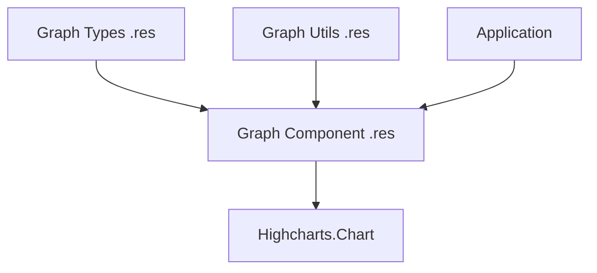

# Graph Components in Hyperswitch

This document provides a comprehensive overview of the graph visualization components in the Hyperswitch Control Center. These components are used throughout the application to display analytics, metrics, and other data visualizations.

## Architecture Overview

The graph components in Hyperswitch are built as type-safe ReScript wrappers around the Highcharts JavaScript library. Each graph type follows a consistent pattern with three primary files:



1. **Component File (`GraphType.res`)**: The React component that renders the chart
2. **Types File (`GraphTypeTypes.res`)**: Type definitions for the chart configuration
3. **Utils File (`GraphTypeUtils.res`)**: Helper functions for creating chart configurations

## Available Graph Types

The following graph types are implemented:

1. **BarGraph**: Horizontal bar charts for comparing values across categories
2. **ColumnGraph**: Vertical column charts for time series or category comparisons
3. **LineGraph**: Line charts for showing trends over time
4. **LineAndColumn**: Combined line and column charts for related metrics
5. **PieGraph**: Pie charts for showing proportions of a whole
6. **SankyGraph**: Sankey diagrams for visualizing flow between nodes
7. **StackedBarGraph**: Stacked bar charts for showing composition within categories

## Common Implementation Pattern

All graph components follow a similar implementation pattern:

### 1. Component Implementation

Each graph component is a simple wrapper around Highcharts.Chart:

```rescript
// Example from BarGraph.res
external barGraphOptionsToJson: BarGraphTypes.barGraphOptions => JSON.t = "%identity"

@react.component
let make = (~options: BarGraphTypes.barGraphOptions, ~className="") => {
  <div className>
    <Highcharts.Chart options={options->barGraphOptionsToJson} highcharts={Highcharts.highcharts} />
  </div>
}
```

### 2. Type Definitions

Extensive type definitions ensure type safety when configuring charts:

```rescript
// Example from BarGraphTypes.res
type barGraphOptions = {
  chart: chart,
  title: title,
  xAxis: xAxis,
  yAxis: yAxis,
  plotOptions: plotOptions,
  series: data,
  credits: credits,
  tooltip: tooltip,
}

type barGraphPayload = {
  categories: categories,
  data: data,
  title: title,
  tooltipFormatter: pointFormatter => string,
}
```

### 3. Utility Functions

Utility functions provide defaults and help generate proper configurations:

```rescript
// Example from BarGraphUtils.res
let getBarGraphOptions = (barGraphOptions: barGraphPayload) => {
  let {categories, data, title, tooltipFormatter} = barGraphOptions

  // Return a properly configured options object
  {
    chart: { /* ... */ },
    title: { /* ... */ },
    xAxis: { /* ... */ },
    yAxis: { /* ... */ },
    // ...
  }
}
```

## Common Configuration Properties

All graph components share common configuration properties aligned with Highcharts:

### 1. Chart Configuration

Basic chart properties:

```rescript
type chart = {
  \"type": \"type",
  spacingLeft: spacingLeft,
  spacingRight: spacingRight,
  // May include other properties like height, style, etc.
}
```

### 2. Axis Configuration

X and Y axis properties:

```rescript
type xAxis = {
  categories: categories,
  labels: labels,
  tickWidth: tickWidth,
  tickmarkPlacement: tickmarkPlacement,
  // Other axis properties...
}

type yAxis = {
  title: title,
  gridLineWidth: gridLineWidth,
  gridLineColor: gridLineColor,
  // Other axis properties...
}
```

### 3. Series Data

Data structure for the chart:

```rescript
type dataObj = {
  showInLegend: showInLegend,
  name: name,
  data: array<float>,
  color: color,
}

type data = array<dataObj>
```

### 4. Styling

Consistent styling properties:

```rescript
type style = {
  color: color,
  fontFamily: string,
  fontSize: string,
}
```

### 5. Tooltips

Tooltip configuration with HTML formatting:

```rescript
type tooltip = {
  shape: string,
  backgroundColor: string,
  borderColor: string,
  useHTML: bool,
  formatter: pointFormatter => string,
  shared: bool,
  style: cssStyle,
  borderWidth: float,
  shadow: bool,
}
```

## Graph-Specific Features

### BarGraph

A horizontal bar chart used for comparing values across categories.

**Key features:**

- Custom tooltip formatting
- Configurable bar padding
- Options for legends and labels

**Example configuration:**

```rescript
let barGraphConfig = {
  categories: ["Category 1", "Category 2", "Category 3"],
  data: [
    {
      showInLegend: true,
      name: "Series 1",
      data: [10.0, 20.0, 30.0],
      color: "#4F54EF",
    },
  ],
  title: {text: "Bar Graph Title"},
  tooltipFormatter: customTooltipFormatter,
}

let options = BarGraphUtils.getBarGraphOptions(barGraphConfig)
<BarGraph options className="h-64" />
```

### LineGraph

A line chart used for showing trends over time.

**Key features:**

- Customizable line styles
- Support for multiple series
- Interactive tooltips
- Custom height configuration

**Example configuration:**

```rescript
let lineGraphConfig = {
  chartHeight: DefaultHeight,
  chartLeftSpacing: DefaultLeftSpacing,
  categories: ["Jan", "Feb", "Mar", "Apr"],
  data: [
    {
      showInLegend: true,
      name: "Series 1",
      data: [10.0, 25.0, 15.0, 30.0],
      color: "#4F54EF",
    },
  ],
  title: {text: "Line Graph Title"},
  yAxisMaxValue: Some(100),
  yAxisMinValue: Some(0),
  tooltipFormatter: customTooltipFormatter,
  yAxisFormatter: customYAxisFormatter,
  legend: customLegend,
}

let options = LineGraphUtils.getLineGraphOptions(lineGraphConfig)
<LineGraph options className="h-64" />
```

### LineAndColumn

A combined line and column chart for showing related metrics.

**Key features:**

- Dual Y-axes for different scales
- Combined columns and lines
- Shared tooltips across series types
- Advanced tooltip formatting

**Example configuration:**

```rescript
let lineColumnConfig = {
  categories: ["Jan", "Feb", "Mar", "Apr"],
  data: [
    {
      type: "column",
      name: "Volume",
      data: [10.0, 20.0, 15.0, 25.0],
      color: "#4F54EF",
      yAxis: 0,
    },
    {
      type: "line",
      name: "Success Rate",
      data: [90.0, 85.0, 95.0, 92.0],
      color: "#28A745",
      yAxis: 1,
    },
  ],
  tooltipFormatter: customTooltipFormatter,
  yAxisFormatter: customYAxisFormatter,
  titleObj: {
    chartTitle: {text: "Payments Volume and Success Rate"},
    yAxisTitle: {text: "Volume"},
    oppositeYAxisTitle: {text: "Success Rate (%)"},
    xAxisTitle: {text: "Period"},
  },
  minValY2: 0,
  maxValY2: 100,
  legend: customLegend,
}

let options = LineAndColumnGraphUtils.getLineColumnGraphOptions(lineColumnConfig)
<LineAndColumnGraph options className="h-64" />
```

## Tooltip Formatting

The graph components support rich HTML tooltips with custom formatting:

```rescript
let customTooltipFormatter = (
  @this
  (this: pointFormatter) => {
    let content = `
      <div style="padding:5px 12px; display:flex; flex-direction:column; gap:7px;">
        <div style="font-size:16px; font-weight:bold;">${this.x}</div>
        <div style="display:flex; align-items:center;">
          <div style="width:10px; height:10px; background-color:${this.color}; border-radius:3px;"></div>
          <div style="margin-left:8px;">${this.series.name}</div>
          <div style="flex:1; text-align:right; font-weight:bold; margin-left:25px;">
            ${LogicUtils.valueFormatter(this.y, Currency)}
          </div>
        </div>
      </div>
    `

    `<div style="padding:10px; border-radius:7px; background-color:#FFFFFF; box-shadow:0px 4px 8px rgba(0,0,0,0.2); border:1px solid #E5E5E5;">
      ${content}
    </div>`
  }
)->asTooltipPointFormatter
```

## Style Constants

Common style constants are used across graph components for consistency:

```rescript
// Common styling constants
let fontFamily = "Arial, sans-serif"
let darkGray = "#666666"
let lightGray = "#999999"
let gridLineColor = "#e6e6e6"
```

## Integration with Value Formatting

Charts are often integrated with the application's value formatting utilities:

```rescript
// Example from LineAndColumnGraphUtils.res
let formattedValue = LogicUtils.valueFormatter(value, statType, ~currency, ~suffix)
```

## Legend Customization

Custom HTML legends are supported:

```rescript
let labelFormatter = (
  @this
  this => {
    `<div style="display:flex; align-items:center;">
      <div style="width:13px; height:13px; background-color:${this.color}; border-radius:3px;"></div>
      <div style="margin-left:5px;">${this.name}</div>
    </div>`
  }
)->asLegendsFormatter
```

## Usage Best Practices

1. **Type Safety**: Take advantage of the type system to catch configuration errors at compile time.

2. **Default Configurations**: Use the utility functions to generate default configurations, then override specific properties as needed.

3. **Responsive Design**: Apply responsive sizing through the className prop:

   ```rescript
   <BarGraph options className="h-64 md:h-80 lg:h-96" />
   ```

4. **Consistent Styling**: Use the predefined style constants for consistency with the application design system.

5. **Interactive Tooltips**: Implement custom tooltip formatters for better data presentation.

6. **Accessibility**: Consider adding aria attributes and ensuring color contrast for accessibility.

## Use Cases in Hyperswitch

Graph components are commonly used for:

1. **Payment Analytics**: Visualizing payment volumes, success rates, and trends
2. **Revenue Metrics**: Displaying revenue growth and comparisons
3. **Performance Dashboards**: Showing processor performance comparisons
4. **Operational Insights**: Visualizing operational metrics like dispute ratios
5. **Financial Reporting**: Presenting financial data for business users

## Extending Graph Components

To create a new graph type:

1. Define the types in a new `[GraphType]Types.res` file
2. Create utility functions in a `[GraphType]Utils.res` file
3. Implement the component in a `[GraphType].res` file
4. Follow the established patterns for consistency

## Common Pitfalls

1. **Performance with Large Datasets**: Be cautious with large datasets as they may impact rendering performance.

2. **Mobile Responsiveness**: Ensure graphs are responsive and readable on smaller screens.

3. **Tooltip Positioning**: Custom tooltips may have positioning issues in certain layouts.

4. **Legend Space**: Large legends can consume significant space; consider collapsible legends for complex graphs.

5. **Color Accessibility**: Ensure color choices meet accessibility standards for color blindness.
