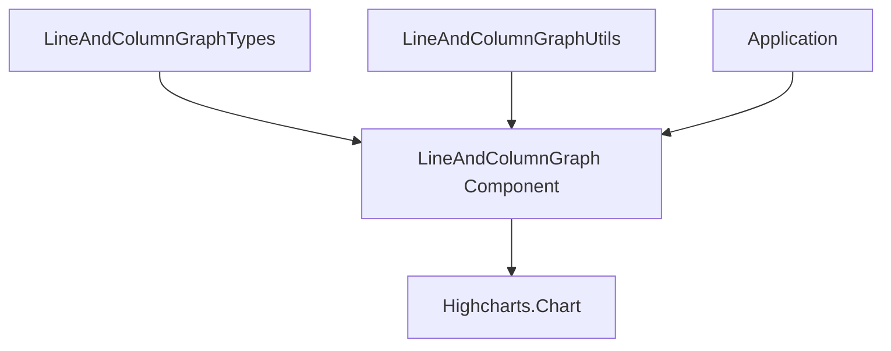

# LineAndColumn Graph in Hyperswitch

This document provides detailed information about the LineAndColumn graph component in Hyperswitch Control Center, which combines line and column charts into a single visualization with dual Y-axes.

## Overview

The LineAndColumn graph is a powerful visualization that combines:

- Bar/column charts (typically for volume metrics)
- Line charts (typically for percentage or rate metrics)

This combination allows for displaying related metrics with different scales in a single chart, making it ideal for visualizing relationships between absolute values and rates.



## Component Implementation

The LineAndColumnGraph component is implemented as a simple wrapper around Highcharts:

```rescript
// LineAndColumnGraph.res
external lineAndColumnGraphOptionsToJson: LineAndColumnGraphTypes.lineAndColumnGraphOptions => JSON.t = "%identity"

@react.component
let make = (~options: LineAndColumnGraphTypes.lineAndColumnGraphOptions, ~className="") => {
  <div className>
    <Highcharts.Chart
      options={options->lineAndColumnGraphOptionsToJson}
      highcharts={Highcharts.highcharts}
    />
  </div>
}
```

## Type Structure

The LineAndColumnGraph has an extensive type system defined in `LineAndColumnGraphTypes.res`:

### Core Types

```rescript
// Main options type that gets passed to Highcharts
type lineAndColumnGraphOptions = {
  chart: chart,
  title: title,
  xAxis: xAxis,
  yAxis: yAxis,
  plotOptions: plotOptions,
  series: data,
  credits: credits,
  tooltip: tooltip,
  legend: legend,
}

// Input payload for the utility function
type lineColumnGraphPayload = {
  categories: categories,
  data: data,
  tooltipFormatter: pointFormatter => string,
  yAxisFormatter: pointFormatter => string,
  titleObj: titleObj,
  minValY2: int,
  maxValY2: int,
  legend: legend,
}

// Special title object for LineAndColumn charts
type titleObj = {
  chartTitle: title,
  yAxisTitle: title,
  oppositeYAxisTitle: title,
  xAxisTitle: title,
}
```

### Data Series Types

LineAndColumn graphs support multiple series types:

```rescript
type dataObj = {
  type?: string,        // "line" or "column"
  showInLegend: showInLegend,
  name: name,
  data: array<float>,
  color: color,
  yAxis?: int,         // 0 for left y-axis, 1 for right y-axis
}

type data = array<dataObj>
```

### Y-Axis Configuration

The component supports dual Y-axes:

```rescript
// Array of two y-axis configurations
type yAxis = array<singleYAxis>

type singleYAxis = {
  title: title,
  opposite: bool,        // true for right axis
  gridLineWidth: gridLineWidth,
  gridLineColor: gridLineColor,
  gridLineDashStyle: gridLineDashStyle,
  labels: labels,
  min: option<int>,
  max: option<int>,
}
```

## Utility Functions

The `LineAndColumnGraphUtils.res` file provides utility functions for configuring the chart:

### Main Configuration Function

```rescript
let getLineColumnGraphOptions = (lineColumnGraphOptions: lineColumnGraphPayload) => {
  let {
    categories,
    data,
    tooltipFormatter,
    yAxisFormatter,
    titleObj,
    minValY2,
    maxValY2,
    legend,
  } = lineColumnGraphOptions

  // Configure dual y-axes
  let yAxis: LineAndColumnGraphTypes.yAxis = [
    {
      // Right axis (typically for percentages)
      title: titleObj.oppositeYAxisTitle,
      opposite: true,
      // Other configuration...
      min: minValY2,
      max: Some(maxValY2),
    },
    {
      // Left axis (typically for volumes)
      title: titleObj.yAxisTitle,
      opposite: false,
      // Other configuration...
      min: 0,
    },
  ]

  // Return the complete configuration
  {
    chart: { /* ... */ },
    title: titleObj.chartTitle,
    xAxis: { /* ... */ },
    yAxis,
    tooltip: { /* ... */ },
    legend: { /* ... */ },
    plotOptions: { /* ... */ },
    series: data,
    credits: { enabled: false },
  }
}
```

### Tooltip Formatter

Specialized tooltip formatter for LineAndColumn charts:

```rescript
let lineColumnGraphTooltipFormatter = (
  ~title,
  ~metricType: LogicUtilsTypes.valueType,
  ~currency="$",
  ~showNameInTooltip=false,
) => {
  open LogicUtils

  (
    @this
    (this: pointFormatter) => {
      // Format title
      let title = `<div style="font-size: 16px; font-weight: bold;">${title}</div>`

      // Extract points from different series
      let defaultValue = {color: "", x: "", y: 0.0, point: {index: 0}, key: "", series: {name: ""}}
      let primartPoint = this.points->getValueFromArray(0, defaultValue)
      let line1Point = this.points->getValueFromArray(1, defaultValue)
      let line2Point = this.points->getValueFromArray(2, defaultValue)

      // Format each row of the tooltip
      let getRowsHtml = (~iconColor, ~date, ~value, ~comparisionComponent="", ~name="") => {
        let formattedValue = LogicUtils.valueFormatter(value, metricType, ~currency)
        let key = showNameInTooltip ? name : date
        `<div style="display: flex; align-items: center;">
            <div style="width: 10px; height: 10px; background-color:${iconColor}; border-radius:3px;"></div>
            <div style="margin-left: 8px;">${key}${comparisionComponent}</div>
            <div style="flex: 1; text-align: right; font-weight: bold;margin-left: 25px;">${formattedValue}</div>
        </div>`
      }

      // Combine rows into a table
      let tableItems =
        [
          getRowsHtml(
            ~iconColor=primartPoint.color,
            ~date=primartPoint.key,
            ~value=primartPoint.y,
            ~name=primartPoint.series.name,
          ),
          getRowsHtml(
            ~iconColor=line1Point.color,
            ~date=line1Point.key,
            ~value=line1Point.y,
            ~name=line1Point.series.name,
          ),
          getRowsHtml(
            ~iconColor=line2Point.color,
            ~date=line2Point.key,
            ~value=line2Point.y,
            ~name=line2Point.series.name,
          ),
        ]->Array.joinWith("")

      // Generate the final HTML content
      let content = `
          <div style="
          padding:5px 12px;
          display:flex;
          flex-direction:column;
          justify-content: space-between;
          gap: 7px;">
              ${title}
              <div style="
                margin-top: 5px;
                display:flex;
                flex-direction:column;
                gap: 7px;">
                ${tableItems}
              </div>
        </div>`

      // Return styled tooltip container with content
      `<div style="
    padding: 10px;
    width:fit-content;
    border-radius: 7px;
    background-color:#FFFFFF;
    padding:10px;
    box-shadow: 0px 4px 8px rgba(0, 0, 0, 0.2);
    border: 1px solid #E5E5E5;
    position:relative;">
        ${content}
    </div>`
    }
  )->asTooltipPointFormatter
}
```

### Y-Axis Formatter

Custom formatter for Y-axis labels:

```rescript
let lineColumnGraphYAxisFormatter = (
  ~statType: LogicUtilsTypes.valueType,
  ~currency="",
  ~suffix="",
  ~scaleFactor=1.0,
) => {
  (
    @this
    (this: yAxisFormatter) => {
      let value = this.value->Int.toFloat /. scaleFactor
      let formattedValue = LogicUtils.valueFormatter(value, statType, ~currency, ~suffix)
      formattedValue
    }
  )->asTooltipPointFormatter
}
```

## Use Cases

The LineAndColumn graph is particularly useful for:

1. **Payment Analytics**

   - Column: Payment volume
   - Line: Success rate percentage

2. **Revenue Reporting**

   - Column: Revenue amount
   - Line: Growth rate

3. **Operational Metrics**

   - Column: Transaction count
   - Line: Average processing time

4. **Performance Comparison**
   - Column: Absolute numbers
   - Line: Relative percentages

## Example Usage

```rescript
// Create graph configuration
let lineColumnConfig = {
  categories: ["Jan", "Feb", "Mar", "Apr"],
  data: [
    {
      type: "column",
      name: "Payment Volume",
      data: [1000.0, 1200.0, 1500.0, 1800.0],
      color: "#4F54EF",
      yAxis: 0, // Left axis
    },
    {
      type: "line",
      name: "Success Rate",
      data: [92.5, 93.8, 94.2, 95.6],
      color: "#28A745",
      yAxis: 1, // Right axis
    },
  ],
  tooltipFormatter: LineAndColumnGraphUtils.lineColumnGraphTooltipFormatter(
    ~title="Payment Performance",
    ~metricType=Percentage,
    ~showNameInTooltip=true,
  ),
  yAxisFormatter: LineAndColumnGraphUtils.lineColumnGraphYAxisFormatter(
    ~statType=Percentage,
    ~suffix="%",
  ),
  titleObj: {
    chartTitle: {text: "Payment Volume and Success Rate"},
    yAxisTitle: {text: "Volume"},
    oppositeYAxisTitle: {text: "Success Rate (%)"},
    xAxisTitle: {text: "Month"},
  },
  minValY2: 85, // Min value for right axis
  maxValY2: 100, // Max value for right axis
  legend: {
    align: "center",
    verticalAlign: "bottom",
    useHTML: true,
    labelFormatter: customLabelFormatter,
  },
}

// Generate options
let options = LineAndColumnGraphUtils.getLineColumnGraphOptions(lineColumnConfig)

// Render component
<LineAndColumnGraph options className="h-80" />
```

## Styling Considerations

1. **Color Coordination**

   - Use contrasting colors between column and line series
   - Ensure colors align with application's design system

2. **Axis Scaling**

   - Set appropriate min/max values for each axis
   - Consider truncating Y-axis to highlight variations

3. **Legend Placement**

   - Bottom placement often works best for dual-axis charts
   - Use HTML formatting for custom legend appearance

4. **Tooltip Design**
   - Include both metrics in tooltips
   - Use consistent formatting for values
   - Consider showing percentage changes

## Best Practices

1. **Related Metrics**

   - Only combine metrics that have a meaningful relationship
   - Use dual axes when metrics have different scales but related meaning

2. **Clear Labels**

   - Label both Y-axes clearly
   - Use different colors for axis labels to match series colors

3. **Consistent Categories**

   - Use consistent X-axis categories (typically time periods)
   - Limit the number of categories to avoid overcrowding

4. **Mobile Responsiveness**

   - Test charts at various screen sizes
   - Consider simplifying for mobile views

5. **Performance**
   - Limit the number of data points for optimal performance
   - Consider data aggregation for large datasets

## Common Customizations

1. **Adjusting Axis Ranges**

   ```rescript
   minValY2: 80, // Custom minimum for right axis
   maxValY2: 100, // Custom maximum for right axis
   ```

2. **Adding Chart Title**

   ```rescript
   titleObj: {
     chartTitle: {
       text: "Custom Chart Title",
       align: "left",
       style: {
         fontWeight: "bold",
         fontSize: "16px",
       },
     },
     // Other titles...
   }
   ```

3. **Customizing Series Types**

   ```rescript
   data: [
     {
       type: "column", // or "line"
       // Other properties...
     }
   ]
   ```

4. **Custom Tooltip Formatting**
   ```rescript
   tooltipFormatter: LineAndColumnGraphUtils.lineColumnGraphTooltipFormatter(
     ~title="Custom Title",
     ~metricType=Currency,
     ~currency="€",
     ~showNameInTooltip=true,
   )
   ```

## Troubleshooting

1. **Missing Data Points**

   - Ensure data arrays match category array length
   - Use `null` or `0.0` for missing data points

2. **Axis Scale Issues**

   - Check min/max values for both axes
   - Ensure Y-axis types match data types

3. **Tooltip Formatting Errors**

   - Verify the tooltip formatter handles all possible series combinations
   - Include null checks for missing data

4. **Legend Display Problems**

   - Check HTML formatting in legend formatter
   - Ensure sufficient space for legend display

5. **Rendering Performance**
   - Reduce number of data points if chart is slow to render
   - Simplify tooltip HTML if tooltips appear laggy
