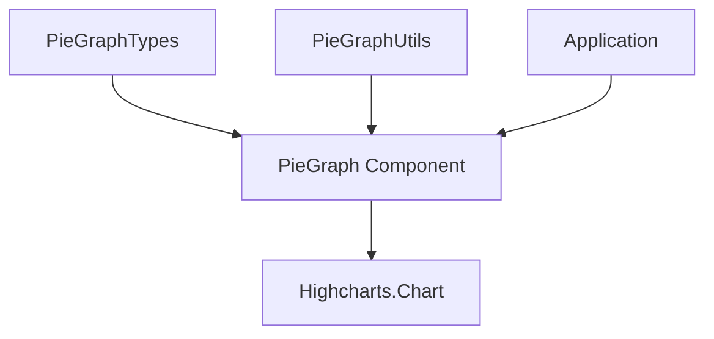

# PieGraph in Hyperswitch

This document provides detailed information about the PieGraph component in Hyperswitch Control Center, which visualizes proportional data using a circular chart divided into sections.

## Overview

The PieGraph component is used for visualizing proportional data, showing parts of a whole. It's particularly useful for displaying:
- Payment method distribution
- Transaction status breakdowns
- Processor allocation percentages
- Revenue sources



## Component Implementation

Like other graph components, the PieGraph is implemented as a wrapper around Highcharts:

```rescript
// PieGraph.res
external pieGraphOptionsToJson: PieGraphTypes.pieGraphOptions => JSON.t = "%identity"

@react.component
let make = (~options: PieGraphTypes.pieGraphOptions, ~className="") => {
  <div className>
    <Highcharts.Chart 
      options={options->pieGraphOptionsToJson} 
      highcharts={Highcharts.highcharts} 
    />
  </div>
}
```

## Type Structure

The PieGraph uses the following type definitions:

### Core Types

```rescript
// Main options type
type pieGraphOptions = {
  chart: chart,
  title: title,
  plotOptions: plotOptions,
  series: array<pieSeriesData>,
  credits: credits,
  tooltip: tooltip,
  legend: legend,
}

// Input payload for the utility function
type pieGraphPayload = {
  data: array<pieDataPoint>,
  title: title,
  tooltipFormatter: pointFormatter => string,
  legend: legend,
}
```

### Data Structure

Pie graphs use a specialized data structure:

```rescript
// Data point for a pie slice
type pieDataPoint = {
  name: string,
  y: float,
  color?: string,
  sliced?: bool,
  selected?: bool,
}

// Series configuration
type pieSeriesData = {
  type: string,
  name: string,
  data: array<pieDataPoint>,
  showInLegend: bool,
  dataLabels: dataLabels,
  // Other optional configurations
}

// Data label configuration
type dataLabels = {
  enabled: bool,
  distance?: int,
  format?: string,
  style?: dataLabelStyle,
}
```

## Utility Functions

The `PieGraphUtils.res` file provides utilities for configuring the chart:

### Main Configuration Function

```rescript
let getPieGraphOptions = (pieGraphOptions: pieGraphPayload) => {
  let {data, title, tooltipFormatter, legend} = pieGraphOptions

  // Series configuration
  let series = [
    {
      type: "pie",
      name: "Share",
      data,
      showInLegend: true,
      dataLabels: {
        enabled: false,  // Often disabled in favor of tooltips
      },
    },
  ]

  // Return complete configuration
  {
    chart: {
      type: "pie",
      spacingLeft: 20,
      spacingRight: 20,
      style: {
        fontFamily,
        fontSize: "12px",
        color: darkGray,
      },
    },
    title,
    plotOptions: {
      pie: {
        allowPointSelect: true,
        cursor: "pointer",
        borderWidth: 0,
        showInLegend: true,
      },
    },
    tooltip: {
      style: {
        padding: "0px",
        fontFamily,
        fontSize: "14px",
      },
      shape: "square",
      shadow: false,
      backgroundColor: "transparent",
      borderColor: "transparent",
      borderWidth: 0.0,
      formatter: tooltipFormatter,
      useHTML: true,
    },
    series,
    legend,
    credits: {
      enabled: false,
    },
  }
}
```

### Tooltip Formatter

Specialized tooltip formatter for pie charts:

```rescript
let pieGraphTooltipFormatter = (
  ~title: string,
  ~valueType: LogicUtilsTypes.valueType=LogicUtilsTypes.Percentage,
  ~currency="",
  ~showTotal=false,
  ~totalValue=0.0,
) => {
  open LogicUtils

  (
    @this
    (point: pointFormatter) => {
      // Format title
      let titleHtml = `<div style="font-size: 16px; font-weight: bold;">${title}</div>`
      
      // Format value
      let formattedValue = valueFormatter(point.y, valueType, ~currency)
      let formattedPercentage = if valueType !== Percentage {
        ` (${(point.percentage)->Js.Math.round->Int.toString}%)`
      } else {
        ""
      }
      
      // Format total if requested
      let totalHtml = if showTotal {
        let formattedTotal = valueFormatter(totalValue, valueType, ~currency)
        `<div style="margin-top: 5px; font-weight: normal;">
           Total: ${formattedTotal}
         </div>`
      } else {
        ""
      }
      
      // Generate content
      let content = `
        <div style="padding: 5px 12px; display: flex; flex-direction: column; gap: 7px;">
          ${titleHtml}
          <div style="display: flex; align-items: center;">
            <div style="width: 10px; height: 10px; background-color: ${point.color}; border-radius: 3px;"></div>
            <div style="margin-left: 8px;">${point.key}</div>
            <div style="flex: 1; text-align: right; font-weight: bold; margin-left: 25px;">
              ${formattedValue}${formattedPercentage}
            </div>
          </div>
          ${totalHtml}
        </div>
      `
      
      // Return styled container
      `<div style="padding: 10px; border-radius: 7px; background-color: #FFFFFF; box-shadow: 0px 4px 8px rgba(0, 0, 0, 0.2); border: 1px solid #E5E5E5;">
        ${content}
      </div>`
    }
  )->asTooltipPointFormatter
}
```

## Use Cases

The PieGraph is particularly useful for:

1. **Payment Method Distribution**
   - Show breakdown of card vs. wallet vs. bank transfer payments
   - Visualize card brand (Visa, Mastercard, etc.) distribution

2. **Status Breakdowns**
   - Display transaction statuses (successful, failed, pending)
   - Show dispute resolution outcomes

3. **Geographical Analysis**
   - Display transaction distribution by country or region
   - Show revenue breakdown by market

4. **Processor Allocation**
   - Visualize payment volume distribution across processors
   - Show cost breakdown by processor

## Example Usage

```rescript
// Create graph configuration
let pieChartConfig = {
  data: [
    {name: "Visa", y: 45.0, color: "#4F54EF"},
    {name: "Mastercard", y: 30.0, color: "#28A745"},
    {name: "American Express", y: 15.0, color: "#DC3545"},
    {name: "Other", y: 10.0, color: "#6C757D"},
  ],
  title: {text: "Payment Method Distribution"},
  tooltipFormatter: PieGraphUtils.pieGraphTooltipFormatter(
    ~title="Payment Methods",
    ~valueType=Percentage,
  ),
  legend: {
    align: "center",
    verticalAlign: "bottom",
    layout: "horizontal",
    useHTML: true,
    labelFormatter: customLabelFormatter,
  },
}

// Generate options
let options = PieGraphUtils.getPieGraphOptions(pieChartConfig)

// Render component
<PieGraph options className="h-64" />
```

## Styling Considerations

1. **Color Selection**
   - Use distinct colors for different segments
   - Follow design system color palette for consistency
   - Ensure sufficient contrast between adjacent segments

2. **Label Placement**
   - Consider enabling or disabling data labels based on chart size
   - Use shorter labels when possible to avoid overlap

3. **Legend Design**
   - Position legend for optimal space usage (bottom for larger segments, right for many small segments)
   - Use custom formatting for clearer representation

4. **Tooltip Information**
   - Include both percentage and absolute values when relevant
   - Format values according to their type (currency, percentage, etc.)

## Advanced Features

### 1. Donut Charts

Donut charts can be created by adding an `innerSize` parameter:

```rescript
plotOptions: {
  pie: {
    allowPointSelect: true,
    cursor: "pointer",
    innerSize: "60%", // Creates a donut chart
    borderWidth: 0,
    showInLegend: true,
  },
},
```

### 2. Exploded Segments

Individual segments can be "exploded" from the pie by setting `sliced` to true:

```rescript
data: [
  {name: "Visa", y: 45.0, color: "#4F54EF"},
  {name: "Mastercard", y: 30.0, color: "#28A745", sliced: true}, // This segment will be pulled out
  {name: "American Express", y: 15.0, color: "#DC3545"},
  {name: "Other", y: 10.0, color: "#6C757D"},
],
```

### 3. Click Interaction

Segments can be made selectable by the user:

```rescript
plotOptions: {
  pie: {
    allowPointSelect: true,
    cursor: "pointer",
    events: {
      click: (e) => {
        // Handle click event on pie segment
        // Access e.point.name, e.point.y, etc.
      },
    },
  },
},
```

### 4. Semi-Circle Pie

Create a semi-circle (half pie) chart:

```rescript
plotOptions: {
  pie: {
    startAngle: -90,
    endAngle: 90,
    center: ["50%", "75%"],
    // Other options...
  },
},
```

## Best Practices

1. **Limit Segments**
   - Keep the number of segments below 7 for readability
   - Consider grouping small segments into an "Other" category

2. **Order Segments**
   - Arrange segments by size (largest to smallest) or by logical grouping
   - Place the most important segment at the 12 o'clock position

3. **Use Clear Labels**
   - Ensure labels clearly identify each segment
   - Consider using percentages in labels when appropriate

4. **Provide Context**
   - Include a clear title that explains what the pie represents
   - Add a subtitle if additional context is needed

5. **Mobile Considerations**
   - Ensure the chart is readable on mobile devices
   - Consider using fewer segments for small screens

## Common Customizations

1. **Gradient Colors**
   ```rescript
   data: [
     {
       name: "Visa",
       y: 45.0,
       color: {
         linearGradient: {x1: 0, y1: 0, x2: 0, y2: 1},
         stops: [
           [0, "#4F54EF"],
           [1, "#3742D9"],
         ],
       },
     },
     // Other data points...
   ],
   ```

2. **Custom Legend Layout**
   ```rescript
   legend: {
     layout: "vertical",
     align: "right",
     verticalAlign: "middle",
     itemMarginTop: 5,
     itemMarginBottom: 5,
   },
   ```

3. **Data Labels with Connectors**
   ```rescript
   dataLabels: {
     enabled: true,
     format: "<b>{point.name}</b>: {point.percentage:.1f}%",
     distance: 30,
     connectorPadding: 5,
     connectorWidth: 1,
     connectorColor: "#cccccc",
   },
   ```

## Troubleshooting

1. **Overlapping Labels**
   - Reduce label content or size
   - Switch to using tooltips instead of data labels
   - Increase chart size if possible

2. **Poor Segment Visibility**
   - Adjust colors for better contrast
   - Group very small segments into an "Other" category
   - Consider using a donut chart for better differentiation

3. **Unclear Proportions**
   - Ensure total adds up to 100%
   - Sort segments by size for easier comparison
   - Add percentage values to tooltips or labels

4. **Legend Issues**
   - Adjust legend position based on available space
   - Use shorter names in the legend
   - Consider a custom legend formatter for better control

5. **Responsiveness Problems**
   - Test at various screen sizes
   - Adjust inner padding for smaller screens
   - Consider fallback to a simpler representation on very small screens
