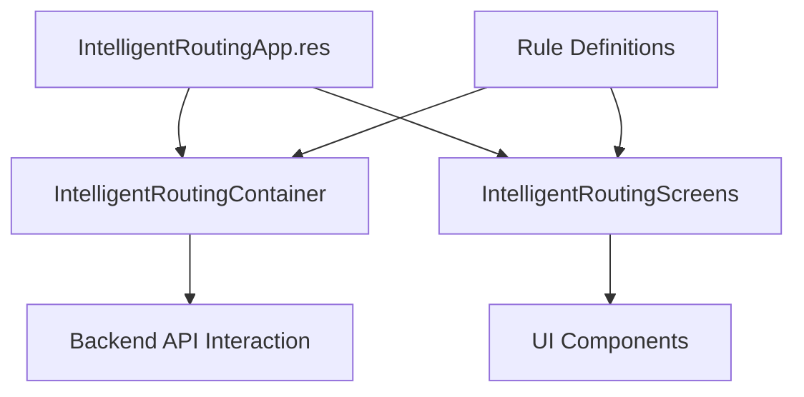
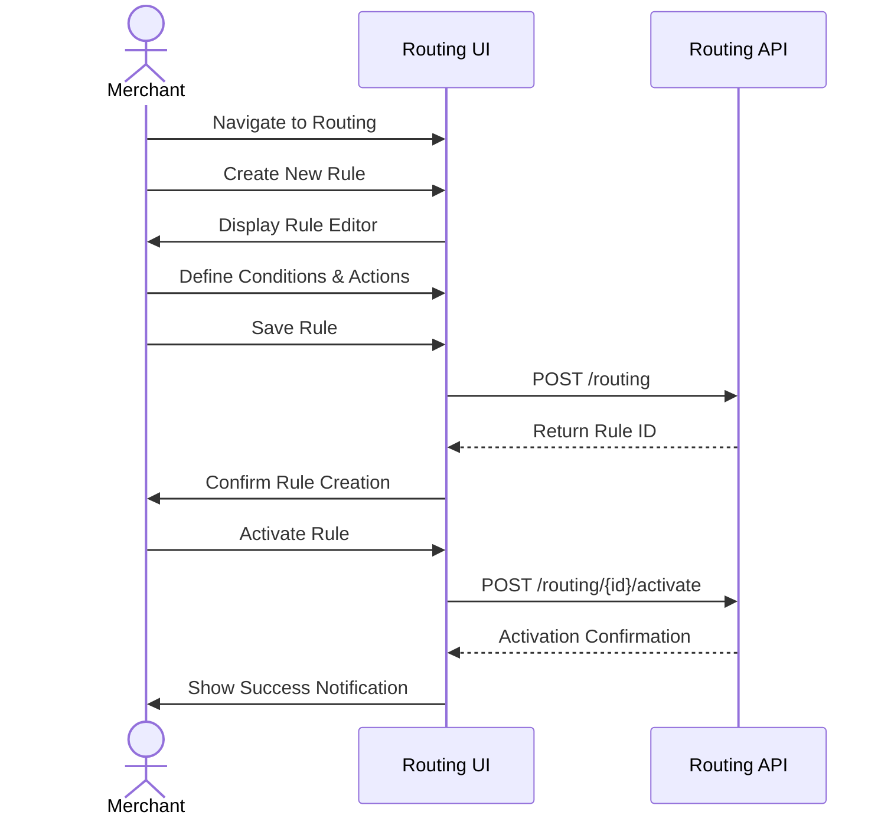
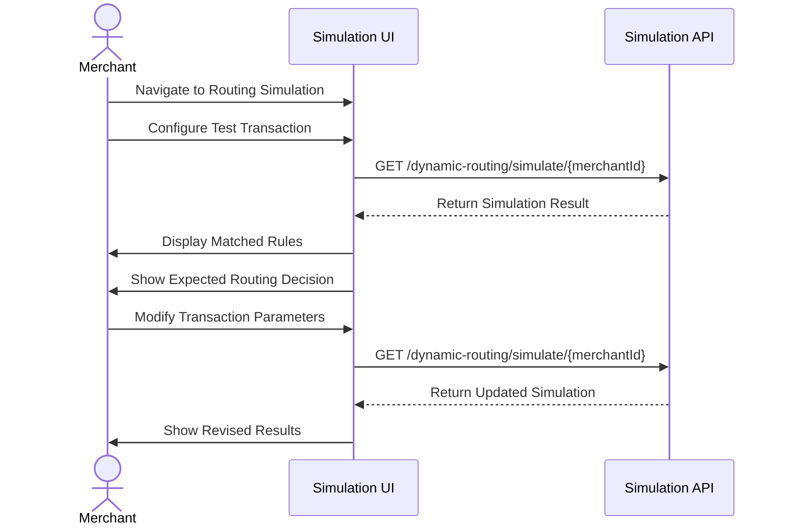

# Intelligent Routing in Hyperswitch

This document provides an overview of the Intelligent Routing functionality in Hyperswitch Control Center, its architecture, features, and implementation patterns.

## Overview

Intelligent Routing is a core feature of Hyperswitch that enables merchants to optimize payment processing by dynamically routing payment transactions across multiple payment processors based on configurable rules and strategies.

The primary goals of the Intelligent Routing system are:

1. **Cost Optimization**: Route transactions to the most cost-effective processor for each specific payment scenario
2. **Success Rate Improvement**: Maximize payment success rates by routing to processors with the best performance for specific payment methods, regions, or currencies
3. **Redundancy**: Provide failover capabilities to alternate processors when primary processors fail
4. **Flexibility**: Enable merchants to implement custom routing strategies tailored to their specific business needs

## Architecture

The Intelligent Routing module follows the standard feature module organization pattern in Hyperswitch:



Key architectural components include:

1. **IntelligentRoutingApp.res**: Entry point for the Intelligent Routing feature
2. **IntelligentRoutingContainer/**: Logic and data management for routing rules
3. **IntelligentRoutingScreens/**: UI components for configuring and visualizing routing
4. **API Integration**: Communication with backend routing services

## Routing Concepts

### 1. Routing Rules

Routing rules define conditions and actions for payment routing:

- **Conditions**: Criteria that determine when a rule applies (e.g., payment method, currency, amount range)
- **Actions**: Processors to route to when conditions are met
- **Priority**: Order in which rules are evaluated
- **Fallback**: Default routing when no rules match

### 2. Routing Strategies

Hyperswitch supports several routing strategies:

- **Volume-Based Routing**: Distribute transactions across processors based on predefined percentages
- **Rule-Based Routing**: Route based on specific transaction attributes (country, currency, card type, etc.)
- **Smart Routing**: Dynamically adjust routing based on processor performance
- **Cascading Routing**: Try alternate processors in sequence if primary processor fails
- **Surcharge-Based Routing**: Apply and route based on surcharges for specific payment methods

### 3. Processors and Connectors

The routing system interacts with:

- **Connector Configurations**: Credentials and settings for each payment processor
- **Processor Capabilities**: Features and limitations of each processor
- **Processor Performance Metrics**: Success rates, latency, and other metrics that influence routing decisions

## Implementation Details

### 1. Rule Configuration Interface

The routing configuration UI allows:

- Creating, editing, and deleting routing rules
- Visualizing rule priority and relationships
- Testing rule outcomes with simulated transactions
- Activating and deactivating routing configurations

Example rule definition structure:

```rescript
type routingCondition = {
  field: string,
  operator: conditionOperator,
  value: string,
}

type routingAction = {
  processor: string,
  fallback: option<string>,
}

type routingRule = {
  id: string,
  name: string,
  conditions: array<routingCondition>,
  action: routingAction,
  priority: int,
}
```

### 2. Rule Evaluation Simulation

The routing module includes simulation capabilities:

- **Test Transactions**: Create test transactions with various attributes
- **Rule Matching**: Visualize which rules would match for specific transactions
- **Expected Outcome**: Show the expected routing decision
- **Performance Metrics**: Simulate success rates and costs

### 3. Analytics Integration

Routing performance is monitored through:

- **Success Rate Tracking**: Monitor success rates by processor and rule
- **Cost Analysis**: Calculate processing costs by routing strategy
- **Optimization Recommendations**: Identify potential improvements

## API Integration

The Intelligent Routing module interacts with several backend endpoints:

| Endpoint                                                | Purpose                                | Method |
| ------------------------------------------------------- | -------------------------------------- | ------ |
| `/routing/list/profile`                                 | List routing configurations            | GET    |
| `/routing/{id}`                                         | Get specific routing configuration     | GET    |
| `/routing`                                              | Create routing configuration           | POST   |
| `/routing/{id}/activate`                                | Activate a routing configuration       | POST   |
| `/routing/active`                                       | Get currently active configuration     | GET    |
| `/routing/default`                                      | Get default fallback configuration     | GET    |
| `/dynamic-routing/simulate/{merchantId}`                | Simulate routing for a transaction     | GET    |
| `/dynamic-routing/simulate/{merchantId}/get-records`    | Get simulation records                 | GET    |
| `/dynamic-routing/simulate/{merchantId}/get-statistics` | Get simulation statistics              | GET    |
| `/dynamic-routing/baseline-review-fields`               | Get fields available for routing rules | GET    |

## User Journeys

### 1. Creating a New Routing Strategy



### 2. Testing a Routing Strategy



## Feature Implementation Status

| Feature               | Status      | Notes                                   |
| --------------------- | ----------- | --------------------------------------- |
| Basic Rule Creation   | Complete    | Core rule creation and editing          |
| Rule Activation       | Complete    | Mechanism to activate configurations    |
| Simulation            | Complete    | Basic simulation capabilities           |
| Volume-Based Routing  | Complete    | Percentage-based distribution           |
| Rule-Based Routing    | Complete    | Condition-based routing                 |
| Cascading Routing     | Complete    | Fallback routing support                |
| Smart Routing         | In Progress | Dynamic adjustment based on performance |
| Performance Analytics | In Progress | Extended metrics and analysis           |

## Best Practices

### 1. Rule Design Principles

- **Specificity**: More specific rules should have higher priority
- **Fallback**: Always define default routing as a fallback
- **Measurability**: Design rules to enable clear performance measurement
- **Simplicity**: Prefer simpler rule sets for easier maintenance

### 2. Testing Recommendations

- **Comprehensive Testing**: Test rules with a variety of transaction scenarios
- **Incremental Rollout**: Consider activating new rules for a small percentage of transactions initially
- **Monitor Closely**: Watch performance metrics after activating new rules

### 3. Optimization Strategies

- **Regular Review**: Periodically review routing performance
- **A/B Testing**: Compare different routing strategies
- **Cost-Benefit Analysis**: Balance processing fees against success rates

## Reference Implementation

A typical routing rule creation flow:

```rescript
// Example: Container component for rule creation
@react.component
let make = () => {
  let getURL = APIUtils.useGetURL()
  let updateMethod = APIUtils.useUpdateMethod()
  let (rule, setRule) = React.useState(_ => initialRuleState)

  let saveRule = async () => {
    try {
      let url = getURL(~entityName=V1(ROUTING), ~methodType=Post)
      let response = await updateMethod(url, rule->convertToJson, Post)
      // Handle success
    } catch {
    | _ => // Handle error
    }
  }

  <RoutingRuleEditorScreen
    rule
    onRuleChange={newRule => setRule(_ => newRule)}
    onSave={_ => saveRule()->ignore}
  />
}
```

## Common Challenges and Solutions

1. **Complex Rule Interactions**

   - **Challenge**: Rules may have unexpected interactions when combined
   - **Solution**: Simulation tools to visualize and test rule outcomes

2. **Performance Monitoring**

   - **Challenge**: Determining if routing is actually improving performance
   - **Solution**: Detailed analytics comparing routing strategies

3. **Processor-Specific Limitations**

   - **Challenge**: Different processors have different capabilities
   - **Solution**: Processor capability matrix in the UI for guidance

4. **Testing in Production**
   - **Challenge**: Testing routing changes in live environments
   - **Solution**: Canary deployment features with gradual rollout
