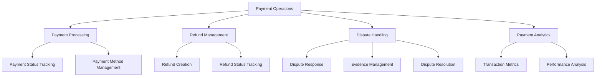
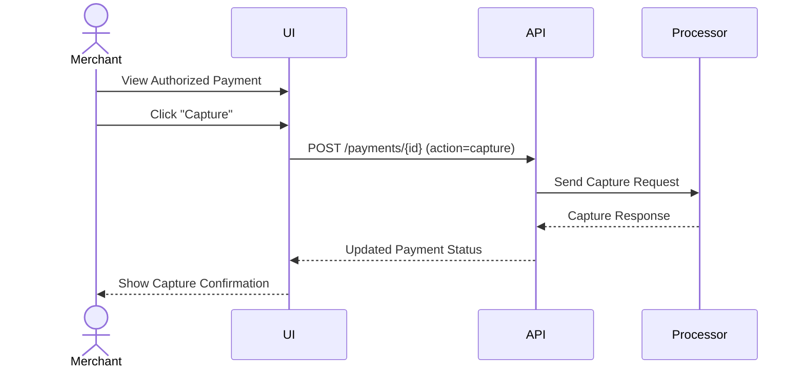
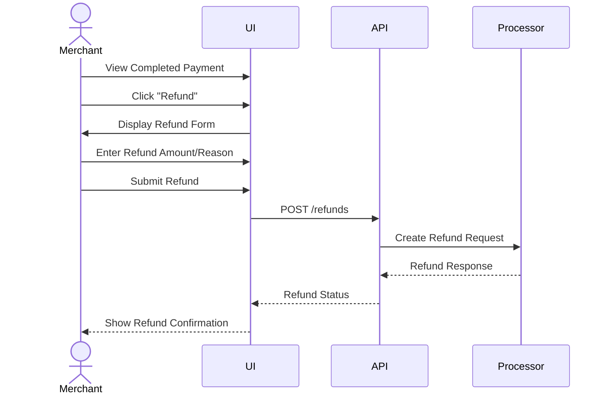
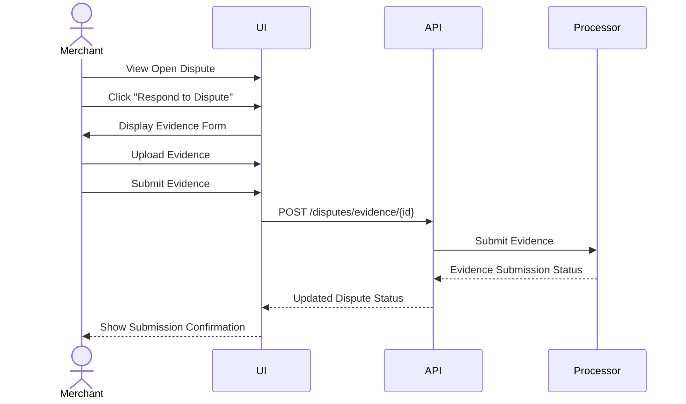

# Payment Operations in Hyperswitch

This document outlines the payment operations functionality in Hyperswitch Control Center, including payment processing, refunds, disputes, and the underlying implementation patterns.

## Overview

Payment operations are core to Hyperswitch Control Center, enabling merchants to process and manage payment transactions across multiple payment processors within a unified interface.



## Key Payment Concepts

### 1. Payment Lifecycle

The full lifecycle of a payment in Hyperswitch:

1. **Initiated**: Payment is created but not yet processed
2. **Processing**: Payment is being processed by the payment provider
3. **Authorized**: Payment has been authorized but not yet captured
4. **Captured**: Funds have been successfully captured
5. **Completed**: Payment process is fully completed
6. **Failed**: Payment processing has failed
7. **Cancelled**: Payment has been cancelled before completion

### 2. Refund Process

The refund workflow:

1. **Initiated**: Refund request is created
2. **Processing**: Refund is being processed by the payment provider
3. **Succeeded**: Refund has been successfully processed
4. **Failed**: Refund processing has failed

### 3. Dispute Lifecycle

The dispute handling process:

1. **Open**: Dispute has been opened by the customer
2. **Under Review**: Dispute is being reviewed
3. **Won**: Dispute has been resolved in merchant's favor
4. **Lost**: Dispute has been resolved in customer's favor
5. **Expired**: Dispute has expired without resolution

## Implementation Architecture

### 1. Payment Table Interface

The payment list view allows merchants to view and manage payments:

```rescript
// Payment table component
@react.component
let make = () => {
  let getURL = APIUtils.useGetURL()
  let getMethod = APIUtils.useGetMethod()
  let (payments, setPayments) = React.useState(_ => [])
  let (loading, setLoading) = React.useState(_ => true)

  React.useEffect0(() => {
    let fetchPayments = async () => {
      try {
        setLoading(_ => true)
        let url = getURL(~entityName=V1(ORDERS), ~methodType=Get)
        let response = await getMethod(url)
        setPayments(_ => response["data"])
      } catch {
      | _ => () // Error handling
      } finally {
        setLoading(_ => false)
      }
    }

    fetchPayments()->ignore
    None
  })

  // Render payment table with filters, sorting, and pagination
}
```

### 2. Payment Detail View

Detailed payment information and actions:

```rescript
// Payment detail component
@react.component
let make = (~paymentId) => {
  let getURL = APIUtils.useGetURL()
  let getMethod = APIUtils.useGetMethod()
  let updateMethod = APIUtils.useUpdateMethod()
  let (payment, setPayment) = React.useState(_ => None)
  let (loading, setLoading) = React.useState(_ => true)

  React.useEffect1(() => {
    let fetchPaymentDetails = async () => {
      try {
        setLoading(_ => true)
        let url = getURL(~entityName=V1(ORDERS), ~methodType=Get, ~id=Some(paymentId))
        let response = await getMethod(url)
        setPayment(_ => Some(response))
      } catch {
      | _ => () // Error handling
      } finally {
        setLoading(_ => false)
      }
    }

    fetchPaymentDetails()->ignore
    None
  }, [paymentId])

  let capturePayment = async () => {
    try {
      let url = getURL(~entityName=V1(ORDERS), ~methodType=Post, ~id=Some(paymentId))
      let body = {
        "action": "capture"
      }
      let _ = await updateMethod(url, body, Post)
      // Refresh payment details
    } catch {
    | _ => () // Error handling
    }
  }

  // Render payment details and action buttons
}
```

### 3. Refund Creation

Process for creating refunds:

```rescript
// Refund creation component
@react.component
let make = (~paymentId, ~paymentAmount) => {
  let getURL = APIUtils.useGetURL()
  let updateMethod = APIUtils.useUpdateMethod()
  let (amount, setAmount) = React.useState(_ => "")
  let (reason, setReason) = React.useState(_ => "")
  let (submitting, setSubmitting) = React.useState(_ => false)

  let createRefund = async () => {
    setSubmitting(_ => true)
    try {
      let url = getURL(~entityName=V1(REFUNDS), ~methodType=Post)
      let body = {
        "payment_id": paymentId,
        "amount": amount->Float.fromString->Option.getOr(0.0),
        "reason": reason,
      }
      let _ = await updateMethod(url, body, Post)
      // Handle success, close modal, etc.
    } catch {
    | _ => () // Error handling
    } finally {
      setSubmitting(_ => false)
    }
  }

  // Render refund form
}
```

### 4. Dispute Management

Interface for handling disputes:

```rescript
// Dispute management component
@react.component
let make = (~disputeId) => {
  let getURL = APIUtils.useGetURL()
  let getMethod = APIUtils.useGetMethod()
  let updateMethod = APIUtils.useUpdateMethod()
  let (dispute, setDispute) = React.useState(_ => None)
  let (loading, setLoading) = React.useState(_ => true)

  React.useEffect1(() => {
    let fetchDisputeDetails = async () => {
      try {
        setLoading(_ => true)
        let url = getURL(~entityName=V1(DISPUTES), ~methodType=Get, ~id=Some(disputeId))
        let response = await getMethod(url)
        setDispute(_ => Some(response))
      } catch {
      | _ => () // Error handling
      } finally {
        setLoading(_ => false)
      }
    }

    fetchDisputeDetails()->ignore
    None
  }, [disputeId])

  let submitEvidence = async (evidenceData) => {
    try {
      let url = getURL(~entityName=V1(DISPUTES_ATTACH_EVIDENCE), ~methodType=Post, ~id=Some(disputeId))
      let _ = await updateMethod(url, evidenceData, Post)
      // Handle success
    } catch {
    | _ => () // Error handling
    }
  }

  // Render dispute details and evidence submission form
}
```

## Data Models

### 1. Payment Data Model

```typescript
type PaymentStatus =
  | "initiated"
  | "processing"
  | "authorized"
  | "captured"
  | "completed"
  | "failed"
  | "cancelled";

interface Payment {
  id: string;
  amount: number;
  currency: string;
  customer_id?: string;
  payment_method: {
    type: string;
    card?: {
      last4: string;
      brand: string;
      expiry_month: number;
      expiry_year: number;
    };
  };
  status: PaymentStatus;
  created_at: string;
  updated_at: string;
  connector: string;
  metadata?: Record<string, any>;
}
```

### 2. Refund Data Model

```typescript
type RefundStatus = "initiated" | "processing" | "succeeded" | "failed";

interface Refund {
  id: string;
  payment_id: string;
  amount: number;
  currency: string;
  reason?: string;
  status: RefundStatus;
  created_at: string;
  updated_at: string;
  connector: string;
  metadata?: Record<string, any>;
}
```

### 3. Dispute Data Model

```typescript
type DisputeStatus = "open" | "under_review" | "won" | "lost" | "expired";

interface Dispute {
  id: string;
  payment_id: string;
  amount: number;
  currency: string;
  reason: string;
  status: DisputeStatus;
  evidence_submitted_at?: string;
  evidence_due_by: string;
  created_at: string;
  updated_at: string;
  connector: string;
}
```

## Payment Operations Workflows

### 1. Payment Capture Workflow



### 2. Refund Creation Workflow



### 3. Dispute Response Workflow



## Key API Endpoints

| Endpoint                  | Purpose                 | Method | Parameters                 |
| ------------------------- | ----------------------- | ------ | -------------------------- |
| `/payments/list`          | List payments           | GET    | page, page_size, filters   |
| `/payments/{id}`          | Get payment details     | GET    | payment_id                 |
| `/payments/{id}`          | Capture/Cancel payment  | POST   | payment_id, action         |
| `/refunds`                | Create refund           | POST   | payment_id, amount, reason |
| `/refunds/list`           | List refunds            | GET    | page, page_size, filters   |
| `/refunds/{id}`           | Get refund details      | GET    | refund_id                  |
| `/disputes/list`          | List disputes           | GET    | page, page_size, filters   |
| `/disputes/{id}`          | Get dispute details     | GET    | dispute_id                 |
| `/disputes/evidence/{id}` | Submit dispute evidence | POST   | dispute_id, evidence_data  |
| `/disputes/accept/{id}`   | Accept dispute          | POST   | dispute_id                 |

## UI Components

### 1. PaymentStatusBadge

Displays payment status with appropriate color coding:

```rescript
// Payment status badge component
@react.component
let make = (~status: string) => {
  let (color, text) = switch status->String.toLowerCase {
  | "initiated" => ("bg-blue-100 text-blue-800", "Initiated")
  | "processing" => ("bg-yellow-100 text-yellow-800", "Processing")
  | "authorized" => ("bg-purple-100 text-purple-800", "Authorized")
  | "captured" => ("bg-indigo-100 text-indigo-800", "Captured")
  | "completed" => ("bg-green-100 text-green-800", "Completed")
  | "failed" => ("bg-red-100 text-red-800", "Failed")
  | "cancelled" => ("bg-gray-100 text-gray-800", "Cancelled")
  | _ => ("bg-gray-100 text-gray-800", status)
  }

  <span className={`px-2 py-1 rounded-full text-xs font-medium ${color}`}>
    {React.string(text)}
  </span>
}
```

### 2. PaymentMethodDisplay

Renders payment method details:

```rescript
// Payment method display component
@react.component
let make = (~paymentMethod) => {
  let methodType = paymentMethod->Dict.get("type")->Option.getOr("")

  switch methodType {
  | "card" => {
      let card = paymentMethod->Dict.get("card")->Option.getOr(Dict.make())
      let last4 = card->Dict.get("last4")->Option.getOr("")
      let brand = card->Dict.get("brand")->Option.getOr("")

      <div className="flex items-center">
        <Icon name={brand->getCardIcon} className="mr-2" />
        <span>
          {React.string(`${brand->String.capitalize} ending in ${last4}`)}
        </span>
      </div>
    }
  | "wallet" => {
      let wallet = paymentMethod->Dict.get("wallet")->Option.getOr(Dict.make())
      let walletType = wallet->Dict.get("type")->Option.getOr("")

      <div className="flex items-center">
        <Icon name={walletType->getWalletIcon} className="mr-2" />
        <span>
          {React.string(walletType->String.capitalize)}
        </span>
      </div>
    }
  | _ => <span> {React.string(methodType->String.capitalize)} </span>
  }
}
```

### 3. PaymentActionButtons

Contextual action buttons based on payment status:

```rescript
// Payment action buttons component
@react.component
let make = (~payment, ~onCapture, ~onRefund, ~onCancel) => {
  let status = payment->Dict.get("status")->Option.getOr("")

  <div className="flex space-x-2">
    <RenderIf condition={status == "authorized"}>
      <Button
        text="Capture"
        buttonType=Primary
        leftIcon=FontAwesome("check-circle")
        onClick={_ => onCapture()}
      />
    </RenderIf>

    <RenderIf condition={status == "captured" || status == "completed"}>
      <Button
        text="Refund"
        buttonType=Secondary
        leftIcon=FontAwesome("undo")
        onClick={_ => onRefund()}
      />
    </RenderIf>

    <RenderIf condition={status == "authorized" || status == "initiated"}>
      <Button
        text="Cancel"
        buttonType=Delete
        leftIcon=FontAwesome("times-circle")
        onClick={_ => onCancel()}
      />
    </RenderIf>
  </div>
}
```

## Payment Analytics

### 1. Success Rate Metrics

Tracking payment success rates:

```rescript
// Success rate component
@react.component
let make = (~timeframe) => {
  let getURL = APIUtils.useGetURL()
  let getMethod = APIUtils.useGetMethod()
  let (metrics, setMetrics) = React.useState(_ => None)
  let (loading, setLoading) = React.useState(_ => true)

  React.useEffect1(() => {
    let fetchMetrics = async () => {
      try {
        setLoading(_ => true)
        let url = getURL(
          ~entityName=V1(ANALYTICS_PAYMENTS),
          ~methodType=Post,
          ~id=Some("success_rate")
        )
        let body = {
          "timeframe": timeframe,
        }
        let response = await APIUtils.useUpdateMethod(url, body, Post)
        setMetrics(_ => Some(response))
      } catch {
      | _ => () // Error handling
      } finally {
        setLoading(_ => false)
      }
    }

    fetchMetrics()->ignore
    None
  }, [timeframe])

  // Render success rate metrics and charts
}
```

### 2. Payment Volume Analysis

Analyzing payment volumes:

```rescript
// Payment volume component
@react.component
let make = (~timeframe, ~groupBy) => {
  let getURL = APIUtils.useGetURL()
  let updateMethod = APIUtils.useUpdateMethod()
  let (volumeData, setVolumeData) = React.useState(_ => None)
  let (loading, setLoading) = React.useState(_ => true)

  React.useEffect2(() => {
    let fetchVolumeData = async () => {
      try {
        setLoading(_ => true)
        let url = getURL(
          ~entityName=V1(ANALYTICS_PAYMENTS),
          ~methodType=Post,
          ~id=Some("volume")
        )
        let body = {
          "timeframe": timeframe,
          "group_by": groupBy,
        }
        let response = await updateMethod(url, body, Post)
        setVolumeData(_ => Some(response))
      } catch {
      | _ => () // Error handling
      } finally {
        setLoading(_ => false)
      }
    }

    fetchVolumeData()->ignore
    None
  }, [timeframe, groupBy])

  // Render volume charts
}
```

## Security Considerations

Payment operations require special security handling:

1. **Sensitive Data**: Card details are never stored or displayed in full
2. **PCI Compliance**: Adheres to PCI-DSS requirements for handling payment data
3. **Access Control**: Fine-grained permissions for payment operations
4. **Audit Logging**: All payment actions are logged for audit purposes
5. **Data Encryption**: Sensitive payment data is encrypted

## Best Practices

### 1. Payment Processing

- Always validate payment details before submitting
- Implement proper error handling for failed payments
- Provide clear feedback on payment status
- Use idempotency keys for payment operations to prevent duplicates

### 2. Refund Management

- Implement confirmation dialogs for refund actions
- Validate refund amounts against original payment
- Track refund status and provide updates
- Support partial refunds with proper validation

### 3. Dispute Handling

- Provide clear dispute resolution workflows
- Enable easy evidence submission
- Send notifications for dispute deadlines
- Track dispute metrics to identify patterns

## Payment Processing Hooks

Custom hooks for common payment operations:

```rescript
// Hook for fetching payment details
let usePaymentDetails = (paymentId) => {
  let getURL = APIUtils.useGetURL()
  let getMethod = APIUtils.useGetMethod()
  let (payment, setPayment) = React.useState(_ => None)
  let (loading, setLoading) = React.useState(_ => true)
  let (error, setError) = React.useState(_ => None)

  React.useEffect1(() => {
    let fetchPayment = async () => {
      setLoading(_ => true)
      setError(_ => None)

      try {
        let url = getURL(~entityName=V1(ORDERS), ~methodType=Get, ~id=Some(paymentId))
        let response = await getMethod(url)
        setPayment(_ => Some(response))
      } catch {
      | e => setError(_ => Some(Exn.message(e)->Option.getOr("Failed to fetch payment")))
      } finally {
        setLoading(_ => false)
      }
    }

    if paymentId->String.length > 0 {
      fetchPayment()->ignore
    }

    None
  }, [paymentId])

  (payment, loading, error)
}

// Hook for capturing a payment
let useCapturePayment = () => {
  let getURL = APIUtils.useGetURL()
  let updateMethod = APIUtils.useUpdateMethod()
  let (loading, setLoading) = React.useState(_ => false)
  let (error, setError) = React.useState(_ => None)

  let capturePayment = async (paymentId) => {
    setLoading(_ => true)
    setError(_ => None)

    try {
      let url = getURL(~entityName=V1(ORDERS), ~methodType=Post, ~id=Some(paymentId))
      let body = {
        "action": "capture"
      }
      let response = await updateMethod(url, body, Post)
      response
    } catch {
    | e => {
        setError(_ => Some(Exn.message(e)->Option.getOr("Failed to capture payment")))
        Exn.raiseError("Failed to capture payment")
      }
    } finally {
      setLoading(_ => false)
    }
  }

  (capturePayment, loading, error)
}
```

## Feature Flag Integration

Payment operations integrate with feature flags:

```rescript
@react.component
let make = () => {
  let {auditTrail} = HyperswitchAtom.featureFlagAtom->Recoil.useRecoilValueFromAtom

  <div>
    <PaymentTable />

    <RenderIf condition=auditTrail>
      <PaymentAuditTrail />
    </RenderIf>
  </div>
}
```

## Testing Strategy

Approaches for testing payment operations:

1. **Unit Testing**: Test individual payment components and hooks
2. **Integration Testing**: Test payment workflows end-to-end
3. **API Mocking**: Mock payment API responses for testing
4. **Test Mode**: Sandbox environment for testing payment operations
5. **Visual Testing**: Ensure payment UI displays correctly in all states

## Common Payment Patterns

### 1. Payment Status Polling

For long-running payment operations:

```rescript
// Payment status polling
let usePaymentStatusPolling = (paymentId, initialStatus) => {
  let getURL = APIUtils.useGetURL()
  let getMethod = APIUtils.useGetMethod()
  let (status, setStatus) = React.useState(_ => initialStatus)

  React.useEffect2(() => {
    let isTerminalStatus = s => {
      switch s {
      | "completed" | "failed" | "cancelled" => true
      | _ => false
      }
    }

    let rec pollStatus = () => {
      if isTerminalStatus(status) {
        // Stop polling for terminal statuses
        None
      } else {
        // Set up polling for non-terminal statuses
        let timerId = Js.Global.setTimeout(() => {
          let fetchStatus = async () => {
            try {
              let url = getURL(~entityName=V1(ORDERS), ~methodType=Get, ~id=Some(paymentId))
              let response = await getMethod(url)
              let newStatus = response->Dict.get("status")->Option.getOr(status)
              setStatus(_ => newStatus)
            } catch {
            | _ => () // Handle errors
            }
          }

          fetchStatus()->ignore
          // Continue polling
          pollStatus()->ignore
        }, 5000) // Poll every 5 seconds

        Some(() => Js.Global.clearTimeout(timerId))
      }
    }

    pollStatus()->ignore

    // Clean up on unmount
    Some(() => {
      // Any cleanup code
    })
  }, (paymentId, status))

  status
}
```

### 2. Batch Operations

For processing multiple payments/refunds:

```rescript
// Batch refund component
@react.component
let make = (~selectedPaymentIds) => {
  let getURL = APIUtils.useGetURL()
  let updateMethod = APIUtils.useUpdateMethod()
  let (processing, setProcessing) = React.useState(_ => false)
  let (results, setResults) = React.useState(_ => [])

  let processBatchRefunds = async () => {
    setProcessing(_ => true)
    setResults(_ => [])

    let processedResults = []

    for (i in 0 to selectedPaymentIds->Array.length - 1) {
      let paymentId = selectedPaymentIds[i]

      try {
        let url = getURL(~entityName=V1(REFUNDS), ~methodType=Post)
        let body = {
          "payment_id": paymentId,
          "amount": 0, // Full refund
        }
        let response = await updateMethod(url, body, Post)

        processedResults->Array.push({
          "payment_id": paymentId,
          "status": "succeeded",
          "refund_id": response->Dict.get("id")->Option.getOr(""),
        })
      } catch {
      | e => {
          processedResults->Array.push({
            "payment_id": paymentId,
            "status": "failed",
            "error": Exn.message(e)->Option.getOr("Unknown error"),
          })
        }
      }
    }

    setResults(_ => processedResults)
    setProcessing(_ => false)
  }

  // Render batch refund interface
}
```

### 3. Payment Search and Filtering

Advanced search capabilities:

```rescript
// Payment search component
@react.component
let make = () => {
  let getURL = APIUtils.useGetURL()
  let updateMethod = APIUtils.useUpdateMethod()
  let (filters, setFilters) = React.useState(_ => Dict.make())
  let (searchResults, setSearchResults) = React.useState(_ => [])
  let (loading, setLoading) = React.useState(_ => false)

  let updateFilter = (key, value) => {
    let updatedFilters = filters->Dict.copy

    if value->String.length > 0 {
      updatedFilters->Dict.set(key, value)
    } else {
      updatedFilters->Dict.remove(key)
    }

    setFilters(_ => updatedFilters)
  }

  let performSearch = async () => {
    setLoading(_ => true)

    try {
      let url = getURL(~entityName=V1(ORDER_FILTERS), ~methodType=Get)
      let filtersJson = filters->JSON.stringify
      let searchUrl = `${url}?filters=${filtersJson}`

      let response = await getMethod(searchUrl)
      setSearchResults(_ => response["data"])
    } catch {
    | _ => () // Error handling
    } finally {
      setLoading(_ => false)
    }
  }

  // Render search interface and results
}
```

## Payment Experience Optimization

Strategies for optimizing payment operations:

1. **Quick Actions**: Common payment actions accessible with minimal clicks
2. **Batch Processing**: Process multiple payments/refunds at once
3. **Contextual Information**: Show relevant payment details based on context
4. **Intelligent Defaults**: Pre-populate form fields with smart defaults
5. **Keyboard Shortcuts**: Support keyboard shortcuts for power users
