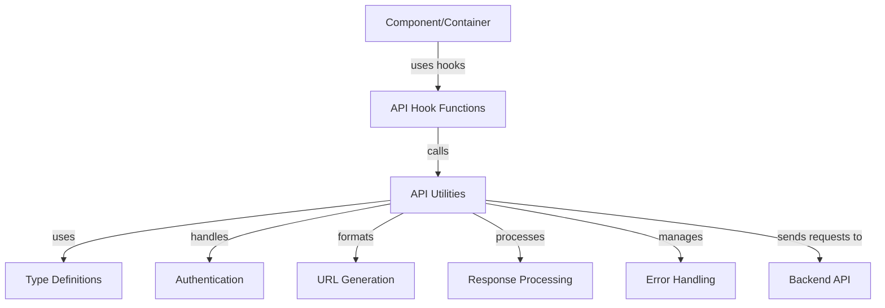

# ReScript API Call Structure in Hyperswitch

This document outlines the standardized patterns for making API calls in the Hyperswitch Control Center, focusing on the ReScript-specific implementation details and type safety patterns.

## API Call Architecture

The Hyperswitch Control Center implements a robust, type-safe approach to API communication using ReScript's strong type system and pattern matching capabilities.



## Key Components

### 1. Type Definitions (APIUtilsTypes.res)

ReScript's type system is leveraged to ensure type-safe API calls:

```rescript
// Entity type definitions for URL generation
type entityName =
  | CONNECTOR
  | ROUTING
  | MERCHANT_ACCOUNT
  // ... other entity types

// Version variations
type entityTypeWithVersion = V1(entityName) | V2(v2entityNameType)

// Function signature for URL generation
type getUrlTypes = (
  ~entityName: entityTypeWithVersion,
  ~methodType: Fetch.requestMethod,
  ~id: option<string>=?,
  // ... other parameters
) => string
```

These type definitions ensure:
1. All possible API endpoints are enumerated and handled
2. Required parameters are enforced at compile time
3. Optional parameters are properly typed

### 2. URL Generation (APIUtils.res)

A central function (`useGetURL`) generates consistent URLs based on entity types:

```rescript
let useGetURL = () => {
  let {getUserInfoData} = React.useContext(UserInfoProvider.defaultContext)

  let getUrl = (
    ~entityName: entityTypeWithVersion,
    ~methodType: Fetch.requestMethod,
    ~id=None,
    // ... other parameters
  ) => {
    let {transactionEntity, analyticsEntity, userEntity, merchantId, profileId} = getUserInfoData()
    
    // URL generation logic using pattern matching
    let endpoint = switch entityName {
      | V1(entityNameType) =>
          switch entityNameType {
          | CONNECTOR => // Generate connector URL
          | ROUTING => // Generate routing URL
          // ... other entities
          }
      | V2(entityNameForv2) => // Handle V2 endpoints
    }

    `${Window.env.apiBaseUrl}/${endpoint}`
  }
  getUrl
}
```

This approach:
1. Centralizes URL generation logic
2. Uses exhaustive pattern matching for all endpoint types
3. Incorporates user context and permissions
4. Supports versioned API endpoints (V1, V2)

### 3. API Request Hooks

Two main hooks encapsulate GET and update (POST/PUT/DELETE) operations:

```rescript
// GET requests
let useGetMethod = (~showErrorToast=true) => {
  // Hook setup code...
  
  async (url, ~version=UserInfoTypes.V1) => {
    try {
      let res = await fetchApi(url, ~method_=Get, /* other params */)
      await responseHandler(~url, ~res, /* other params */)
    } catch {
    | Exn.Error(e) => catchHandler(/* params */)
    | _ => Exn.raiseError("Something went wrong")
    }
  }
}

// POST/PUT/DELETE requests
let useUpdateMethod = (~showErrorToast=true) => {
  // Hook setup code...
  
  async (url, body, method, ~bodyFormData=?, ~headers=Dict.make(), /* other params */) => {
    try {
      let res = await fetchApi(url, ~method_=method, ~bodyStr=body->JSON.stringify, /* other params */)
      await responseHandler(~url, ~res, /* other params */)
    } catch {
    | Exn.Error(e) => catchHandler(/* params */)
    | _ => Exn.raiseError("Something went wrong")
    }
  }
}
```

These hooks:
1. Abstract the complexity of making API requests
2. Handle authentication automatically
3. Provide consistent error handling
4. Integrate with the application's toast notification system

### 4. Response and Error Handling

Standardized response handling ensures consistent processing of API responses:

```rescript
let responseHandler = async (
  ~url,
  ~res,
  ~showToast: ToastState.showToastFn,
  ~showErrorToast: bool,
  ~showPopUp: PopUpState.popUpProps => unit,
  ~isPlayground,
  ~popUpCallBack,
  ~handleLogout,
  ~sendEvent,
) => {
  // Parse response JSON
  let json = try {
    await res->(res => res->Fetch.Response.json)
  } catch {
  | _ => JSON.Encode.null
  }

  // Handle response based on status code
  let responseStatus = res->Fetch.Response.status
  
  switch responseStatus {
  | 200 => json  // Success case
  | 401 => // Handle authentication failure
  | 403 => // Handle forbidden access
  | 404 => // Handle not found
  | _ => // Handle other errors
  }
}
```

Error handling patterns include:
1. Status code-specific handling (401 for auth failures, etc.)
2. User-friendly error messages via toast notifications
3. Session management for authentication failures
4. Event logging for monitoring and debugging

## Usage Patterns

### Basic GET Request

```rescript
// In a component or container
let fetchData = () => {
  let getURL = APIUtils.useGetURL()
  let getMethod = APIUtils.useGetMethod()
  
  let getData = async () => {
    try {
      let url = getURL(~entityName=V1(ORDERS), ~methodType=Get)
      let response = await getMethod(url)
      // Process response...
    } catch {
    | Exn.Error(e) => // Handle error
    }
  }
  
  getData()
}
```

### POST/PUT/DELETE Request

```rescript
// In a component or container
let submitData = (data) => {
  let getURL = APIUtils.useGetURL()
  let updateMethod = APIUtils.useUpdateMethod()
  
  let sendData = async () => {
    try {
      let url = getURL(~entityName=V1(CONNECTOR), ~methodType=Post)
      let response = await updateMethod(url, data, Post)
      // Process response...
    } catch {
    | Exn.Error(e) => // Handle error
    }
  }
  
  sendData()
}
```

## Best Practices

1. **Type Everything**: Use ReScript's type system to ensure all API parameters and responses are properly typed.

2. **Centralize URL Generation**: Always use the `useGetURL` hook for consistent URL generation.

3. **Handle Errors Gracefully**: 
   - Use try/catch blocks around API calls
   - Show user-friendly error messages
   - Log errors for debugging

4. **Version Awareness**: Use the appropriate version (V1/V2) for endpoints based on API documentation.

5. **Authentication Integration**: Let the API utilities handle authentication automatically.

6. **Toast Notifications**: Use the built-in toast notification system for user feedback on API operations.

## Common Patterns

### Data Fetching in Components

```rescript
// Pattern for data fetching in a component
@react.component
let make = () => {
  let getURL = APIUtils.useGetURL()
  let getMethod = APIUtils.useGetMethod()
  let (data, setData) = React.useState(_ => None)
  let (loading, setLoading) = React.useState(_ => true)
  
  React.useEffect0(() => {
    let fetchData = async () => {
      try {
        setLoading(_ => true)
        let url = getURL(~entityName=V1(ORDERS), ~methodType=Get)
        let response = await getMethod(url)
        setData(_ => Some(response))
      } catch {
      | _ => () // Handle error
      } finally {
        setLoading(_ => false)
      }
    }
    
    fetchData()->ignore
    None
  })
  
  if loading {
    <LoadingComponent />
  } else {
    switch data {
    | Some(data) => <DataDisplay data />
    | None => <EmptyState />
    }
  }
}
```

### Form Submission

```rescript
// Pattern for form submission
let handleSubmit = (formData) => {
  let getURL = APIUtils.useGetURL()
  let updateMethod = APIUtils.useUpdateMethod()
  let (submitting, setSubmitting) = React.useState(_ => false)
  
  let submit = async () => {
    setSubmitting(_ => true)
    try {
      let url = getURL(~entityName=V1(CONNECTOR), ~methodType=Post)
      let response = await updateMethod(url, formData, Post)
      // Handle success
    } catch {
    | _ => // Handle error
    } finally {
      setSubmitting(_ => false)
    }
  }
  
  submit()->ignore
}
```

## Custom API Hooks

For frequently used API operations, custom hooks are built on top of the base API utilities:

```rescript
// Example custom hook for fetching payment data
let useFetchPayments = () => {
  let getURL = APIUtils.useGetURL()
  let getMethod = APIUtils.useGetMethod()
  
  let fetchPayments = async (~params=?) => {
    let queryString = switch params {
    | Some(p) => `?${p}`
    | None => ""
    }
    
    let url = getURL(~entityName=V1(ORDERS), ~methodType=Get) ++ queryString
    await getMethod(url)
  }
  
  fetchPayments
}
```

These custom hooks:
1. Abstract common API operations into reusable functions
2. Provide a more domain-specific interface
3. Reduce duplication across components
