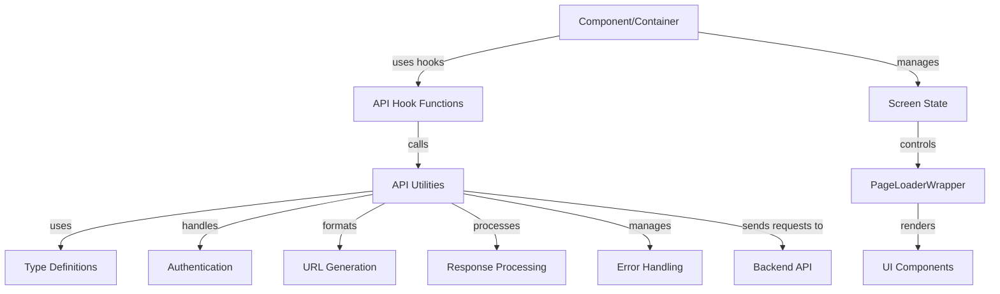

# ReScript API Call Structure in Hyperswitch

This document outlines the standardized patterns for making API calls in the Hyperswitch Control Center, focusing on the ReScript-specific implementation details and type safety patterns, with integration of the PageLoaderWrapper pattern for consistent UI state management.

## API Call Architecture

The Hyperswitch Control Center implements a robust, type-safe approach to API communication using ReScript's strong type system and pattern matching capabilities.



## Key Components

### 1. Type Definitions (APIUtilsTypes.res)

    - `entityName`: The name of the entity to fetch (e.g., `USERS`). You will need to provide this.
    - `userType`: The type of user (e.g., `#ROLE_INFO`).
    - `methodType`: The HTTP method to use (e.g., `Get`). You will need to provide this.

ReScript's type system is leveraged to ensure type-safe API calls:

```rescript
// Entity type definitions for URL generation
type entityName =
  | CONNECTOR
  | ROUTING
  | MERCHANT_ACCOUNT
  // ... other entity types

// Version variations
type entityTypeWithVersion = V1(entityName) | V2(v2entityNameType)

// Function signature for URL generation
type getUrlTypes = (
  ~entityName: entityTypeWithVersion,
  ~methodType: Fetch.requestMethod,
  ~id: option<string>=?,
  // ... other parameters
) => string
```

These type definitions ensure:

1. All possible API endpoints are enumerated and handled
2. Required parameters are enforced at compile time
3. Optional parameters are properly typed

### 2. URL Generation (APIUtils.res)

A central function (`useGetURL`) generates consistent URLs based on entity types:

```rescript
let useGetURL = () => {
  let {getUserInfoData} = React.useContext(UserInfoProvider.defaultContext)

  let getUrl = (
    ~entityName: entityTypeWithVersion,
    ~methodType: Fetch.requestMethod,
    ~id=None,
    // ... other parameters
  ) => {
    let {transactionEntity, analyticsEntity, userEntity, merchantId, profileId} = getUserInfoData()

    // URL generation logic using pattern matching
    let endpoint = switch entityName {
      | V1(entityNameType) =>
          switch entityNameType {
          | CONNECTOR => // Generate connector URL
          | ROUTING => // Generate routing URL
          // ... other entities
          }
      | V2(entityNameForv2) => // Handle V2 endpoints
    }

    `${Window.env.apiBaseUrl}/${endpoint}`
  }
  getUrl
}
```

This approach:

1. Centralizes URL generation logic
2. Uses exhaustive pattern matching for all endpoint types
3. Incorporates user context and permissions
4. Supports versioned API endpoints (V1, V2)

### 3. API Request Hooks

Two main hooks encapsulate GET and update (POST/PUT/DELETE) operations:

```rescript
// GET requests
let useGetMethod = (~showErrorToast=true) => {
  // Hook setup code...

  async (url, ~version=UserInfoTypes.V1) => {
    try {
      let res = await fetchApi(url, ~method_=Get, /* other params */)
      await responseHandler(~url, ~res, /* other params */)
    } catch {
    | Exn.Error(e) => catchHandler(/* params */)
    | _ => Exn.raiseError("Something went wrong")
    }
  }
}

// POST/PUT/DELETE requests
let useUpdateMethod = (~showErrorToast=true) => {
  // Hook setup code...

  async (url, body, method, ~bodyFormData=?, ~headers=Dict.make(), /* other params */) => {
    try {
      let res = await fetchApi(url, ~method_=method, ~bodyStr=body->JSON.stringify, /* other params */)
      await responseHandler(~url, ~res, /* other params */)
    } catch {
    | Exn.Error(e) => catchHandler(/* params */)
    | _ => Exn.raiseError("Something went wrong")
    }
  }
}
```

These hooks:

1. Abstract the complexity of making API requests
2. Handle authentication automatically
3. Provide consistent error handling
4. Integrate with the application's toast notification system

### 4. Response and Error Handling

Standardized response handling ensures consistent processing of API responses:

```rescript
let responseHandler = async (
  ~url,
  ~res,
  ~showToast: ToastState.showToastFn,
  ~showErrorToast: bool,
  ~showPopUp: PopUpState.popUpProps => unit,
  ~isPlayground,
  ~popUpCallBack,
  ~handleLogout,
  ~sendEvent,
) => {
  // Parse response JSON
  let json = try {
    await res->(res => res->Fetch.Response.json)
  } catch {
  | _ => JSON.Encode.null
  }

  // Handle response based on status code
  let responseStatus = res->Fetch.Response.status

  switch responseStatus {
  | 200 => json  // Success case
  | 401 => // Handle authentication failure
  | 403 => // Handle forbidden access
  | 404 => // Handle not found
  | _ => // Handle other errors
  }
}
```

Error handling patterns include:

1. Status code-specific handling (401 for auth failures, etc.)
2. User-friendly error messages via toast notifications
3. Session management for authentication failures
4. Event logging for monitoring and debugging

## Usage Patterns

### Basic GET Request

```rescript
// In a component or container
let fetchData = () => {
  let getURL = APIUtils.useGetURL()
  let getMethod = APIUtils.useGetMethod()

  let getData = async () => {
    try {
      let url = getURL(~entityName=V1(ORDERS), ~methodType=Get)
      let response = await getMethod(url)
      // Process response...
    } catch {
    | Exn.Error(e) => // Handle error
    }
  }

  getData()
}
```

### POST/PUT/DELETE Request

```rescript
// In a component or container
let submitData = (data) => {
  let getURL = APIUtils.useGetURL()
  let updateMethod = APIUtils.useUpdateMethod()

  let sendData = async () => {
    try {
      let url = getURL(~entityName=V1(CONNECTOR), ~methodType=Post)
      let response = await updateMethod(url, data, Post)
      // Process response...
    } catch {
    | Exn.Error(e) => // Handle error
    }
  }

  sendData()
}
```

## Best Practices

1. **Type Everything**: Use ReScript's type system to ensure all API parameters and responses are properly typed.

2. **Centralize URL Generation**: Always use the `useGetURL` hook for consistent URL generation.

3. **Handle Errors Gracefully**:

   - Use try/catch blocks around API calls
   - Show user-friendly error messages
   - Log errors for debugging

4. **Version Awareness**: Use the appropriate version (V1/V2) for endpoints based on API documentation.

5. **Authentication Integration**: Let the API utilities handle authentication automatically.

6. **Toast Notifications**: Use the built-in toast notification system for user feedback on API operations.

## Integration with PageLoaderWrapper

A core pattern in the Hyperswitch Control Center is integrating API calls with the PageLoaderWrapper component to manage UI states during asynchronous operations. This approach provides consistent loading, error, and success states across the application.

### Data Fetching with PageLoaderWrapper

```rescript
// Pattern for data fetching in a component with PageLoaderWrapper
@react.component
let make = () => {
  let getURL = APIUtils.useGetURL()
  let getMethod = APIUtils.useGetMethod()
  let showToast = ToastState.useShowToast()

  // Screen state for UI state management
  let (screenState, setScreenState) = React.useState(_ => PageLoaderWrapper.Loading)
  let (data, setData) = React.useState(_ => None)

  React.useEffect0(() => {
    let fetchData = async () => {
      try {
        // Set loading state before API call
        setScreenState(_ => PageLoaderWrapper.Loading)

        let url = getURL(~entityName=V1(ORDERS), ~methodType=Get)
        let response = await getMethod(url)

        // Set data and success state after successful API call
        setData(_ => Some(response))
        setScreenState(_ => PageLoaderWrapper.Success)
      } catch {
      | Exn.Error(e) => {
        // Set error state with message
        let errorMsg = Exn.message(e)->Option.getOr("Failed to fetch data")
        setScreenState(_ => PageLoaderWrapper.Error(errorMsg))
        showToast(~message=errorMsg, ~toastType=ToastError)
      }
      }
    }

    fetchData()->ignore
    None
  })

  // PageLoaderWrapper handles loading, error, and success states
  <PageLoaderWrapper screenState>
    <div className="p-4">
      {switch data {
      | Some(responseData) => <DataDisplay data={responseData} />
      | None => React.null
      }}
    </div>
  </PageLoaderWrapper>
}
```

### Form Submission with PageLoaderWrapper

```rescript
// Pattern for form submission with PageLoaderWrapper
let FormComponent = () => {
  let getURL = APIUtils.useGetURL()
  let updateMethod = APIUtils.useUpdateMethod()
  let showToast = ToastState.useShowToast()

  // Screen state for UI state management
  let (screenState, setScreenState) = React.useState(_ => PageLoaderWrapper.Success)

  let handleSubmit = async (formData) => {
    try {
      setScreenState(_ => PageLoaderWrapper.Loading)

      let url = getURL(~entityName=V1(CONNECTOR), ~methodType=Post)
      let response = await updateMethod(url, formData, Post)

      setScreenState(_ => PageLoaderWrapper.Success)
      showToast(~message="Data saved successfully", ~toastType=ToastSuccess)

      // Process response if needed
    } catch {
    | Exn.Error(e) => {
      let errorMsg = Exn.message(e)->Option.getOr("Failed to save data")
      setScreenState(_ => PageLoaderWrapper.Error(errorMsg))
      showToast(~message=errorMsg, ~toastType=ToastError)
    }
    }
  }

  <PageLoaderWrapper screenState>
    <Form onSubmit={handleSubmit}>
      {/* Form fields */}
    </Form>
  </PageLoaderWrapper>
}
```

### Empty Data Handling

```rescript
// Handling empty data with PageLoaderWrapper Custom state
let fetchData = async () => {
  setScreenState(_ => PageLoaderWrapper.Loading)

  try {
    let url = getURL(~entityName=V1(ENTITY), ~methodType=Get)
    let response = await getMethod(url)

    if (response->Array.length > 0) {
      setData(_ => response)
      setScreenState(_ => PageLoaderWrapper.Success)
    } else {
      // No data case uses Custom state
      setScreenState(_ => PageLoaderWrapper.Custom)
    }
  } catch {
    | Exn.Error(e) => {
      let errorMsg = Exn.message(e)->Option.getOr("Failed to fetch data")
      setScreenState(_ => PageLoaderWrapper.Error(errorMsg))
    }
  }
}

// In render function
<PageLoaderWrapper
  screenState
  customUI={<NoDataFound message="No data available" />}>
  <DataDisplay data />
</PageLoaderWrapper>
```

## Adding New API Endpoints

When adding a new API endpoint to the application, follow these steps to ensure type safety and consistency:

### 1. Add a Route Variant to APIUtilsTypes.res

First, add a new variant to the `entityName` or `v2entityNameType` type in APIUtilsTypes.res:

```rescript
type entityName =
  | CONNECTOR
  | ROUTING
  | MERCHANT_ACCOUNT
  | NEW_ENTITY // Add your new entity here
  // ... other entity types
```

### 2. Update URL Mapping in APIUtils.res

Add a mapping for the new route in the `useGetURL` function:

```rescript
let endpoint = switch entityName {
  | V1(entityNameType) =>
      switch entityNameType {
      | CONNECTOR => // Existing connector URL
      | ROUTING => // Existing routing URL
      | NEW_ENTITY => // New entity URL format
        switch methodType {
        | Get => `api/v1/new-entity${id->Option.mapOr("", id => `/${id}`)}`
        | Post => `api/v1/new-entity`
        | Put => `api/v1/new-entity${id->Option.mapOr("", id => `/${id}`)}`
        | Delete => `api/v1/new-entity${id->Option.mapOr("", id => `/${id}`)}`
        | _ => ""
        }
      // ... other entities
      }
  | V2(entityNameForv2) => // Handle V2 endpoints
}
```

### 3. Component Implementation

Implement the API call in your component:

```rescript
@react.component
let make = () => {
  let (screenState, setScreenState) = React.useState(_ => PageLoaderWrapper.Loading)
  let (data, setData) = React.useState(_ => None)
  let getURL = APIUtils.useGetURL()
  let getMethod = APIUtils.useGetMethod()

  React.useEffect0(() => {
    let fetchData = async () => {
      try {
        setScreenState(_ => PageLoaderWrapper.Loading)

        let url = getURL(~entityName=V1(NEW_ENTITY), ~methodType=Get)
        let response = await getMethod(url)

        // Convert response to properly typed value
        let typedResponse = response->convertToTypedValue

        setData(_ => Some(typedResponse))
        setScreenState(_ => PageLoaderWrapper.Success)
      } catch {
      | Exn.Error(e) => {
        let errorMsg = Exn.message(e)->Option.getOr("Failed to fetch data")
        setScreenState(_ => PageLoaderWrapper.Error(errorMsg))
      }
      }
    }

    fetchData()->ignore
    None
  })

  <PageLoaderWrapper screenState>
    // Component content for success state
  </PageLoaderWrapper>
}
```

## Custom API Hooks with Screen State Management

For frequently used API operations, custom hooks can be built that incorporate screen state management:

```rescript
// Example custom hook for fetching payment data with screen state management
let useFetchPaymentsWithState = () => {
  let getURL = APIUtils.useGetURL()
  let getMethod = APIUtils.useGetMethod()
  let showToast = ToastState.useShowToast()

  // Return both the fetch function and state management
  (screenState, setScreenState) => {
    let fetchPayments = async (~params=?) => {
      try {
        setScreenState(_ => PageLoaderWrapper.Loading)

        let queryString = switch params {
        | Some(p) => `?${p}`
        | None => ""
        }

        let url = getURL(~entityName=V1(ORDERS), ~methodType=Get) ++ queryString
        let response = await getMethod(url)

        setScreenState(_ => PageLoaderWrapper.Success)
        response
      } catch {
      | Exn.Error(e) => {
        let errorMsg = Exn.message(e)->Option.getOr("Failed to fetch payments")
        setScreenState(_ => PageLoaderWrapper.Error(errorMsg))
        showToast(~message=errorMsg, ~toastType=ToastError)

        // Return null or a default value on error
        JSON.Encode.null
      }
      }
    }

    fetchPayments
  }
}

// Usage in a component
let PaymentsComponent = () => {
  let (screenState, setScreenState) = React.useState(_ => PageLoaderWrapper.Loading)
  let (data, setData) = React.useState(_ => [])

  let fetchPayments = useFetchPaymentsWithState()(screenState, setScreenState)

  React.useEffect0(() => {
    let loadData = async () => {
      let response = await fetchPayments()
      setData(_ => response->convertToPaymentsArray)
    }

    loadData()->ignore
    None
  })

  <PageLoaderWrapper screenState>
    <PaymentsTable data />
  </PageLoaderWrapper>
}
```

    ```rescript
    open APIUtils
    ```

2.  Define state variables for screen state and API data.
3.  Use `useGetURL` hook to generate the API URL.
4.  Use `useGetMethod` hook to fetch data from the API.
5.  Wrap the component with `PageLoaderWrapper` to handle loading and error states.

### Notes

- Ensure that the `entityName` and `methodType` are correctly defined in `src/APIUtils/APIUtilsTypes.res`.
- The `PageLoaderWrapper` component is used to display loading and error states.
- The `fetchData` function is an asynchronous function that fetches data from the API and updates the state variables.
  These custom hooks:

1. Abstract common API operations into reusable functions
2. Provide integrated screen state management
3. Reduce duplication across components
4. Ensure consistent error handling and user feedback
