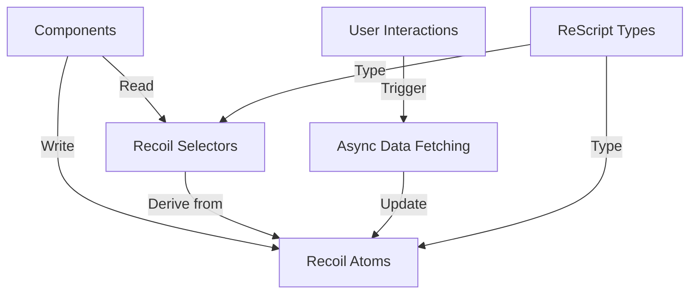

# State Management with Recoil in Hyperswitch

This document outlines how state management is implemented in the Hyperswitch Control Center using Recoil, including patterns, best practices, and integration with ReScript.

## State Management Architecture

Hyperswitch Control Center uses Recoil as its primary state management solution, integrated with ReScript to provide type safety and functional programming patterns.



## Core Concepts

### Atoms

Atoms are the basic units of state in Recoil. In Hyperswitch, atoms are defined with ReScript and typically follow this pattern:

```rescript
// HyperswitchAtom.res
let featureFlagAtom = Recoil.atom({
  key: "featureFlagAtom",
  default: {
    mixpanel: false,
    generateReport: false,
    // other feature flags
    xFeatureRoute: "",
    forceCookies: "",
  },
})

// TableAtoms.res
let customColumnsAtom = Recoil.atom({
  key: "customColumnsAtom",
  default: Dict.make(),
})
```

Key characteristics:
- Each atom has a unique key
- Default values are provided in the atom definition
- Atoms are exported for use across the application
- Type safety is enforced through ReScript's type system

### Selectors

Selectors derive state from atoms or other selectors, allowing for computed values:

```rescript
let filteredDataSelector = Recoil.selector({
  key: "filteredDataSelector",
  get: ({get}) => {
    let allData = get(dataAtom)
    let filters = get(filtersAtom)
    
    // Apply filters to data
    allData->Array.filter(item => applyFilters(item, filters))
  },
})
```

Selectors in Hyperswitch are used for:
- Filtering and sorting data
- Combining data from multiple atoms
- Formatting data for display
- Computing derived values

### Hooks for Accessing State

Components access Recoil state using custom hooks and bindings:

```rescript
// Accessing atom state
let {xFeatureRoute, forceCookies} = HyperswitchAtom.featureFlagAtom->Recoil.useRecoilValueFromAtom

// Accessing selector state
let filteredData = FilterSelectors.filteredDataSelector->Recoil.useRecoilValueFromSelector

// Setting atom state
let setFilterState = FilterAtoms.filtersAtom->Recoil.useSetRecoilState
```

## ReScript Integration Patterns

### Type Definitions for State

ReScript's type system ensures type safety for state:

```rescript
// Define types for state
type featureFlags = {
  mixpanel: bool,
  generateReport: bool,
  feedback: bool,
  xFeatureRoute: string,
  forceCookies: string,
}

// Use types in atom definition
let featureFlagAtom = Recoil.atom({
  key: "featureFlagAtom",
  default: {
    mixpanel: false,
    generateReport: false,
    feedback: false,
    xFeatureRoute: "",
    forceCookies: "",
  }: featureFlags,
})
```

### Custom Hooks

Custom hooks abstract Recoil interactions:

```rescript
let useClearRecoilValue = () => {
  let resetTableFilterState = TableFilterAtoms.tableFilterAtom->Recoil.useResetRecoilState
  let resetOrdersData = TableAtoms.ordersAtom->Recoil.useResetRecoilState
  
  () => {
    // Reset all relevant atoms
    resetTableFilterState()
    resetOrdersData()
    // Other resets as needed
  }
}
```

## State Organization

### 1. Global Application State

State that affects the entire application:

- **Feature Flags**: Control feature visibility and behavior
- **User Information**: Current user, roles, and permissions
- **Theme Settings**: UI theme configuration
- **Authentication**: Auth status and tokens

```rescript
// HyperswitchAtom.res
let featureFlagAtom = Recoil.atom({
  key: "featureFlagAtom",
  default: {
    // Feature flags
  },
})
```

### 2. Module-Specific State

State that is contained within specific feature modules:

- **Routing Configuration**: Intelligent routing rules and settings
- **Analytics Filters**: Selected filters for analytics views
- **Payment Operation State**: Current payments, refunds, or disputes being processed

```rescript
// IntelligentRoutingAtoms.res
let routingRulesAtom = Recoil.atom({
  key: "routingRulesAtom",
  default: [],
})
```

### 3. UI State

State that controls UI behavior:

- **Table Configurations**: Sorting, filtering, and pagination
- **Form State**: Form values and validation
- **Modal State**: Which modals are visible
- **Accordion State**: Which sections are expanded

```rescript
// TableAtoms.res
let tablePageAtom = Recoil.atom({
  key: "tablePageAtom",
  default: 1,
})

let tableSortAtom = Recoil.atom({
  key: "tableSortAtom",
  default: None,
})
```

## Asynchronous State Management

### Data Fetching Pattern

Managing asynchronous data fetching using Recoil:

```rescript
let useLoadTableData = () => {
  let getURL = APIUtils.useGetURL()
  let getMethod = APIUtils.useGetMethod()
  let setTableData = TableAtoms.tableDataAtom->Recoil.useSetRecoilState
  let setLoading = TableAtoms.loadingAtom->Recoil.useSetRecoilState
  let setError = TableAtoms.errorAtom->Recoil.useSetRecoilState
  
  let fetchData = async () => {
    setLoading(true)
    try {
      let url = getURL(~entityName=V1(ORDERS), ~methodType=Get)
      let response = await getMethod(url)
      setTableData(response)
      setLoading(false)
    } catch {
    | e => {
        setError(Exn.message(e)->Option.getOr("Failed to fetch data"))
        setLoading(false)
      }
    }
  }
  
  fetchData
}
```

### Derived Async State

Using selectors to derive state from async data:

```rescript
let paymentStatsSelector = Recoil.selector({
  key: "paymentStatsSelector",
  get: ({get}) => {
    let payments = get(paymentsAtom)
    
    // Calculate statistics from payments data
    let totalAmount = payments->Array.reduce(0.0, (acc, payment) => {
      acc +. payment.amount
    })
    
    let successRate = {
      let total = payments->Array.length
      let successful = payments->Array.filter(p => p.status === "succeeded")->Array.length
      
      total > 0 ? successful->Float.fromInt /. total->Float.fromInt *. 100.0 : 0.0
    }
    
    {
      totalAmount,
      successRate,
      count: payments->Array.length,
    }
  },
})
```

## State Persistence

### Local Storage Integration

Persisting state across sessions:

```rescript
// Storing state in localStorage
let useStoreFilterPreferences = () => {
  let filters = FilterAtoms.filtersAtom->Recoil.useRecoilValueFromAtom
  
  React.useEffect1(() => {
    let filtersJson = filters->JSON.stringify
    LocalStorage.setItem("filters", filtersJson)
    None
  }, [filters])
}

// Loading state from localStorage
let useLoadFilterPreferences = () => {
  let setFilters = FilterAtoms.filtersAtom->Recoil.useSetRecoilState
  
  React.useEffect0(() => {
    switch LocalStorage.getItem("filters") {
    | Some(filtersJson) => {
        try {
          let parsedFilters = filtersJson->JSON.parse
          setFilters(parsedFilters)
        } catch {
        | _ => () // Handle parsing errors
        }
      }
    | None => () // No saved filters
    }
    None
  })
}
```

## Common State Patterns

### 1. Table State Management

Tables in Hyperswitch have standardized state management:

```rescript
// Table state atoms
let tableDataAtom = Recoil.atom({
  key: "tableDataAtom",
  default: [],
})

let tablePageAtom = Recoil.atom({
  key: "tablePageAtom",
  default: 1,
})

let tablePageSizeAtom = Recoil.atom({
  key: "tablePageSizeAtom",
  default: 10,
})

let tableSortAtom = Recoil.atom({
  key: "tableSortAtom",
  default: None,
})

let tableFilterAtom = Recoil.atom({
  key: "tableFilterAtom",
  default: Dict.make(),
})

// Table computed state
let paginatedDataSelector = Recoil.selector({
  key: "paginatedDataSelector",
  get: ({get}) => {
    let data = get(tableDataAtom)
    let page = get(tablePageAtom)
    let pageSize = get(tablePageSizeAtom)
    
    let startIndex = (page - 1) * pageSize
    let endIndex = min(startIndex + pageSize, data->Array.length)
    
    data->Array.slice(~start=startIndex, ~end=endIndex)
  },
})
```

### 2. Form State Management

Forms are managed using a combination of Recoil and React Final Form:

```rescript
// Form state atom
let formValuesAtom = Recoil.atom({
  key: "formValuesAtom",
  default: Dict.make(),
})

// Form validation state
let formErrorsAtom = Recoil.atom({
  key: "formErrorsAtom",
  default: Dict.make(),
})

// Form component
@react.component
let make = () => {
  let formValues = formValuesAtom->Recoil.useRecoilValueFromAtom
  let setFormValues = formValuesAtom->Recoil.useSetRecoilState
  
  <Form
    initialValues=formValues
    onSubmit={values => {
      // Handle submission
      setFormValues(values)
    }}
    validate={values => {
      // Validation logic
    }}
    render={formProps => {
      <form onSubmit=formProps.handleSubmit>
        // Form fields
      </form>
    }}
  />
}
```

### 3. Filter State Management

Managing filters for data views:

```rescript
// Filter state atoms
let filterValuesAtom = Recoil.atom({
  key: "filterValuesAtom",
  default: Dict.make(),
})

let activeFiltersAtom = Recoil.atom({
  key: "activeFiltersAtom",
  default: [],
})

// Apply filters selector
let filteredDataSelector = Recoil.selector({
  key: "filteredDataSelector",
  get: ({get}) => {
    let data = get(dataAtom)
    let filters = get(filterValuesAtom)
    let activeFilters = get(activeFiltersAtom)
    
    // Apply active filters to data
    data->Array.filter(item => {
      activeFilters->Array.every(filterKey => {
        let filterValue = filters->Dict.get(filterKey)
        
        switch filterValue {
        | Some(value) => applyFilter(item, filterKey, value)
        | None => true
        }
      })
    })
  },
})
```

## Best Practices

### 1. Atom Naming and Organization

- Use consistent naming conventions for atoms (e.g., `entityNameAtom`)
- Group related atoms in feature-specific modules
- Provide descriptive comments for complex atoms or selectors

### 2. State Granularity

- Split state into small, focused atoms rather than large state objects
- Use selectors to recombine state when needed
- Avoid duplicating state across multiple atoms

### 3. Performance Optimization

- Use selectors to compute derived state rather than computing in components
- Consider atomFamily for collections of similar state
- Implement memoization for expensive computations

### 4. Type Safety

- Define explicit types for all state
- Use ReScript's pattern matching to handle all possible states
- Leverage the compiler to catch state-related errors

### 5. Testing

- Test selectors independently of components
- Mock atom values for component testing
- Test state transitions and side effects

## Common Pitfalls and Solutions

### 1. Overusing Global State

**Problem**: Putting too much in global state that should be local component state

**Solution**: 
- Use React's local state for temporary UI state
- Only elevate to Recoil state when sharing across components is needed

### 2. Derived State Inconsistency

**Problem**: Computed values becoming out of sync with source data

**Solution**:
- Always use selectors for derived state
- Avoid storing calculated values in atoms that could get out of sync

### 3. Excessive Re-renders

**Problem**: Components re-rendering too often due to state changes

**Solution**:
- Split atoms into smaller pieces to reduce unnecessary re-renders
- Use React.memo and useMemo when appropriate
- Structure selectors to minimize dependencies
