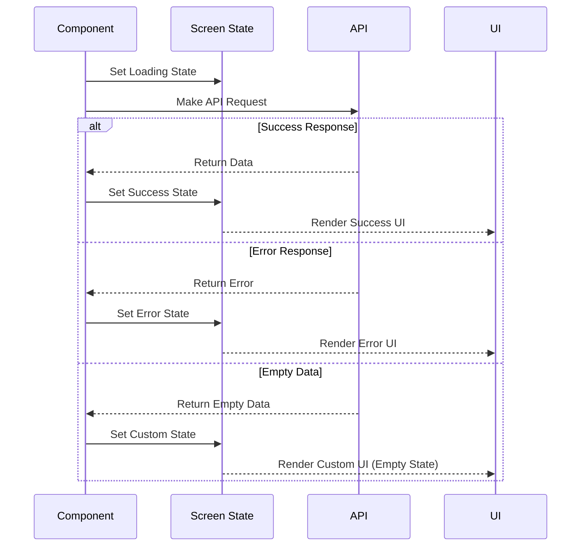

# Screen State Management Pattern

Screen state management is a core pattern in the Hyperswitch Control Center, used to handle UI states during asynchronous operations, particularly API calls. This document outlines the standardized approach to managing loading, success, and error states throughout the application.

## Overview

The screen state pattern provides a consistent way to:

1. Indicate to users when data is loading
2. Display appropriate UI when data is successfully loaded
3. Show meaningful error messages when operations fail
4. Handle special cases like empty data sets



## Implementation Pattern

### State Definition

Screen state is typically managed using React's useState hook with the PageLoaderWrapper's viewType:

```rescript
let (screenState, setScreenState) = React.useState(_ => PageLoaderWrapper.Loading)
```

### Standard State Transitions

```rescript
// Initial or before API call
setScreenState(_ => PageLoaderWrapper.Loading)

// After successful API call
setScreenState(_ => PageLoaderWrapper.Success)

// After API error
setScreenState(_ => PageLoaderWrapper.Error("Error message"))

// For empty data or special cases
setScreenState(_ => PageLoaderWrapper.Custom)
```

## API Integration Pattern

### Basic API Call Pattern

```rescript
// Component setup
let (screenState, setScreenState) = React.useState(_ => PageLoaderWrapper.Loading)
let (data, setData) = React.useState(_ => None)
let getURL = APIUtils.useGetURL()
let getMethod = APIUtils.useGetMethod()

// API call function
let fetchData = async () => {
  try {
    setScreenState(_ => PageLoaderWrapper.Loading)
    
    let url = getURL(~entityName=V1(ENTITY_NAME), ~methodType=Get)
    let response = await getMethod(url)
    
    // Process and store response
    setData(_ => Some(response))
    
    // Update screen state based on result
    setScreenState(_ => PageLoaderWrapper.Success)
  } catch {
    | Exn.Error(e) => {
      let errorMsg = Exn.message(e)->Option.getOr("Failed to fetch data")
      setScreenState(_ => PageLoaderWrapper.Error(errorMsg))
      
      // Optional: Show toast notification
      showToast(~message=errorMsg, ~toastType=ToastError)
    }
  }
}

// Component rendering
<PageLoaderWrapper screenState>
  {/* Content to display when successful */}
</PageLoaderWrapper>
```

### Post/Update API Call Pattern

```rescript
let handleSubmit = async (formData) => {
  setScreenState(_ => PageLoaderWrapper.Loading)
  
  try {
    let url = getURL(~entityName=V1(ENTITY_NAME), ~methodType=Post)
    let response = await updateMethod(url, formData, Post)
    
    // Handle successful submission
    setScreenState(_ => PageLoaderWrapper.Success)
    showToast(~message="Data saved successfully", ~toastType=ToastSuccess)
  } catch {
    | Exn.Error(e) => {
      let errorMsg = Exn.message(e)->Option.getOr("Failed to save data")
      setScreenState(_ => PageLoaderWrapper.Error(errorMsg))
      showToast(~message=errorMsg, ~toastType=ToastError)
    }
  }
}
```

## Advanced Patterns

### Empty Data Handling

```rescript
try {
  setScreenState(_ => PageLoaderWrapper.Loading)
  let response = await getMethod(url)
  
  if (response->Array.length > 0) {
    setData(_ => response)
    setScreenState(_ => PageLoaderWrapper.Success)
  } else {
    // No data case
    setScreenState(_ => PageLoaderWrapper.Custom)
  }
} catch {
  | _ => setScreenState(_ => PageLoaderWrapper.Error("Failed to fetch data"))
}

// In render function
<PageLoaderWrapper 
  screenState 
  customUI={<NoDataFound message="No data available" />}>
  <DataTable data />
</PageLoaderWrapper>
```

### Cancellation and Cleanup

```rescript
React.useEffect(() => {
  let isMounted = true
  
  let fetchData = async () => {
    try {
      setScreenState(_ => PageLoaderWrapper.Loading)
      let response = await getMethod(url)
      
      // Only update state if component is still mounted
      if (isMounted) {
        setData(_ => response)
        setScreenState(_ => PageLoaderWrapper.Success)
      }
    } catch {
      if (isMounted) {
        setScreenState(_ => PageLoaderWrapper.Error("Failed to fetch"))
      }
    }
  }
  
  fetchData()->ignore
  
  // Cleanup function
  () => {
    isMounted = false
  }
}, [url])
```

### Dependent API Calls

```rescript
let fetchDependentData = async () => {
  try {
    setScreenState(_ => PageLoaderWrapper.Loading)
    
    // First API call
    let configUrl = getURL(~entityName=V1(CONFIG), ~methodType=Get)
    let config = await getMethod(configUrl)
    
    // Second API call depends on first
    let dataUrl = getURL(
      ~entityName=V1(DATA),
      ~methodType=Get,
      ~id=Some(config.id),
    )
    let data = await getMethod(dataUrl)
    
    // Set all data and update state
    setConfig(_ => config)
    setData(_ => data)
    setScreenState(_ => PageLoaderWrapper.Success)
  } catch {
    | _ => setScreenState(_ => PageLoaderWrapper.Error("Failed to fetch data"))
  }
}
```

## Best Practices

1. **Always Set Initial State**: Start with `Loading` state when the component mounts or before making API calls.

2. **Handle All Outcomes**: Ensure you handle success, error, and empty data states appropriately.

3. **Meaningful Error Messages**: Provide specific error messages that help users understand what went wrong.

4. **Toast Notifications**: Consider pairing screen state changes with toast notifications for transient feedback.

5. **Cleanup on Unmount**: For long-running operations, implement proper cleanup to prevent memory leaks and state updates on unmounted components.

6. **Consistent Pattern**: Follow the same pattern across all components for predictability and maintainability.

7. **Component Composition**: For complex UIs, consider composing multiple components with their own screen states.

## Integration with Other Features

### Toast Notifications

```rescript
try {
  setScreenState(_ => PageLoaderWrapper.Loading)
  let response = await getMethod(url)
  setData(_ => response)
  setScreenState(_ => PageLoaderWrapper.Success)
} catch {
  | Exn.Error(e) => {
    let errorMsg = Exn.message(e)->Option.getOr("Failed to fetch data")
    setScreenState(_ => PageLoaderWrapper.Error(errorMsg))
    showToast(~message=errorMsg, ~toastType=ToastError)
  }
}
```

### Form Integration

```rescript
let MyForm = () => {
  let (screenState, setScreenState) = React.useState(_ => PageLoaderWrapper.Success)
  
  let handleSubmit = async (formData) => {
    setScreenState(_ => PageLoaderWrapper.Loading)
    // Process form submission
    // ...
    setScreenState(_ => PageLoaderWrapper.Success)
  }
  
  <PageLoaderWrapper screenState>
    <Form onSubmit={handleSubmit}>
      {/* Form fields */}
    </Form>
  </PageLoaderWrapper>
}
```

### Filterable Tables

```rescript
let fetchFilteredData = async (filters) => {
  setScreenState(_ => PageLoaderWrapper.Loading)
  
  try {
    let queryParams = filters->convertToQueryString
    let url = `${baseUrl}?${queryParams}`
    let response = await getMethod(url)
    
    setTableData(_ => response)
    setScreenState(_ => PageLoaderWrapper.Success)
  } catch {
    | _ => setScreenState(_ => PageLoaderWrapper.Error("Failed to fetch filtered data"))
  }
}
```

## Benefits

1. **Consistent User Experience**: Provides uniform loading, success, and error states across the application.

2. **Reduced Boilerplate**: Standardized pattern minimizes repetitive code for handling async operations.

3. **Improved Error Handling**: Centralizes error state management with appropriate UI feedback.

4. **Better UX**: Gives users clear feedback about the application state during operations.

5. **Maintainability**: Makes components more predictable and easier to maintain.
