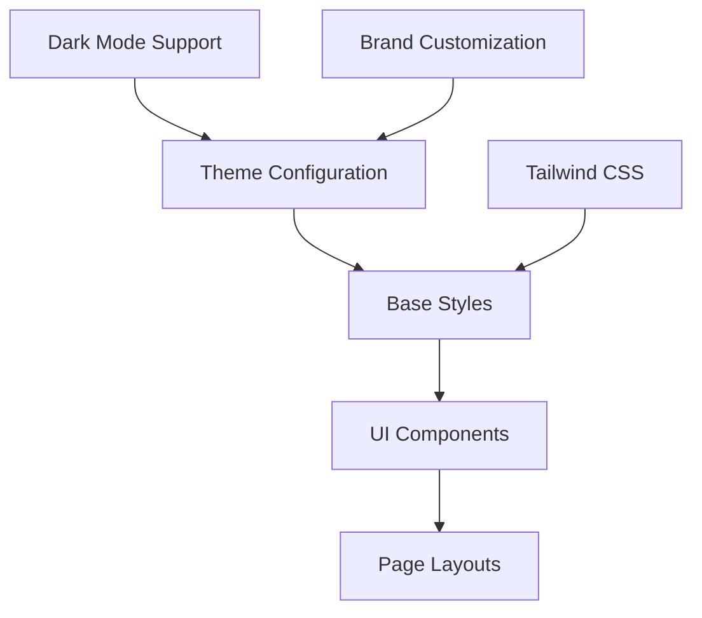

# Design System and UI Patterns in Hyperswitch

This document outlines the design system implementation and UI patterns used in the Hyperswitch Control Center, focusing on the visual language, component styling, and theming capabilities.

## Design System Overview

Hyperswitch implements a cohesive design system built on Tailwind CSS with theme customization capabilities. The design system ensures consistency across the application while providing flexibility for customization.



## Core Design Principles

1. **Consistency**: Unified visual language across the application
2. **Accessibility**: Compliant with accessibility standards
3. **Responsiveness**: Mobile-first approach with responsive layouts
4. **Customization**: Theme and brand customization capabilities
5. **Dark Mode**: First-class support for light and dark themes

## Theme Implementation

### ThemeProvider

The central theme configuration is managed through a React Context provider that makes theme settings available throughout the application:

```rescript
// ThemeProvider.res
type themeConfig = {
  globalUIConfig: {
    button: {
      backgroundColor: {
        primaryNormal: string,
        primaryLoading: string,
        primaryDisabled: string,
        primaryNoHover: string,
        primaryOutline: string,
        // ... other button states
      },
      textColor: {
        primaryNormal: string,
        primaryDisabled: string,
        secondaryNormal: string,
        secondaryDisabled: string,
        secondaryLoading: string,
        // ... other text colors
      },
    },
    // ... other component configurations
  },
  // ... other theme settings
}

let defaultThemeConfig = {
  globalUIConfig: {
    button: {
      backgroundColor: {
        primaryNormal: "bg-primary",
        primaryLoading: "bg-primary-700",
        primaryDisabled: "bg-jp-gray-300 dark:bg-jp-gray-950 dark:bg-opacity-50",
        // ... other values
      },
      textColor: {
        primaryNormal: "text-white",
        primaryDisabled: "text-jp-gray-600 dark:text-jp-gray-text_darktheme dark:text-opacity-25",
        // ... other values
      },
    },
    // ... other component settings
  },
}

let themeContext = React.createContext(defaultThemeConfig)

@react.component
let make = (~children) => {
  let (theme, _) = React.useState(_ => defaultThemeConfig)

  <themeContext.Provider value=theme>
    {children}
  </themeContext.Provider>
}
```

### Theme Customization

Themes can be customized by overriding the default values:

```rescript
// customTheme.res
let customTheme = {
  ...defaultThemeConfig,
  globalUIConfig: {
    ...defaultThemeConfig.globalUIConfig,
    button: {
      ...defaultThemeConfig.globalUIConfig.button,
      backgroundColor: {
        ...defaultThemeConfig.globalUIConfig.button.backgroundColor,
        primaryNormal: "bg-blue-600",
      },
    },
  },
}
```

Themes can also be customized at runtime through environment variables or configuration files, allowing for white-label solutions.

## Color System

### Base Colors

The color system is built on a set of base colors with semantic naming:

```css
/* Tailwind color definitions */
'primary': '#4F54EF', /* Primary brand color */
'secondary': '#6C757D', /* Secondary UI elements */
'success': '#28A745', /* Success states */
'danger': '#DC3545', /* Error states */
'warning': '#FFC107', /* Warning states */
'info': '#17A2B8', /* Informational states */
'light': '#F8F9FA', /* Light backgrounds */
'dark': '#343A40', /* Dark text and backgrounds */
'jp-gray': { /* Gray scale with various opacities */
  '100': '#F8F9FA',
  '200': '#E9ECEF',
  /* ... other gray values */
  '900': '#212529',
}
```

### Color Usage

Color usage is standardized across components:

1. **Primary Actions**: Primary brand color for important actions
2. **Secondary Actions**: Secondary color for less prominent actions
3. **Status Colors**: Success, danger, warning, and info colors for status indicators
4. **Text Colors**: Dark colors for text, with lighter variants for less prominent text
5. **Background Colors**: Light backgrounds with subtle variations for different UI sections

## Typography System

### Type Scale

The typography system uses a consistent scale:

```css
/* Font sizes */
'fs-10': '0.625rem', /* 10px */
'fs-11': '0.6875rem', /* 11px */
'fs-12': '0.75rem', /* 12px */
'fs-13': '0.8125rem', /* 13px */
'fs-14': '0.875rem', /* 14px */
'fs-16': '1rem', /* 16px */
'fs-18': '1.125rem', /* 18px */
'fs-20': '1.25rem', /* 20px */
'fs-24': '1.5rem', /* 24px */
'fs-30': '1.875rem', /* 30px */
'fs-36': '2.25rem', /* 36px */
```

### Typography Components

Typography is implemented through a set of consistent components:

```rescript
// Typography.res
module Heading = {
  type headingLevel = H1 | H2 | H3 | H4 | H5 | H6

  @react.component
  let make = (~level=H2, ~className="", ~children) => {
    let headingClass = switch level {
    | H1 => "text-fs-30 font-bold"
    | H2 => "text-fs-24 font-bold"
    | H3 => "text-fs-20 font-semibold"
    | H4 => "text-fs-18 font-semibold"
    | H5 => "text-fs-16 font-medium"
    | H6 => "text-fs-14 font-medium"
    }

    let combinedClassName = `${headingClass} ${className}`

    switch level {
    | H1 => <h1 className=combinedClassName> {children} </h1>
    | H2 => <h2 className=combinedClassName> {children} </h2>
    | H3 => <h3 className=combinedClassName> {children} </h3>
    | H4 => <h4 className=combinedClassName> {children} </h4>
    | H5 => <h5 className=combinedClassName> {children} </h5>
    | H6 => <h6 className=combinedClassName> {children} </h6>
    }
  }
}

module Text = {
  type textSize = XSmall | Small | Medium | Large

  @react.component
  let make = (~size=Medium, ~className="", ~children) => {
    let textClass = switch size {
    | XSmall => "text-fs-11"
    | Small => "text-fs-12"
    | Medium => "text-fs-14"
    | Large => "text-fs-16"
    }

    <p className={`${textClass} ${className}`}> {children} </p>
  }
}
```

## Spacing System

A consistent spacing system ensures proper layout throughout the application:

```css
/* Spacing scale */
'0': '0',
'0.5': '0.125rem', /* 2px */
'1': '0.25rem', /* 4px */
'1.5': '0.375rem', /* 6px */
'2': '0.5rem', /* 8px */
'2.5': '0.625rem', /* 10px */
'3': '0.75rem', /* 12px */
'4': '1rem', /* 16px */
'5': '1.25rem', /* 20px */
'6': '1.5rem', /* 24px */
'8': '2rem', /* 32px */
'10': '2.5rem', /* 40px */
'12': '3rem', /* 48px */
'16': '4rem', /* 64px */
'20': '5rem', /* 80px */
```

Spacing is applied consistently through Tailwind classes:

- Margin: `m-4`, `mt-4`, `mr-4`, `mb-4`, `ml-4`, `mx-4`, `my-4`
- Padding: `p-4`, `pt-4`, `pr-4`, `pb-4`, `pl-4`, `px-4`, `py-4`
- Gap: `gap-4`, `gap-x-4`, `gap-y-4`

## Layout System

### Grid System

Layouts are built using Tailwind's flexbox and grid utilities:

```rescript
// Example grid layout
@react.component
let make = () => {
  <div className="grid grid-cols-1 md:grid-cols-2 lg:grid-cols-3 gap-4">
    <div className="bg-white p-4 rounded shadow"> {React.string("Card 1")} </div>
    <div className="bg-white p-4 rounded shadow"> {React.string("Card 2")} </div>
    <div className="bg-white p-4 rounded shadow"> {React.string("Card 3")} </div>
  </div>
}
```

### Responsive Breakpoints

Standard breakpoints ensure consistent responsive behavior:

```css
/* Breakpoints */
'sm': '640px', /* Small screens */
'md': '768px', /* Medium screens */
'lg': '1024px', /* Large screens */
'xl': '1280px', /* Extra large screens */
'2xl': '1536px', /* 2X large screens */
```

## Component Styling Patterns

### 1. Tailwind Integration

Components use Tailwind utility classes for styling:

```rescript
@react.component
let make = (~title) => {
  <div className="bg-white dark:bg-gray-800 rounded-lg p-4 shadow-sm">
    <h2 className="text-fs-18 font-medium text-gray-900 dark:text-white">
      {React.string(title)}
    </h2>
  </div>
}
```

### 2. Theme-Aware Components

Components access theme configuration for consistent styling:

```rescript
@react.component
let make = (~text) => {
  let config = React.useContext(ThemeProvider.themeContext)
  let textColor = config.globalUIConfig.button.textColor.primaryNormal

  <button className={`px-4 py-2 rounded ${textColor} bg-primary`}>
    {React.string(text)}
  </button>
}
```

### 3. Conditional Styling

Component styling adapts based on props and state:

```rescript
@react.component
let make = (~isActive, ~text) => {
  let baseClass = "px-4 py-2 rounded transition-colors"
  let stateClass = isActive ? "bg-primary text-white" : "bg-gray-200 text-gray-700"

  <button className={`${baseClass} ${stateClass}`}>
    {React.string(text)}
  </button>
}
```

### 4. Dark Mode Support

Components support both light and dark modes:

```rescript
@react.component
let make = (~title, ~content) => {
  <div className="bg-white dark:bg-gray-800 rounded-lg p-4 shadow-sm">
    <h3 className="text-gray-900 dark:text-white font-medium mb-2">
      {React.string(title)}
    </h3>
    <p className="text-gray-700 dark:text-gray-300">
      {React.string(content)}
    </p>
  </div>
}
```

## Icon System

### Icon Component

A unified Icon component provides consistent icon usage:

```rescript
// Icon.res
type iconSize = int

@react.component
let make = (
  ~name: string,
  ~size: iconSize=16,
  ~className="",
) => {
  <span className={`icon fa-${name} ${className}`} style={ReactDOM.Style.make(~fontSize=`${size->Int.toString}px`, ())} />
}
```

### Icon Usage

Icons are used consistently throughout the application:

```rescript
// Using icons in components
<Button
  text="Save"
  leftIcon=FontAwesome("save")
/>

<Icon
  name="chart-line"
  size=24
  className="text-primary"
/>
```

## UI Component Patterns

### 1. Button Variants

Buttons follow a consistent pattern with variants:

```rescript
// Button example
@react.component
let make = (
  ~buttonState: buttonState=Normal,
  ~text=?,
  ~buttonType: buttonType=SecondaryFilled,
  ~buttonVariant: buttonVariant=Fit,
  ~leftIcon: iconType=NoIcon,
  ~onClick=?,
) => {
  let backColor = useGetBgColor(~buttonType, ~buttonState, ~showBorder)
  let textColor = useGetTextColor(~buttonType, ~buttonState, ~showBorder)

  <button
    className={`flex items-center justify-center ${backColor} ${textColor} rounded-lg`}
    onClick=?onClick
    disabled={buttonState === Disabled || buttonState === Loading}
  >
    // Button content
  </button>
}
```

### 2. Card Components

Cards provide a consistent container for content:

```rescript
// Card example
@react.component
let make = (~title, ~children, ~footer=?) => {
  <div className="bg-white dark:bg-gray-800 rounded-lg shadow-sm overflow-hidden">
    <div className="px-4 py-3 border-b border-gray-200 dark:border-gray-700">
      <Typography.Heading level=H3> {React.string(title)} </Typography.Heading>
    </div>
    <div className="p-4">
      {children}
    </div>
    {switch footer {
     | Some(content) =>
       <div className="px-4 py-3 bg-gray-50 dark:bg-gray-900 border-t border-gray-200 dark:border-gray-700">
         {content}
       </div>
     | None => React.null
     }}
  </div>
}
```

### 3. Form Elements

Form elements follow consistent styling patterns:

```rescript
// Input field example
@react.component
let make = (
  ~label,
  ~value,
  ~onChange,
  ~placeholder="",
  ~error=None,
) => {
  <div className="mb-4">
    <label className="block text-gray-700 dark:text-gray-300 mb-1">
      {React.string(label)}
    </label>
    <input
      className="w-full px-3 py-2 border border-gray-300 dark:border-gray-700 rounded-md focus:outline-none focus:ring-2 focus:ring-primary"
      value
      onChange
      placeholder
    />
    {switch error {
     | Some(errorMsg) =>
       <p className="mt-1 text-red-500 text-sm"> {React.string(errorMsg)} </p>
     | None => React.null
     }}
  </div>
}
```

## Accessibility Considerations

The design system incorporates accessibility features:

1. **Color Contrast**: Ensures sufficient contrast between text and background
2. **Focus States**: Visible focus indicators for keyboard navigation
3. **Screen Reader Support**: Semantic HTML and aria attributes
4. **Keyboard Navigation**: All interactive elements are accessible via keyboard
5. **Reduced Motion**: Respects user preferences for reduced motion

Example:

```rescript
@react.component
let make = (~label, ~onClick) => {
  <button
    className="px-4 py-2 bg-primary text-white rounded focus:outline-none focus:ring-2 focus:ring-primary focus:ring-offset-2"
    onClick
    aria-label=label
  >
    {React.string(label)}
  </button>
}
```

## Animation System

Animations follow consistent patterns:

1. **Transitions**: Smooth state transitions with consistent timing
2. **Feedback**: Visual feedback for user interactions
3. **Loading States**: Consistent loading indicators
4. **Motion**: Subtle motion to guide attention

Example of transition:

```rescript
<div className="transition-all duration-300 ease-in-out transform hover:scale-105">
  // Content
</div>
```

## Responsive Design Approach

The application follows a responsive design approach:

1. **Mobile-First**: Base styles for mobile, then progressively enhance
2. **Breakpoints**: Consistent breakpoint usage
3. **Fluid Typography**: Typography scales with viewport
4. **Adaptive Layouts**: Layouts adapt to screen size

Example responsive layout:

```rescript
<div className="grid grid-cols-1 sm:grid-cols-2 md:grid-cols-3 lg:grid-cols-4 gap-4">
  // Grid items
</div>
```

## Best Practices

### 1. Consistent Component Usage

Maintain consistency by using defined components rather than custom styling:

```rescript
// Good: Use Typography components
<Typography.Heading level=H2> {React.string("Dashboard")} </Typography.Heading>

// Avoid: Custom heading styling
<h2 className="text-2xl font-bold"> {React.string("Dashboard")} </h2>
```

### 2. Theme-First Approach

Use theme values rather than hardcoded values:

```rescript
// Good: Use theme colors
let config = React.useContext(ThemeProvider.themeContext)
let primaryColor = config.globalUIConfig.button.backgroundColor.primaryNormal

// Avoid: Hardcoded colors
let primaryColor = "bg-blue-500"
```

### 3. Responsive Development

Always consider different screen sizes:

```rescript
// Good: Responsive design
<div className="p-2 md:p-4 lg:p-6">
  // Content
</div>

// Avoid: Fixed sizing
<div className="p-4">
  // Content
</div>
```

### 4. Dark Mode Support

Always include dark mode alternatives:

```rescript
// Good: Dark mode support
<div className="bg-white text-gray-900 dark:bg-gray-800 dark:text-white">
  // Content
</div>

// Avoid: Light-mode only
<div className="bg-white text-gray-900">
  // Content
</div>
```

## Feature Flag Integration

UI components integrate with feature flags for conditional rendering:

```rescript
@react.component
let make = () => {
  let {feedback} = HyperswitchAtom.featureFlagAtom->Recoil.useRecoilValueFromAtom

  <div>
    <RenderIf condition=feedback>
      <FeedbackButton />
    </RenderIf>
  </div>
}
```

## Design-to-Code Process

The process for implementing new UI components:

1. **Design Specification**: Receive design specs from designers
2. **Component Planning**: Identify reusable patterns and components
3. **Implementation**: Build components using the design system
4. **Review**: Ensure consistency with design specs
5. **Testing**: Test across devices and screen sizes
6. **Documentation**: Document usage patterns

## UI Customization

The application supports UI customization for white-labeling:

1. **Brand Colors**: Customizable primary and secondary colors
2. **Logo**: Replaceable logo through configuration
3. **Favicon**: Customizable favicon
4. **Theme Overrides**: Override specific theme settings

Configuration example:

```toml
# config.toml
[branding]
primary_color = "#4F54EF"
logo_url = "/custom/logo.png"
favicon_url = "/custom/favicon.ico"
```
